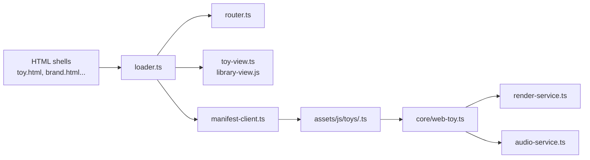
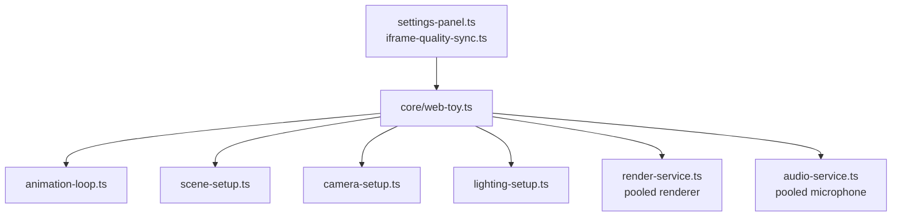

# Stim Webtoys Library

Welcome to the **Stim Webtoys Library**, hosted at [no.toil.fyi](https://no.toil.fyi). This is a collection of interactive web-based toys designed to deliver playful sensory stimulation. They’re built with **Three.js**, **WebGL**, and live **audio interaction** for anyone who enjoys engaging, responsive visuals. These are great for casual play or sensory exploration, especially for neurodiverse folks.

For setup, testing, and contribution details, see [CONTRIBUTING.md](./CONTRIBUTING.md). If you're building or updating toys, the developer docs in [`docs/`](./docs) cover common workflows and patterns. If you’re using the Model Context Protocol server in [`scripts/mcp-server.ts`](./scripts/mcp-server.ts), see the dedicated guide in [`docs/MCP_SERVER.md`](./docs/MCP_SERVER.md).

Looking for release notes? Check out the [CHANGELOG](./CHANGELOG.md) to see what’s new, what changed, and what’s coming next.

## Documentation map

Use these entry points to find the right docs quickly:

- [`docs/README.md`](./docs/README.md): overview of project docs plus onboarding highlights.
- [`docs/DEVELOPMENT.md`](./docs/DEVELOPMENT.md): day-to-day setup, tooling, scripts, and workflow expectations.
- [`docs/TOY_DEVELOPMENT.md`](./docs/TOY_DEVELOPMENT.md), [`docs/TOY_SCRIPT_INDEX.md`](./docs/TOY_SCRIPT_INDEX.md), and [`docs/toys.md`](./docs/toys.md): how to build or modify toys, toy script index, and per-toy notes.
- [`docs/QA_PLAN.md`](./docs/QA_PLAN.md): QA coverage for high-impact flows and how to run the automation that protects them.
- [`docs/PAGE_SPECIFICATIONS.md`](./docs/PAGE_SPECIFICATIONS.md): page-level specs for the library landing and toy shell, covering data, layout, and accessibility expectations.
- [`docs/DEPLOYMENT.md`](./docs/DEPLOYMENT.md): production build/preview steps, Cloudflare Pages/Workers notes, and static hosting tips.
- [`docs/ARCHITECTURE.md`](./docs/ARCHITECTURE.md): runtime composition, loaders, and diagrams for the core systems.
- [`docs/MCP_SERVER.md`](./docs/MCP_SERVER.md): Model Context Protocol stdio server usage and available tools.

If you add new scripts, toys, or deployment options, update the relevant doc above so the workflows stay discoverable.

## Architecture at a glance





### When to update docs

| Change type                   | Docs to touch                                                                 |
| ----------------------------- | ----------------------------------------------------------------------------- |
| New toy or renamed slug       | `docs/TOY_DEVELOPMENT.md`, `docs/TOY_SCRIPT_INDEX.md`, `docs/toys.md`         |
| New script or workflow change | `docs/DEVELOPMENT.md`                                                         |
| Hosting or CI change          | `docs/DEPLOYMENT.md`, `docs/ARCHITECTURE.md` (if it alters runtime/data flow) |
| MCP server updates            | `docs/MCP_SERVER.md`                                                          |

## Quick Start

1. Clone the repo and `cd` into it.
2. Confirm your runtime (the repo records `bun@1.2.14` in `package.json` via `packageManager`):
   - **Bun 1.2+**: install from [bun.sh](https://bun.sh/) for the fastest install/test cycle and the supported workflow.
3. Install dependencies with `bun install`. The repository tracks `bun.lock` for reproducible installs—use `bun install --frozen-lockfile` to respect it.
4. Start the dev server with `bun run dev`, then open `http://localhost:5173` in your browser. Use `bun run dev:host` when you need the server bound to all interfaces for mobile/LAN testing.

See the [Deployment Guide](./docs/DEPLOYMENT.md) for build, preview, static hosting, and Cloudflare Worker instructions. That playbook also covers PR preview validation and multi-entry-point checks before merging.

## Getting Started

### Why people use Stim Webtoys

- **Self-regulation moments**: settle into a repeatable rhythm of sound + visuals without claiming a specific outcome.
- **Instant sensory input**: open a toy and play—no gear or setup required beyond a browser.
- **Clear control surfaces**: adjust intensity with the shared settings panel and its [performance/quality presets](./docs/DEVELOPMENT.md#performance-tips).
- **Fallback audio**: switch to demo audio when mic access is hard or you just want to listen.
- **Short, contained sessions**: jump in for a few minutes and return whenever you want.

### What You’ll Need

- **A Modern Web Browser**: Any browser with WebGL should work (think Chrome, Firefox, Edge).
- **Microphone Access**: A lot of these toys respond to sound, so you’ll want to enable that.
- **Touch Devices**: Some toys are enhanced by touch, but that’s optional.

### How to Play

Head to [no.toil.fyi](https://no.toil.fyi) and jump right in. The toys respond to sound, touch, and other inputs to create a chill or stimulating experience. If you’d rather play locally, follow the steps in **Local Setup** to run the dev server and open the toys at `http://localhost:5173`.

## Repository Layout

This project is organized so you can find the visuals, core utilities, and shared assets quickly:

- `assets/js/toys/`: Individual toy implementations such as `cube-wave.ts`, `spiral-burst.ts`, and other sound-reactive scenes.
- `assets/js/core/`: Rendering and input helpers used by multiple toys (for example, renderer initialization and audio analyzers).
- `assets/js/utils/`: Small utility modules that support the core helpers and toys.
- `assets/css/`: Shared styling for the various HTML entry points.
- `assets/data/`: Static data files consumed by the toys.
- `tests/`: Bun specs that validate core behaviors.
- `toy.html`, `brand.html`, `seary.html`, and other HTML files: Entry points that load specific toys or collections of toys.

If you add a new toy, place the implementation in `assets/js/toys/`, register it in `assets/js/toys-data.js`, and make sure there’s an entry point (often `toy.html?toy=<slug>`) that can load it.

## Toys in the Collection

| Toy                                                       | Description                                                                           |
| --------------------------------------------------------- | ------------------------------------------------------------------------------------- |
| [3D Toy](./toy.html?toy=3dtoy)                            | A twisting 3D tunnel that responds to sound.                                          |
| [Aurora Painter](./toy.html?toy=aurora-painter)           | Paint flowing aurora ribbons that react to your microphone in layered waves.          |
| [Star Guitar Visualizer](./toy.html?toy=brand)            | Visuals inspired by an iconic music video, synced to your music.                      |
| [Pottery Wheel Sculptor](./toy.html?toy=clay)             | Spin and shape a 3D clay vessel with smoothing, carving, and pinching tools.          |
| [Defrag Visualizer](./toy.html?toy=defrag)                | A nostalgic, sound-reactive visualizer evoking old defragmentation screens.           |
| [Evolutionary Weirdcore](./toy.html?toy=evol)             | Watch surreal landscapes evolve with fractals and glitches that react to music.       |
| [Geometry Visualizer](./toy.html?toy=geom)                | Push shifting geometric forms directly from live mic input with responsive controls.  |
| [Halo Visualizer](./toy.html?toy=holy)                    | Layered halos, particles, and shapes that respond to your music.                      |
| [Multi-Capability Visualizer](./toy.html?toy=multi)       | Shapes and lights move with both sound and device motion. (Requires WebGPU.)          |
| [Synesthetic Visualizer](./toy.html?toy=seary)            | Blend audio and visuals into linked patterns.                                         |
| [Pattern Recognition Visualizer](./toy.html?toy=sgpat)    | See patterns form dynamically in response to sound.                                   |
| [Terminal Word Grid](./toy.html?toy=legible)              | A retro green text grid that pulses to audio and surfaces fresh words as you play.    |
| [SVG + Three.js Visualizer](./toy.html?toy=svgtest)       | A hybrid visualizer blending 2D and 3D elements, reacting in real time.               |
| [Spectrograph](./toy.html?toy=symph)                     | A spectrograph that moves gently with your audio.                                     |
| [Interactive Word Cloud](./toy.html?toy=words)            | Speak and watch the word cloud react and shift with your voice.                       |
| [Grid Visualizer](./toy.html?toy=cube-wave)               | Swap between cube waves and bouncing spheres without stopping the music.              |
| [Bubble Harmonics](./toy.html?toy=bubble-harmonics)       | Translucent, audio-inflated bubbles that split into harmonics on high frequencies.    |
| [Cosmic Particles](./toy.html?toy=cosmic-particles)       | Jump between orbiting swirls and nebula fly-throughs with a single toggle.            |
| [Audio Light Show](./toy.html?toy=lights)                 | Swap shader styles and color palettes while lights ripple with your microphone input. |
| [Spiral Burst](./toy.html?toy=spiral-burst)               | Colorful spirals rotate and expand with every beat.                                   |
| [Rainbow Tunnel](./toy.html?toy=rainbow-tunnel)           | Fly through colorful rings that spin to your music.                                   |
| [Star Field](./toy.html?toy=star-field)                   | A field of shimmering stars reacts to the beat.                                       |
| [Fractal Kite Garden](./toy.html?toy=fractal-kite-garden) | Grow branching kite fractals that sway with mids and shimmer with crisp highs.        |
| [Tactile Sand Table](./toy.html?toy=tactile-sand-table)   | Heightfield sand ripples that respond to bass, mids, and device tilt.                 |
| [Bioluminescent Tidepools](./toy.html?toy=bioluminescent-tidepools) | Sketch glowing currents that bloom with high-frequency sparkle from your music. |

---

## Roadmap

### Delivered foundations

- **Compatibility + onboarding**: Capability preflight with status details, retry actions, fallback guidance, and a “why this won’t run here” section that links to supported browsers and fallback toys.
- **Performance + quality controls**: Performance panel with persistent pixel ratio caps, quality presets (including low-motion), and inline explanations so mid-tier devices can stay smooth.
- **Audio permission clarity**: Audio controls surface demo audio alongside the microphone CTA by default, plus immediate “starting” feedback and fallback guidance when mic access fails.
- **Touch + gesture consistency**: Shared input helpers normalize multi-touch gestures and enforce touch-action defaults while keeping control targets sized for reliable taps.
- **Library discovery**: Search supports tags/capabilities, empty-state guidance, and capability badges (mic/motion/demo audio) on toy cards.

### Next priorities

- **Toy onboarding quick wins**: Add lightweight presets or first-time hints for toys with multiple controls so the “wow” moment is immediate.
- **Touch polish**: Add clearer gesture hints and input affordances on the toy page.

---

## Local Setup

To play locally, you’ll need to run the toys from a web server. Opening the HTML files directly won’t work because the TypeScript modules and JSON fetches can’t load over `file://`. Here’s the quick setup:

1. Clone the repository:

   ```bash
   git clone https://github.com/zz-plant/stims.git
   cd stims
   ```

2. Use Bun 1.2+ (recorded in `package.json`).

3. Install dependencies (Bun is required and the only locked flow):

   ```bash
   bun install
   ```

   The repository tracks `bun.lock`; pin installs with `bun install --frozen-lockfile`.

   Bun does not automatically run `prepare` scripts, so the repo includes a `postinstall` hook that installs Husky when `npm_config_user_agent` starts with `bun`. If that step fails for any reason, fall back to `bun x husky install`.

4. Start the development server:

   ```bash
   bun run dev
   ```

Open `http://localhost:5173` in your browser.

To serve a static build instead of the dev server, run:

```bash
bun run build
bun run preview

bun run serve:dist
# or use Python as a fallback
python3 -m http.server dist
```

The preview server hosts the contents of `dist/` on port `4173` using Vite's `--host` flag, so you can load the build from other devices on your LAN if needed.

All JavaScript dependencies are installed via Bun and bundled locally with Vite, so everything can work offline without hitting a CDN.

### Troubleshooting

#### Microphone permissions

- If the browser denied microphone access, re-allow it via the address bar/site settings and click the start button again. Hard-refreshing the page will re-trigger the prompt on most browsers.
- Switch to demo audio if you keep seeing timeouts or “blocked” errors—the UI exposes a fallback button for a pre-mixed track so you can keep exploring without mic input.
- Use the YouTube audio option on `toy.html` to paste a video link and capture tab audio when you want a shared playback source instead of live mic input.
- For deeper debugging (including timeouts and permission-state checks), see the microphone flow helper in [`assets/js/core/microphone-flow.ts`](./assets/js/core/microphone-flow.ts).

#### WebGPU gating

- A WebGPU fallback warning means the browser lacked a compatible adapter or device at startup; toys will fall back to WebGL when possible.
- To force a retry (for example, after toggling a browser flag or switching GPUs), refresh the page—WebGPU detection resets and will attempt the adapter/device handshake again.
- WebGPU-only toys (like [`multi`](./multi.html)) won’t run without WebGPU; expect them to stay idle or prompt you to pick another toy until the capability probe succeeds. The renderer capability probe and fallback reasons live in [`assets/js/core/renderer-capabilities.ts`](./assets/js/core/renderer-capabilities.ts) if you need to trace the gating logic.

#### Dev-server hosting

- Use `bun run dev:host` to bind the dev server to your LAN interface for mobile/device testing; the script mirrors the default `dev` command but with explicit hosting.
- Check the served port in the terminal output (Vite defaults to `5173`; preview uses `4173`). Connect from other devices via `http://<your-ip>:<port>`.
- Avoid loading toys over `file://`; the modules and JSON fetches require an HTTP server, so always use the dev server, preview server, or another static host.

### Helpful Scripts (Bun-first)

- `bun run dev`: Start the Vite development server for local exploration.
- `bun run dev:host`: Start the Vite dev server bound to your LAN interface for quick mobile/device testing.
- `bun run build`: Produce a production build in `dist/`.
- `bun run preview`: Serve the production build locally (Vite preview with `--host` for LAN testing) to validate the output before deploying.
- `bun run test`: Run the Bun-native test suite with the required `--preload=./tests/setup.ts` and `--importmap=./tests/importmap.json` flags applied. These load happy-dom globals and a Three.js stub so specs run headlessly.
- `bun run test:watch`: Keep the Bun test runner active while you iterate on specs.
- `bun run lint`: Check code quality with Biome.
- `bun run lint:fix`: Apply Biome auto-fixes and formatting.
- `bun run format`: Format files with Biome.
- `bun run format:check`: Validate formatting with Biome.
- `bun run typecheck`: Run TypeScript’s type checker without emitting files.
- `bun run typecheck:watch`: Keep TypeScript checking in watch mode without emitting files.
- `bun run check`: Run lint, typecheck, and tests in one go (handy before opening a PR).
- `bun run check:quick`: Run lint and typecheck only (fast guardrail during iteration).
- `bun run scripts/scaffold-toy.ts`: Interactive (or flag-driven) scaffolder that prompts for a slug/title/type, creates a starter module from [`docs/TOY_DEVELOPMENT.md`](./docs/TOY_DEVELOPMENT.md), appends metadata to `assets/js/toys-data.js`, updates `docs/TOY_SCRIPT_INDEX.md`, and can optionally drop a minimal Bun spec. Pass flags such as `--slug ripple-orb --title "Ripple Orb" --type module --with-test` for non-interactive runs.
- `bun run serve:dist`: Serve the `dist/` build with Bun (preferred for local production previews).

## Code of Conduct and Contributions

Please review our [Code of Conduct](./CODE_OF_CONDUCT.md) before participating in the project. By contributing, you agree to uphold these community standards. The contributor expectations and workflow checklist live in [CONTRIBUTING.md](./CONTRIBUTING.md).

### Running Tests

This project uses the [Bun test runner](https://bun.sh/docs/test) for its suite. To install
dependencies and run the tests:

1. Install dependencies:

   ```bash
   bun install
   ```

2. Run the tests (via the script so required flags are applied):

   ```bash
   bun run test
   ```

   This script pins `--preload=./tests/setup.ts` and `--importmap=./tests/importmap.json` to load happy-dom globals and a Three.js stub for headless execution.

For quick iteration, use the watch mode:

```bash
bun run test:watch
```

### Linting and Formatting

Before committing, run `bun run lint` to check code style and `bun run format` to automatically format your files with Biome. This keeps the project consistent.

## Cloudflare Pages (Bun) build & deploy

Cloudflare Pages can build this project with Bun using the `wrangler.toml` in the repo root. Key settings:

- Project name: `stims` (top-level `name` in `wrangler.toml`)
- Build output directory: `dist/` (set via `pages_build_output_dir` in `wrangler.toml`)
- Build command: `bun run build` (set in the Pages UI under **Settings → Builds & deployments → Build command**; Pages rejects a `[build]` table in `wrangler.toml`)
- Cloudflare Pages automatically detects the Bun version from the repo’s `.bun-version` file. As a fallback, you can set the `BUN_VERSION` environment variable (for example, `BUN_VERSION=1.2.14`) in your Pages project to ensure the hosted runtime matches local installs.
- Enable Pages’ **Bun runtime** so the build runs under Bun instead of Node.
- The `compatibility_date` in `wrangler.toml` keeps Pages aligned with the Cloudflare Workers API version.
- Do not add a `[pages]` table in `wrangler.toml`; Cloudflare Pages expects project linkage to be configured in the dashboard.
- If you prefer to omit the build command in the Pages UI, keep `CF_PAGES=1` in the environment; `scripts/postinstall.mjs` will run `bun run build` during install to populate `dist/` automatically. The script still only installs Husky when the installer is Bun, matching local behavior.

To verify the preview locally, run `bun run build` and inspect the generated `dist/` folder; it matches the assets Pages will serve when the Bun runtime is enabled and the build output directory is `dist/`.

## Contributing

If you run into a problem or want to propose an improvement, please use the GitHub issue templates so we get the details we need:

- **Bug reports**: include clear reproduction steps, your environment, and what you expected to happen.
- **Feature requests**: describe the problem you’re trying to solve, the behavior you’d like, and any alternatives you considered.

When opening a pull request, fill out the PR template with a summary of the change and the tests you ran. Check the lint and test boxes only if you executed those commands.

---

## License

This project is released under the [Unlicense](https://unlicense.org/), so you’re free to copy, modify, sell, and distribute it however you like. Do whatever you want with it—there are no restrictions.

Feel free to add more toys, tweak the visuals, or contribute in any way.
