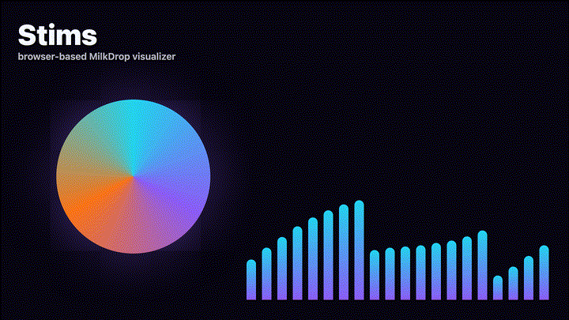

<div align="center">

# Stims

**Browser music visualizer inspired by MilkDrop — press play, get moving visuals, go deeper when you want.**

[](https://toil.fyi)
[](https://github.com/zz-plant/stims/stargazers)
[](./LICENSE)
[](https://bun.sh)
[](https://github.com/zz-plant/stims/discussions)

</div>

<p align="center">
  
  <br>
  <em>Demo audio in one click. Curated presets, live mic/tab input, and deep editing when you want it.</em>
</p>

---

## Try it now

**[→ Launch at toil.fyi](https://toil.fyi)** — no install, no signup. Click play and watch the visuals react.

Curated presets, demo audio, microphone input, YouTube tab capture. All in the browser.

---

## Install locally

```bash
git clone https://github.com/zz-plant/stims.git
cd stims
bun install
bun run dev
```

Open `http://localhost:5173`. That's it.

**Prerequisites:** [Bun](https://bun.sh) 1.3+, a browser with WebGL (WebGPU optional).

See [docs/DEVELOPMENT.md](./docs/DEVELOPMENT.md) for detailed setup, troubleshooting, and production builds.

---

## Features

- **One-click demo playback** — first-time users see visuals instantly, no audio setup required.
- **Curated presets** — browse, preview, and switch smoothly. Pocketful of intros, then dive deeper.
- **Live audio input** — microphone, tab audio, or YouTube-backed tab capture.
- **Preset editor** — live editing with import/export for customization.
- **Cross-device** — desktop keyboard, touch, gamepad, and TV-style remote navigation.
- **Session persistence** — recovers your last audio source and rendering preferences.

---

## Quick reference

```
bun run dev           Start development server
bun run check:quick   Fast quality gate (lint + types)
bun run check         Full quality gate (lint + types + tests)
bun run build         Production build
bun run test          Run unit/integration tests
bun run preview       Preview production build locally
```

---

## Contributing

PRs welcome. Start with [CONTRIBUTING.md](./CONTRIBUTING.md), then check [docs/README.md](./docs/README.md) for the full documentation index.

Questions? Join [GitHub Discussions](https://github.com/zz-plant/stims/discussions).

---

## Project docs

- [Development guide](./docs/DEVELOPMENT.md)
- [Architecture overview](./docs/ARCHITECTURE.md)
- [Preset runtime docs](./docs/MILKDROP_PRESET_RUNTIME.md)
- [Deployment guide](./docs/DEPLOYMENT.md)
- [QA plan](./docs/QA_PLAN.md)
- [Feature specifications](./docs/FEATURE_SPECIFICATIONS.md)

---

## Ecosystem

Stims is part of a broader set of open-source work by [Kanav Jain](https://kanav.net):

- [**sabnzbd-mcp**](https://github.com/zz-plant/sabnzbd-mcp) — MCP server for SABnzbd. Zero deps.
- [**Refract**](https://github.com/refract-org/refract) — Open infrastructure for agent-readable knowledge change.
- [**neckass**](https://github.com/zz-plant/neckass) — Privacy-first headline generator with on-device AI.
- [**ethotechnics.org**](https://github.com/zz-plant/ethotechnics.org) — Essays on ethical technology and human-centered design.

---

## Lineage

Stims is not an official MilkDrop or Winamp release. Credits to original authors, curators, and contributors are maintained in [docs/LINEAGE_AND_CREDITS.md](./docs/LINEAGE_AND_CREDITS.md).
