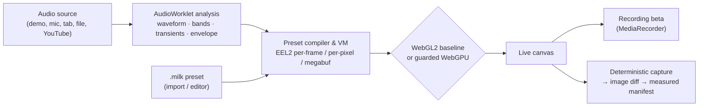

<div align="center">

# Stims

**A browser-native studio for audio-reactive, MilkDrop-inspired visuals**

*Discover, inspect, remix, and record presets—with compatibility claims tied to measured evidence.*

[](https://toil.fyi)
[](https://github.com/zz-plant/stims/stargazers)
[](https://bun.sh)
[](https://toil.fyi)
[](./LICENSE)

[Launch Stims](https://toil.fyi) · [Developer docs](./docs/README.md) · [Compatibility evidence](./docs/MILKDROP_PROJECTM_PARITY_PLAN.md) · [Discussions](https://github.com/zz-plant/stims/discussions)


</div>

[Why Stims](#why-stims) · [What works today](#what-works-today) · [Compatibility and evidence](#compatibility-and-evidence) · [Quick start](#quick-start) · [Documentation](#documentation)

## Why Stims

Stims is an independent browser-native visualizer in the lineage of Ryan Geiss's MilkDrop, Butterchurn, and projectM. It is built as a complete product rather than only an embeddable renderer:

- **Explore** a large preset library with previews, search, collections, favorites, queues, history, and deep links.
- **Author** directly in `.milk` with live editing, compiler diagnostics, parameter controls, import, and export.
- **Verify** compatibility through backend-aware captures and checked-in projectM reference comparisons.
- **Extend** the format through a guarded WebGPU path without treating a newer graphics API as proof of visual fidelity.

The goal is not to claim that every imported preset is visually exact. The goal is to make compatibility visible, improve it systematically, and provide a better browser workflow around the visuals.

## What works today

| Capability | Current behavior |
| --- | --- |
| **1,791-preset catalog** | Searchable and filterable imported catalog with previews, favorites, recent history, queues, and one-click playback. |
| **Direct preset workflow** | Import and export `.milk` files without converting them into a Butterchurn-specific JSON format. |
| **Live preset editor** | CodeMirror editor with MilkDrop completions, diagnostics, snippets, and live controls for values such as `zoom`, `warp`, `rot`, and `decay`. |
| **Multi-source audio** | Built-in demo audio plus microphone, tab, YouTube, and local-file source paths where browser permissions allow them. |
| **WebGL2 + guarded WebGPU** | WebGL2 is the compatibility baseline. WebGPU is additive and can fall back when a compiled preset needs unsupported behavior. |
| **Browser recording beta** | Records the live canvas to common landscape and portrait target dimensions through `MediaRecorder`. See the limitations below. |
| **Shareable sessions** | Preset, collection, audio, tool, and agent state can be retained in URL query parameters. |
| **Automation and proof tooling** | Headless session controls, deterministic capture scripts, projectM reference provenance, and image-diff reports support repeatable QA. |

## Compatibility and evidence

Successful compilation is not the same as visual parity. Catalog entries distinguish runtime evidence from measured visual evidence, and the checked-in certification workflow requires:

1. a Stims capture on the requested backend;
2. a provenance-checked projectM reference;
3. an image-diff result within the declared tolerance; and
4. promotion of that result into the measured manifest.

Most catalog entries currently have runtime evidence only and should not be read as visually certified. The current sources of truth are:

- [`public/milkdrop-presets/catalog.json`](./public/milkdrop-presets/catalog.json) for shipped catalog metadata;
- [`src/data/milkdrop-parity/measured-results.json`](./src/data/milkdrop-parity/measured-results.json) for promoted visual results;
- [`src/data/milkdrop-parity/webgpu-certification-report.json`](./src/data/milkdrop-parity/webgpu-certification-report.json) for the bounded WebGPU certification snapshot; and
- [`docs/MILKDROP_PROJECTM_PARITY_PLAN.md`](./docs/MILKDROP_PROJECTM_PARITY_PLAN.md) for the evidence workflow.

## Experimental foundations

These components are useful engineering foundations, but they are not presented as finished product capabilities:

- **Model-assisted generation beta:** the Generate panel can use a configured hosted model or a loopback OpenAI-compatible endpoint such as Ollama, then validates the returned MilkDrop source before loading it. Hosted availability, local browser configuration, and generated-result quality still need end-to-end proof; blending remains an optional edge API.
- **Semantic and audio-profile search:** optional API-backed experiments supplement the local catalog search path.
- **Stem signals:** the runtime reserves stem-oriented fields, but client-side stem separation is not implemented.
- **MIDI beta:** workspace settings can connect the controller service to live preset parameters. Persistent mappings, recovery behavior, and device-backed verification remain open.
- **XR experiment:** workspace settings can request an immersive session and attach it to the active renderer. Physical-headset visual behavior, spatial audio, and recovery are not yet certified.
- **High-resolution recording beta:** the current implementation can request a native 4K render surface and compose an active audio track when the browser and renderer support them. Output codec, frame pacing, synchronization, and device coverage still require browser-backed proof.

## Technical foundations

1. **Preset compiler and VM** — Parses and executes MilkDrop-style equations, including per-frame, per-pixel, custom-wave, custom-shape, `megabuf`, and `gmegabuf` behavior.
2. **Two rendering paths** — WebGL2 provides the compatibility baseline while WebGPU descriptor and TSL/WGSL paths are introduced behind capability checks and fallback rules.
3. **Off-main-thread audio analysis** — AudioWorklet processing supplies waveform, frequency-band, transient, and energy-envelope data to the runtime.
4. **Browser authoring environment** — The editor, importer, exporter, inspector, and live parameter controls share the same running session.
5. **Evidence-oriented QA** — The repo tracks native projectM references, capture provenance, backend selection, image diffs, and promoted measured results.


```mermaid
flowchart LR
  Audio["Audio source\n(demo, mic, tab, file, YouTube)"] --> Worklet["AudioWorklet analysis\nwaveform · bands · transients · envelope"]
  Worklet --> VM["Preset compiler & VM\nEEL2 per-frame / per-pixel / megabuf"]
  Milk[".milk preset\n(import / editor)"] --> VM
  VM --> Render{"WebGL2 baseline\nor guarded WebGPU"}
  Render --> Canvas["Live canvas"]
  Canvas --> Record["Recording beta\n(MediaRecorder)"]
  Canvas --> Capture["Deterministic capture\n→ image diff → measured manifest"]
```

See [Technical Foundations](./docs/TECHNICAL_ACHIEVEMENTS.md) for the implementation map.

## Quick start

Prerequisites: Bun 1.3+ and a browser with WebGL2 support. WebGPU is optional.

```bash
git clone https://github.com/zz-plant/stims.git
cd stims
bun install
bun run dev
```

Open `http://localhost:5173`.

## Verification commands

```bash
bun run check:quick   # Fast lint, types, metadata, and claim-drift checks
bun run test          # Unit, integration, and compatibility test profiles
bun run check         # Full PR gate
bun run build         # Production bundle
```

The quality gate verifies that the visible preset count matches the public catalog and rejects public README wording that promotes known experimental foundations as shipped features.

## Optional edge APIs

The repository includes Cloudflare Worker routes for generation, blending, visual search, and community presets. They are optional enhancements rather than requirements for local playback or editing. See [the API reference](./docs/api.md) for deployment requirements and endpoint contracts.

## Documentation

| Track | Key documents |
| --- | --- |
| Architecture | [Overview](./docs/ARCHITECTURE.md) · [Technical Foundations](./docs/TECHNICAL_ACHIEVEMENTS.md) · [Preset Runtime](./docs/MILKDROP_PRESET_RUNTIME.md) |
| Presets and proof | [Coding Guide](./docs/MILKDROP_CODING_GUIDE.md) · [Parity Plan](./docs/MILKDROP_PROJECTM_PARITY_PLAN.md) · [Successor Workstreams](./docs/MILKDROP_SUCCESSOR_WORKSTREAMS.md) |
| Development | [Setup](./docs/DEVELOPMENT.md) · [Testing](./docs/TESTING.md) · [Deployment](./docs/DEPLOYMENT.md) |
| Project status | [Implementation Status](./docs/IMPLEMENTATION_STATUS.md) · [Roadmap](./docs/ROADMAP.md) · [Lineage and Credits](./docs/LINEAGE_AND_CREDITS.md) |

## Contributing

Contributions and compatibility reports are welcome. Start with [CONTRIBUTING.md](./CONTRIBUTING.md), and include the tests and evidence appropriate to the surface you change.

## Lineage and license

Stims is an independent implementation. MilkDrop, Butterchurn, and projectM are credited as creative and technical lineage; no official affiliation is implied. See [Lineage and Credits](./docs/LINEAGE_AND_CREDITS.md).

Licensed under the [MIT License](./LICENSE).
