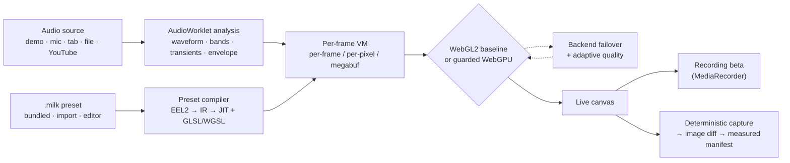

<div align="center">

# Stims

**A browser-native studio for audio-reactive, MilkDrop-inspired visuals**

*Discover, inspect, remix, and record presets—with compatibility claims tied to measured evidence.*

**▶ Try it live — [toil.fyi](https://toil.fyi). Opens in any WebGL2 browser. No account, no install.**

[](https://toil.fyi)
[](https://github.com/zz-plant/stims/stargazers)
[](https://github.com/zz-plant/stims/actions/workflows/ci.yml)
[](https://bun.sh)
[](https://toil.fyi)
[](./LICENSE)

[Launch Stims](https://toil.fyi) · [Developer docs](./docs/README.md) · [Runtime performance evidence](./docs/RUNTIME_PERFORMANCE.md) · [Compatibility evidence](./docs/MILKDROP_PROJECTM_PARITY_PLAN.md) · [Discussions](https://github.com/zz-plant/stims/discussions)

*1,787 presets · live `.milk` editor · WebGL2 + guarded WebGPU · in-browser recording (beta) · public domain (Unlicense)*


<table>
  <tr>
    <td width="33%"></td>
    <td width="33%"></td>
    <td width="33%"></td>
  </tr>
  <tr>
    <td align="center"><sub>Krash &amp; Rovastar — Cerebral Demons</sub></td>
    <td align="center"><sub>Zylot — Crosshair Dimension</sub></td>
    <td align="center"><sub>Martin — Neon Space PS3</sub></td>
  </tr>
  <tr>
    <td></td>
    <td></td>
    <td></td>
  </tr>
  <tr>
    <td align="center"><sub>Eo.S. — Starburst 05 Phasing</sub></td>
    <td align="center"><sub>Aderrasi — Potion of Spirits</sub></td>
    <td align="center"><sub>Orb — Radiation</sub></td>
  </tr>
</table>

<sub>Recorded from the WebGL2 build with <a href="./scripts/generate-readme-clips.ts"><code>scripts/generate-readme-clips.ts</code></a>. Colors are reduced by GIF quantization; the live renderer is smoother and higher-contrast.</sub>

</div>

[Why Stims](#why-stims) · [What works today](#what-works-today) · [How Stims differs](#how-stims-differs-from-other-milkdrop-lineage-projects) · [Compatibility and evidence](#compatibility-and-evidence) · [Quick start](#quick-start) · [Documentation](#documentation)

## Why Stims

Stims is an independent browser-native visualizer in the lineage of Ryan Geiss's MilkDrop, Butterchurn, and projectM. It is built as a complete product rather than only an embeddable renderer:

- **Explore** a large preset library with previews, search, collections, favorites, queues, history, and deep links.
- **Author** directly in `.milk` with live editing, compiler diagnostics, parameter controls, import, and export.
- **Verify** compatibility through backend-aware captures and checked-in projectM reference comparisons.
- **Extend** the format through a guarded WebGPU path without treating a newer graphics API as proof of visual fidelity.

The goal is not to claim that every imported preset is visually exact. The goal is to make compatibility visible, improve it systematically, and provide a better browser workflow around the visuals.

## What works today

Everything here ships in the browser today — no account, no server, no converted preset format.

| Capability | Current behavior |
| --- | --- |
| **1,787-preset catalog** | Searchable and filterable imported catalog with previews, favorites, recent history, queues, and one-click playback. |
| **Direct preset workflow** | Import and export `.milk` files without converting them into a Butterchurn-specific JSON format. |
| **Live preset editor** | CodeMirror editor with MilkDrop completions, diagnostics, snippets, and live controls for values such as `zoom`, `warp`, `rot`, and `decay`. |
| **Multi-source audio** | Built-in demo audio plus microphone, tab, YouTube, and local-file source paths where browser permissions allow them. |
| **WebGL2 + guarded WebGPU** | WebGL2 is the compatibility baseline. WebGPU is additive and can fall back when a compiled preset needs unsupported behavior. |
| **Browser recording beta** | Records the live canvas to common landscape and portrait target dimensions through `MediaRecorder`; its evidence boundary is in [docs/TECHNICAL_ACHIEVEMENTS.md](./docs/TECHNICAL_ACHIEVEMENTS.md). |
| **Shareable sessions** | Preset, collection, audio, tool, and agent state can be retained in URL query parameters. |
| **Automation and proof tooling** | Headless session controls, deterministic capture scripts, projectM reference provenance, and image-diff reports support repeatable QA. |

## How Stims differs from other MilkDrop-lineage projects

Butterchurn and projectM are the projects most people arrive from, and both are
good at what they were built for. Stims occupies a different slot: they are
renderers you embed or run, while Stims is the workflow around one.

| | Stims | Butterchurn | projectM |
| --- | --- | --- | --- |
| **Primary form** | A hosted browser app you use directly | An embeddable JS renderer | A native library and desktop/plugin player |
| **Preset input** | `.milk` source, imported and exported as-is | Presets converted to a Butterchurn JSON format ahead of time | `.milk` source |
| **Authoring** | In-session editor with completions, compiler diagnostics, and live `zoom`/`warp`/`rot`/`decay` controls | No built-in editor; authoring happens elsewhere | No built-in editor; authoring happens elsewhere |
| **Discovery** | Search, filters, collections, previews, favorites, queues, history, deep links | Preset list supplied by the embedding app | Playlist files |
| **Fidelity claims** | Per-preset labels that separate "compiles and runs" from "diffed against a projectM reference" | Broad practical compatibility, established over years of use | The reference implementation this repo diffs against |

What that buys you in practice:

- **Runtime work is measured at the frame seam.** Production browser benchmarks use repeated trials and record delivered cadence, simulation time, render time, resolved WebGPU hardware time when available, backend selection, and adaptive-quality state instead of treating a successful load as proof of speed.
- **Hot equation loops avoid redundant work.** When per-point and per-pixel equations share their runtime scope, the JIT writes each ordinary local result once while retaining differential tests against the interpreter.
- **Rhythm and melody read separately.** Presets can react to percussive and harmonic energy bands independently — transients versus sustained tones — without claiming to separate instruments.
- **Rendering pressure has an explicit fallback path.** Hardware-timed WebGPU pressure can trim render and feedback resolution continuously inside a quality tier; sustained broader pressure can still reduce visual density through the discrete adaptive-quality ladder.
- **Startup work is staged around the first paint.** Renderer-selection probes stay on the critical path; telemetry, automation, and gamepad services load after the shell. The measured cold-load and deploy-build method lives in [the front-end performance audit](./docs/FRONTEND_PERFORMANCE_BOTTLENECKS.md#latest-startup-and-deploy-build-evidence).
- **Presets stay presets.** A `.milk` file loads, runs, edits, and exports as `.milk`. There is no conversion step to run before a preset is usable, and no converted artifact to keep in sync with the original.
- **Editing is part of playback.** The compiler diagnostics, parameter controls, and inspector act on the preset that is on screen right now, so a change is visible in the same session that found the problem.

### Frame-cost benchmark

The fixed-tier browser benchmark compares code changes at the same renderer,
viewport, preset, audio source, and adaptive-quality step. On an Apple M1 Max in
Chromium/WebGPU at 1280×720, the `eos-apocalypse` stress case produced the
following before/after result for commit
[`ac2b354d`](https://github.com/zz-plant/stims/commit/ac2b354d):

| CDP CPU throttle | Median delivered FPS | Average frame work |
| --- | ---: | ---: |
| 1× | 120.48 → 120.48 (display-capped) | 3.43 → 2.87 ms |
| 2× | 120.48 → 120.48 (display-capped) | 7.96 → 6.75 ms |
| 4× | 58.14 → 59.88 | 17.56 → 15.31 ms |
| 6× | 38.61 → 39.68–39.84 | 25.91 → 24.08–24.26 ms |

These numbers are one preset on one host, not a device-wide FPS promise. The
8× tier was too scheduler-sensitive to promote as a stable result. See
[`docs/RUNTIME_PERFORMANCE.md`](./docs/RUNTIME_PERFORMANCE.md) for the exact
2-second warmup, 8-second capture, quality lock, reproduction command, and
interpretation rules. Current runs default to a production build and three
trials, report median/min/max frame work, and reject renderer validation or
device errors as incomplete evidence. Frame cost is also not visual fidelity;
that oracle is the projectM reference workflow in the next section.

## Compatibility and evidence

Successful compilation is not the same as visual parity. Catalog entries distinguish runtime evidence from measured visual evidence, and the checked-in certification workflow requires:

1. a Stims capture on the requested backend;
2. a provenance-checked projectM reference;
3. an image-diff result within the declared tolerance; and
4. promotion of that result into the measured manifest.

Most catalog entries currently have runtime evidence only and should not be read as visually certified. The current sources of truth are:

- [`public/milkdrop-presets/catalog.json`](./public/milkdrop-presets/catalog.json) for shipped catalog metadata;
- [`src/data/milkdrop-parity/measured-results.json`](./src/data/milkdrop-parity/measured-results.json) for promoted visual results;
- [`src/data/milkdrop-parity/webgpu-certification-report.json`](./src/data/milkdrop-parity/webgpu-certification-report.json) for the bounded WebGPU certification snapshot; and
- [`docs/MILKDROP_PROJECTM_PARITY_PLAN.md`](./docs/MILKDROP_PROJECTM_PARITY_PLAN.md) for the evidence workflow.

## Experimental foundations

MIDI control, model-assisted generation, 4K recording, and percussive/harmonic audio signals are experimental: each is documented with its current evidence boundary in [docs/TECHNICAL_ACHIEVEMENTS.md](./docs/TECHNICAL_ACHIEVEMENTS.md) and tracked in [docs/ROADMAP.md](./docs/ROADMAP.md). None is presented as a finished product capability.

## Technical foundations

1. **Preset compiler and VM** — Parses and executes MilkDrop-style equations, including per-frame, per-pixel, custom-wave, custom-shape, `megabuf`, and `gmegabuf` behavior.
2. **Two rendering paths** — WebGL2 provides the compatibility baseline while WebGPU descriptor and TSL/WGSL paths are introduced behind capability checks and fallback rules.
3. **Off-main-thread audio analysis** — AudioWorklet processing supplies waveform, frequency-band, transient, and energy-envelope data to the runtime.
4. **Browser authoring environment** — The editor, importer, exporter, inspector, and live parameter controls share the same running session.
5. **Evidence-oriented QA** — The repo tracks native projectM references, capture provenance, backend selection, image diffs, and promoted measured results.


```mermaid
flowchart LR
  Audio["Audio source<br/>demo · mic · tab · file · YouTube"] --> Worklet["AudioWorklet analysis<br/>waveform · bands · transients · envelope"]
  Milk[".milk preset<br/>bundled · import · editor"] --> Compiler["Preset compiler<br/>EEL2 → IR → JIT + GLSL/WGSL"]
  Worklet --> VM["Per-frame VM<br/>per-frame / per-pixel / megabuf"]
  Compiler --> VM
  VM --> Render{"WebGL2 baseline<br/>or guarded WebGPU"}
  Render -.-> Fallback["Backend failover<br/>+ adaptive quality"] -.-> Render
  Render --> Canvas["Live canvas"]
  Canvas --> Record["Recording beta<br/>(MediaRecorder)"]
  Canvas --> Capture["Deterministic capture<br/>→ image diff → measured manifest"]
```

See [Technical Foundations](./docs/TECHNICAL_ACHIEVEMENTS.md) for the implementation map.

## Quick start

Prerequisites: Bun 1.3+ and a browser with WebGL2 support. WebGPU is optional.

```bash
git clone https://github.com/zz-plant/stims.git
cd stims
bun install
bun run dev
```

Open `http://localhost:5173`.

## Verification commands

```bash
bun run check:quick   # Fast lint, types, metadata, and claim-drift checks
bun run test          # Unit, integration, and compatibility test profiles
bun run check         # Full PR gate
bun run build         # Production bundle build
```

The quality gate verifies that the visible preset count matches the public catalog and rejects public README wording that promotes known experimental foundations as shipped features.

## Optional edge APIs

The repository includes Cloudflare Worker routes for generation, blending, visual search, and community presets. They are optional enhancements rather than requirements for local playback or editing. See [the API reference](./docs/api.md) for deployment requirements and endpoint contracts.

## Documentation

Architecture, authoring, parity, and QA docs are indexed at [docs/README.md](./docs/README.md).

## Contributing

Contributions and compatibility reports are welcome. Start with [CONTRIBUTING.md](./CONTRIBUTING.md), and include the tests and evidence appropriate to the surface you change.

## Star history

[](https://star-history.com/#zz-plant/stims&Date)

## Acknowledgments and lineage

Stims is built with deep gratitude for the creative, mathematical, and technical giants whose work pioneered real-time audio visualization:

- **Ryan Geiss & MilkDrop**: For creating the original MilkDrop visualizer, Winamp plugin, and per-pixel math expression language that defined an entire digital art form.
- **Jordan Berg (`jberg`) & Butterchurn Contributors**: For pioneering web-based MilkDrop rendering in WebGL and establishing open-source web preset parsing patterns.
- **Carmelo Piccione, Mischa Spiegelmock & projectM Maintainers**: For building and maintaining projectM, the open-source C++ reference implementation used as our gold-standard visual parity reference target.
- **The MilkDrop Preset Author Community**: Gratitude to the authors whose math and artistic vision power the 1,787 catalog presets. The most-credited handles in the shipped catalog, counting every appearance in an accretive credit chain rather than only solo bylines, are *Geiss, Flexi, Martin, Rovastar, Eo.S., Stahlregen, Unchained, fiShbRaiN, Phat, Aderrasi, Shifter, Zylot, ORB, suksma, Cope, Goody, and Krash* — alongside roughly 120 more.
- **Nullsoft & Winamp**: For providing the legendary software platform that brought music visualization to millions worldwide.

Stims is an independent implementation. MilkDrop, Butterchurn, and projectM are credited as creative and technical lineage; no official affiliation is implied. See [Lineage and Credits](./docs/LINEAGE_AND_CREDITS.md).

Licensed under [the Unlicense](./LICENSE) — public domain.
