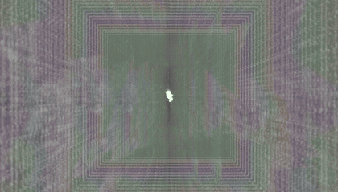
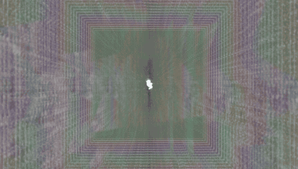
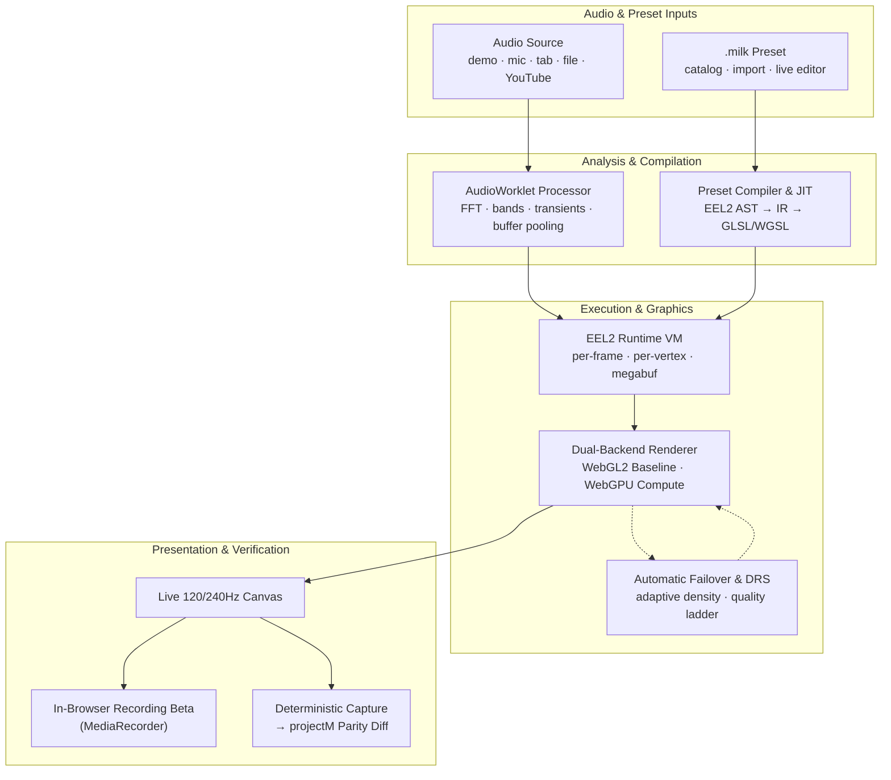

<div align="center">

# Stims

**Winamp's MilkDrop in the browser. Play and live-edit the original `.milk` presets, point them at any audio, and share what you see as a link.**

*Browse, edit, remix, and record presets. Compatibility labels come from measurements, not guesses.*

**▶ Try it live — [toil.fyi](https://toil.fyi). Opens in any WebGL2 browser. No account, no install.**

[](https://toil.fyi)
[](https://github.com/zz-plant/stims/stargazers)
[](https://github.com/zz-plant/stims/actions/workflows/ci.yml)
[](https://bun.sh)
[](https://toil.fyi)
[](./LICENSE)

[Launch Stims](https://toil.fyi) · [Developer docs](./docs/README.md) · [Runtime performance evidence](./docs/RUNTIME_PERFORMANCE.md) · [Compatibility evidence](./docs/MILKDROP_PROJECTM_PARITY_PLAN.md) · [Discussions](https://github.com/zz-plant/stims/discussions)

*1,787 presets, curated first · live `.milk` editor · deep-linkable sessions · WebGL2, plus WebGPU where supported · fine-grained sensory controls · public domain (Unlicense)*


### Presets

<table>
  <tr>
    <td width="25%"><a href="https://toil.fyi/?preset=geiss-casino"></a></td>
    <td width="25%"><a href="https://toil.fyi/?preset=eos-glowsticks-v2-03-music"></a></td>
    <td width="25%"><a href="https://toil.fyi/?preset=martin-neon-space-ps3"></a></td>
    <td width="25%"><a href="https://toil.fyi/?preset=krash-rovastar-cerebral-demons-stars"></a></td>
  </tr>
  <tr>
    <td align="center"><sub><b>Geiss</b> — Casino</sub></td>
    <td align="center"><sub><b>Eo.S.</b> — Glowsticks v2</sub></td>
    <td align="center"><sub><b>Martin</b> — Neon Space PS3</sub></td>
    <td align="center"><sub><b>Krash &amp; Rovastar</b> — Cerebral Demons</sub></td>
  </tr>
  <tr>
    <td width="25%"><a href="https://toil.fyi/?preset=zylot-crosshair-dimension-light-of-ages"></a></td>
    <td width="25%"><a href="https://toil.fyi/?preset=eos-starburst-05-phasing"></a></td>
    <td width="25%"><a href="https://toil.fyi/?preset=aderrasi-potion-of-spirits"></a></td>
    <td width="25%"><a href="https://toil.fyi/?preset=orb-radiation"></a></td>
  </tr>
  <tr>
    <td align="center"><sub><b>Zylot</b> — Crosshair Dimension</sub></td>
    <td align="center"><sub><b>Eo.S.</b> — Starburst 05 Phasing</sub></td>
    <td align="center"><sub><b>Aderrasi</b> — Potion of Spirits</sub></td>
    <td align="center"><sub><b>Orb</b> — Radiation</sub></td>
  </tr>
</table>

<sub>Recorded from the WebGL2 build with <a href="./scripts/generate-readme-clips.ts"><code>scripts/generate-readme-clips.ts</code></a>. GIF encoding reduces the colors; the live renderer is smoother and higher-contrast. Each clip links to that preset, playing, in your browser.</sub>

</div>

## Send it to someone

Open [toil.fyi](https://toil.fyi) and a preset is already animating, silently, until you start some audio. A deep link skips the start screen: **demo audio starts and the named preset plays**, with nothing to click.

**[toil.fyi/?preset=krash-rovastar-cerebral-demons-stars](https://toil.fyi/?preset=krash-rovastar-cerebral-demons-stars)** — *Krash & Rovastar — Cerebral Demons (Stars Remix)*, also the first-run preset, chosen by measurement.

The address bar always holds the current session: the preset, the collection, and the audio source (a tab, a YouTube link). Copy it and the recipient opens the same thing. The in-app **Share** button copies the same link with the preset's title. If you edited the preset, the edited source goes in the URL too, and opens in the recipient's editor.

## For stimmers

MilkDrop has a real neurodivergent following, so the controls ship for them: audio-silent until you start it, one action stops everything, motion that follows your operating system's reduce-motion setting, and transitions you set. For some people — including autistic and ADHD people — that much control over the pace and intensity of sensory input is, as part of managing sensory environments generally, linked to more comfort with stimulation, not less. That is a claim about the controls existing, not a medical claim about what they do: the evidence and its limits live in the [accessibility guide](./docs/guides/accessibility.md) and the [sensory research program](./docs/SENSORY_ACCESSIBILITY.md).

[Send it to someone](#send-it-to-someone) · [For stimmers](#for-stimmers) · [Why Stims](#why-stims) · [How it works](#how-it-works) · [What works today](#what-works-today) · [How Stims differs](#how-stims-differs-from-other-milkdrop-lineage-projects) · [Compatibility and evidence](#compatibility-and-evidence) · [Technical foundations](#technical-foundations) · [Quick start](#quick-start) · [Contributing](#contributing)

---

## Why Stims

Stims is an independent browser visualizer in the line of Ryan Geiss's MilkDrop, Butterchurn, and projectM. Those are renderers; Stims is an app built around one, for finding, editing, and sharing presets:

- **Browse** a 1,787-preset library with previews, search, collections, favorites, queues, history, and deep links.
- **Edit and remix** `.milk` source live, with compiler diagnostics, parameter controls, A/B snapshots, import, and export.
- **Verify** compatibility through backend-aware captures and checked-in projectM reference comparisons.
- **Run on WebGPU** where the browser supports it. Running there says nothing about fidelity; that is measured separately.

Not every imported preset renders exactly as it did in MilkDrop. Stims shows which ones have been checked and how closely they match.

Audio can come from a browser tab, a YouTube link, a microphone, or a local file. Presets react to what is measured from it: frequency bands, transients, and beat timing. The controls over pace and intensity are covered under [For stimmers](#for-stimmers).

---

## How it works

### `.milk` compiled in the browser
Butterchurn needs presets converted to JSON ahead of time. Stims compiles `.milk` source as it loads:
- **EEL2 to IR.** Equations parse to an AST and an intermediate representation, which runs on an interpreter, a CPU JIT, or WebGPU compute shaders in WGSL.
- **Shared scope.** When per-point and per-pixel equations share a scope, redundant property writes are skipped.
- **MilkDrop's memory model.** The 4MB `megabuf` (per VM) and 4MB `gmegabuf` (shared across preset switches) are implemented, and kept in sync between CPU and GPU.

### Editing while it plays
- **CodeMirror editor** with syntax highlighting, MilkDrop completions, snippets, and compiler diagnostics as you type.
- **Sliders** for `zoom`, `warp`, `rot`, `decay`, `dx`, and `dy`. If the preset's own equations overwrite a value every frame, the slider says so.
- **A/B snapshots.** Save the current state to slot A, keep editing in slot B, and switch between them with `Cmd/Ctrl+Shift+B` or the toolbar button.

### Checking against projectM
- **Reference captures.** Frames come from native projectM (C++, SDL2, OpenGL) rendered offscreen, with a sidecar file recording how each was made.
- **Noise bands (`parity:noise`).** Each preset's run-to-run variation is measured first, so a diff has to exceed that before it counts.
- **Deterministic stepping.** Frames are stepped on a fixed clock (`renderFrames({ holdAfterPump })`) so Stims and the reference compare the same frame.

### Audio
- **AudioWorklet analysis.** FFT, frequency bands, transients, and energy are computed on the audio thread, off the main loop.
- **Spectrum textures.** Frequency and waveform data are packed into one GPU texture that the warp and composite shaders sample.
- **Sources.** Demo audio, microphone, browser tab, YouTube, and local files; you can switch between them mid-session.

---

## What works today

Everything here ships in the browser today — no account, no server, no converted preset format.

| Capability | Current behavior |
| --- | --- |
| **1,787-preset catalog** | Searchable and filterable imported catalog with previews, favorites, recent history, queues, and one-click playback. Curated picks sort first; every entry ships a measured quality score, with runtime evidence tracked separately from visual certification. |
| **Direct preset workflow** | Import and export `.milk` files without converting them into a Butterchurn-specific JSON format. |
| **Live preset editor** | CodeMirror editor with MilkDrop completions, diagnostics, snippets, and live controls for values such as `zoom`, `warp`, `rot`, and `decay`. |
| **Multi-source audio** | Built-in demo audio plus microphone, tab, YouTube, and local-file source paths where browser permissions allow them. |
| **Sensory controls** | Nothing plays until you start an audio source; one action stops everything; Cut or Blend transitions over a duration you set; honors your operating system's reduce-motion setting; your last session and settings come back where you left them. |
| **WebGL2 + guarded WebGPU** | WebGL2 is the compatibility baseline. WebGPU is additive and can fall back when a compiled preset needs unsupported behavior. |
| **Browser recording beta** | Records the live canvas to common landscape and portrait target dimensions through `MediaRecorder`; its evidence boundary is in [docs/TECHNICAL_ACHIEVEMENTS.md](./docs/TECHNICAL_ACHIEVEMENTS.md). |
| **Shareable sessions** | Preset, collection, audio, tool, and agent state can be retained in URL query parameters; the in-app Share button copies a ready-to-paste link. |
| **Automation and proof tooling** | Headless session controls, deterministic capture scripts, projectM reference provenance, and image-diff reports support repeatable QA. |

---

## How Stims differs from other MilkDrop-lineage projects

Butterchurn and projectM are the projects most people arrive from, and both are
good at what they were built for. Stims occupies a different slot: they are
renderers you embed or run, while Stims is the workflow around one.

| | Stims | Butterchurn | projectM |
| --- | --- | --- | --- |
| **Primary form** | A hosted browser app you use directly | An embeddable JS renderer | A native library and desktop/plugin player |
| **Preset input** | `.milk` source, imported and exported as-is | Presets converted to a Butterchurn JSON format ahead of time | `.milk` source |
| **Authoring** | In-session editor with completions, compiler diagnostics, and live `zoom`/`warp`/`rot`/`decay` controls | No built-in editor; authoring happens elsewhere | No built-in editor; authoring happens elsewhere |
| **Discovery** | Search, filters, collections, previews, favorites, queues, history, deep links | Preset list supplied by the embedding app | Playlist files |
| **Fidelity claims** | Per-preset labels that separate "compiles and runs" from "diffed against a projectM reference" | Broad practical compatibility, established over years of use | The reference implementation this repo diffs against |

What that buys you in practice:

- **Runtime work is measured at the frame seam.** Production browser benchmarks use repeated trials and record delivered cadence, simulation time, render time, resolved WebGPU hardware time when available, backend selection, and adaptive-quality state instead of treating a successful load as proof of speed.
- **Hot equation loops avoid redundant work.** When per-point and per-pixel equations share their runtime scope, the JIT writes each ordinary local result once while retaining differential tests against the interpreter.
- **Rhythm and melody read separately.** Presets can react to percussive and harmonic energy bands independently — transients versus sustained tones — without claiming to separate instruments.
- **Rendering pressure has an explicit fallback path.** Hardware-timed WebGPU pressure can trim render and feedback resolution continuously inside a quality tier; sustained broader pressure can still reduce visual density through the discrete adaptive-quality ladder.
- **Startup work is staged around the first paint.** Renderer-selection probes stay on the critical path; telemetry, automation, and gamepad services load after the shell. The measured cold-load and deploy-build method lives in [the front-end performance audit](./docs/FRONTEND_PERFORMANCE_BOTTLENECKS.md#latest-startup-and-deploy-build-evidence).
- **Presets stay presets.** A `.milk` file loads, runs, edits, and exports as `.milk`. There is no conversion step to run before a preset is usable, and no converted artifact to keep in sync with the original.
- **Editing is part of playback.** The compiler diagnostics, parameter controls, and inspector act on the preset that is on screen right now, so a change is visible in the same session that found the problem.

### Frame-cost benchmark

The fixed-tier browser benchmark compares code changes at the same renderer,
viewport, preset, audio source, and adaptive-quality step. On an Apple M1 Max in
Chromium/WebGPU at 1280×720, the `eos-apocalypse` stress case produced the
following before/after result for commit
[`ac2b354d`](https://github.com/zz-plant/stims/commit/ac2b354d):

| CDP CPU throttle | Median delivered FPS | Average frame work |
| --- | ---: | ---: |
| 1× | 120.48 → 120.48 (display-capped) | 3.43 → 2.87 ms |
| 2× | 120.48 → 120.48 (display-capped) | 7.96 → 6.75 ms |
| 4× | 58.14 → 59.88 | 17.56 → 15.31 ms |
| 6× | 38.61 → 39.68–39.84 | 25.91 → 24.08–24.26 ms |

These numbers are one preset on one host, not a device-wide FPS promise. The
8× tier was too scheduler-sensitive to promote as a stable result. See
[`docs/RUNTIME_PERFORMANCE.md`](./docs/RUNTIME_PERFORMANCE.md) for the exact
2-second warmup, 8-second capture, quality lock, reproduction command, and
interpretation rules. Current runs default to a production build and three
trials, report median/min/max frame work, and reject renderer validation or
device errors as incomplete evidence. Frame cost is also not visual fidelity;
that oracle is the projectM reference workflow in the next section.

---

## Compatibility and evidence

Successful compilation is not the same as visual parity. Catalog entries distinguish runtime evidence from measured visual evidence, and the checked-in certification workflow requires:

1. a Stims capture on the requested backend;
2. a provenance-checked projectM reference;
3. an image-diff result within the declared tolerance; and
4. promotion of that result into the measured manifest.

Most catalog entries currently have runtime evidence only and should not be read as visually certified. The current sources of truth are:

- [`public/milkdrop-presets/catalog.json`](./public/milkdrop-presets/catalog.json) for shipped catalog metadata;
- [`src/data/milkdrop-parity/measured-results.json`](./src/data/milkdrop-parity/measured-results.json) for promoted visual results;
- [`src/data/milkdrop-parity/webgpu-certification-report.json`](./src/data/milkdrop-parity/webgpu-certification-report.json) for the bounded WebGPU certification snapshot; and
- [`docs/MILKDROP_PROJECTM_PARITY_PLAN.md`](./docs/MILKDROP_PROJECTM_PARITY_PLAN.md) for the evidence workflow.

---

## Technical foundations


```mermaid
flowchart TB
  subgraph InputLayer ["Audio & Preset Inputs"]
    Audio["Audio Source<br/>demo · mic · tab · file · YouTube"]
    Milk[".milk Preset<br/>catalog · import · live editor"]
  end

  subgraph ProcessingLayer ["Analysis & Compilation"]
    Worklet["AudioWorklet Processor<br/>FFT · bands · transients · buffer pooling"]
    Compiler["Preset Compiler & JIT<br/>EEL2 AST → IR → GLSL/WGSL"]
  end

  subgraph RuntimeLayer ["Execution & Graphics"]
    VM["EEL2 Runtime VM<br/>per-frame · per-vertex · megabuf"]
    Renderer["Dual-Backend Renderer<br/>WebGL2 Baseline · WebGPU Compute"]
    Fallback["Automatic Failover & DRS<br/>adaptive density · quality ladder"]
  end

  subgraph OutputLayer ["Presentation & Verification"]
    Canvas["Live 120/240Hz Canvas"]
    Record["In-Browser Recording Beta<br/>(MediaRecorder)"]
    Diff["Deterministic Capture<br/>→ projectM Parity Diff"]
  end

  Audio --> Worklet
  Milk --> Compiler
  Worklet --> VM
  Compiler --> VM
  VM --> Renderer
  Renderer -.-> Fallback -.-> Renderer
  Renderer --> Canvas
  Canvas --> Record
  Canvas --> Diff
```

See [Technical Foundations](./docs/TECHNICAL_ACHIEVEMENTS.md) for the implementation map.

---

## Quick start

Prerequisites: Bun 1.3.14+ and a browser with WebGL2 support. WebGPU is optional.

```bash
git clone https://github.com/zz-plant/stims.git
cd stims
bun install
bun run dev
```

Open `http://localhost:5173`.

---

## Verification commands

```bash
bun run check:quick   # Fast lint, types, metadata, and claim-drift checks
bun run test          # Unit, integration, and compatibility test profiles
bun run check         # PR gate (unit + compat + parity corpus — 2,800+ tests)
bun run check:all     # Adds the serial, browser-backed e2e suite
bun run build         # Production bundle build
```

The quality gate verifies that the visible preset count matches the public catalog and rejects public README wording that promotes known experimental foundations as shipped features.

---

## Optional edge APIs

The repository includes Cloudflare Worker routes for generation, blending, visual search, and community presets. They are optional enhancements rather than requirements for local playback or editing. See [the API reference](./docs/api.md) for deployment requirements and endpoint contracts.

---

## Documentation

Architecture, authoring, parity, and QA docs are indexed at [docs/README.md](./docs/README.md).

---

## Contributing

Contributions and compatibility reports are welcome. Start with [CONTRIBUTING.md](./CONTRIBUTING.md); [docs/ONBOARDING.md](./docs/ONBOARDING.md) maps the codebase, and `bun run dev:agent` is the warm dev loop (dev server, typecheck watch, fast tests watch). Compatibility changes should bring a test and its evidence artifact.

---

## Star history

[](https://star-history.com/#zz-plant/stims&Date)

---

## Acknowledgments and lineage

Stims depends on work by:

- **Ryan Geiss**, who wrote MilkDrop, the Winamp plugin, and the per-frame and per-pixel equation language presets are written in.
- **Jordan Berg (`jberg`) and the Butterchurn contributors**, who first ran MilkDrop presets in WebGL and whose preset parsing Stims learned from.
- **Carmelo Piccione, Mischa Spiegelmock, and the projectM maintainers**, whose C++ implementation is the reference Stims measures itself against.
- **The MilkDrop preset authors**, who wrote the 1,787 presets in the catalog. The most-credited handles in the shipped catalog, counting every appearance in an accretive credit chain rather than only solo bylines, are *Geiss, Flexi, Martin, Rovastar, Eo.S., Stahlregen, Unchained, fiShbRaiN, Phat, Aderrasi, Shifter, Zylot, ORB, suksma, Cope, Goody, and Krash* — alongside roughly 120 more.
- **Nullsoft**, whose Winamp is where MilkDrop ran.

Stims is an independent implementation. MilkDrop, Butterchurn, and projectM are credited as creative and technical lineage; no official affiliation is implied. See [Lineage and Credits](./docs/LINEAGE_AND_CREDITS.md).

Licensed under [the Unlicense](./LICENSE) — public domain.

