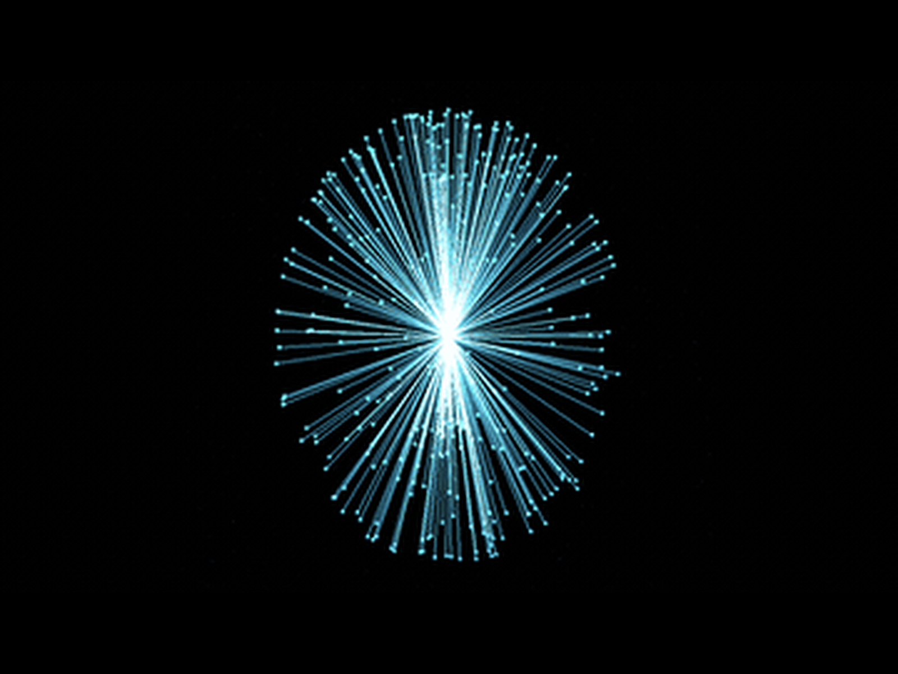
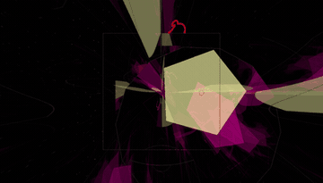
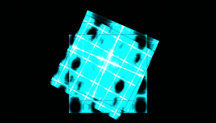
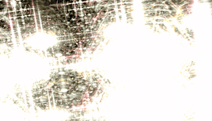
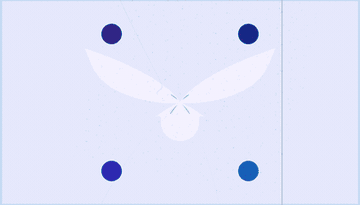
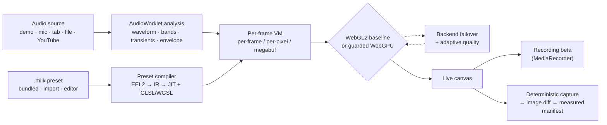

<div align="center">

# Stims

**A browser-native studio for audio-reactive, MilkDrop-inspired visuals**

*Discover, inspect, remix, and record presets—with compatibility claims tied to measured evidence.*

[](https://toil.fyi)
[](https://github.com/zz-plant/stims/stargazers)
[](https://bun.sh)
[](https://toil.fyi)
[](./LICENSE)

[Launch Stims](https://toil.fyi) · [Developer docs](./docs/README.md) · [Compatibility evidence](./docs/MILKDROP_PROJECTM_PARITY_PLAN.md) · [Discussions](https://github.com/zz-plant/stims/discussions)



<table>
  <tr>
    <td width="33%"></td>
    <td width="33%"></td>
    <td width="33%"></td>
  </tr>
  <tr>
    <td align="center"><sub>Krash &amp; Rovastar — Cerebral Demons</sub></td>
    <td align="center"><sub>Zylot — Crosshair Dimension</sub></td>
    <td align="center"><sub>Martin — Neon Space PS3</sub></td>
  </tr>
  <tr>
    <td></td>
    <td></td>
    <td></td>
  </tr>
  <tr>
    <td align="center"><sub>Eo.S. — Starburst 05 Phasing</sub></td>
    <td align="center"><sub>Aderrasi — Potion of Spirits</sub></td>
    <td align="center"><sub>Orb — Radiation</sub></td>
  </tr>
</table>

<sub>Recorded from the WebGL2 build with <a href="./scripts/generate-readme-clips.ts"><code>scripts/generate-readme-clips.ts</code></a>. Colors are reduced by GIF quantization; the live renderer is smoother and higher-contrast.</sub>

</div>

[Why Stims](#why-stims) · [What works today](#what-works-today) · [How Stims differs](#how-stims-differs-from-other-milkdrop-lineage-projects) · [Compatibility and evidence](#compatibility-and-evidence) · [Quick start](#quick-start) · [Documentation](#documentation)

## Why Stims

Stims is an independent browser-native visualizer in the lineage of Ryan Geiss's MilkDrop, Butterchurn, and projectM. It is built as a complete product rather than only an embeddable renderer:

- **Explore** a large preset library with previews, search, collections, favorites, queues, history, and deep links.
- **Author** directly in `.milk` with live editing, compiler diagnostics, parameter controls, import, and export.
- **Verify** compatibility through backend-aware captures and checked-in projectM reference comparisons.
- **Extend** the format through a guarded WebGPU path without treating a newer graphics API as proof of visual fidelity.

The goal is not to claim that every imported preset is visually exact. The goal is to make compatibility visible, improve it systematically, and provide a better browser workflow around the visuals.

## What works today

| Capability | Current behavior |
| --- | --- |
| **1,787-preset catalog** | Searchable and filterable imported catalog with previews, favorites, recent history, queues, and one-click playback. |
| **Direct preset workflow** | Import and export `.milk` files without converting them into a Butterchurn-specific JSON format. |
| **Live preset editor** | CodeMirror editor with MilkDrop completions, diagnostics, snippets, and live controls for values such as `zoom`, `warp`, `rot`, and `decay`. |
| **Multi-source audio** | Built-in demo audio plus microphone, tab, YouTube, and local-file source paths where browser permissions allow them. |
| **WebGL2 + guarded WebGPU** | WebGL2 is the compatibility baseline. WebGPU is additive and can fall back when a compiled preset needs unsupported behavior. |
| **Browser recording beta** | Records the live canvas to common landscape and portrait target dimensions through `MediaRecorder`. See the limitations below. |
| **Shareable sessions** | Preset, collection, audio, tool, and agent state can be retained in URL query parameters. |
| **Automation and proof tooling** | Headless session controls, deterministic capture scripts, projectM reference provenance, and image-diff reports support repeatable QA. |

## How Stims differs from other MilkDrop-lineage projects

Butterchurn and projectM are the projects most people arrive from, and both are
good at what they were built for. Stims occupies a different slot: they are
renderers you embed or run, while Stims is the workflow around one.

| | Stims | Butterchurn | projectM |
| --- | --- | --- | --- |
| **Primary form** | A hosted browser app you use directly | An embeddable JS renderer | A native library and desktop/plugin player |
| **Preset input** | `.milk` source, imported and exported as-is | Presets converted to a Butterchurn JSON format ahead of time | `.milk` source |
| **Authoring** | In-session editor with completions, compiler diagnostics, and live `zoom`/`warp`/`rot`/`decay` controls | No built-in editor; authoring happens elsewhere | No built-in editor; authoring happens elsewhere |
| **Discovery** | Search, filters, collections, previews, favorites, queues, history, deep links | Preset list supplied by the embedding app | Playlist files |
| **Rendering** | WebGL2 baseline with an additive, guarded WebGPU path | WebGL2 | Native OpenGL / OpenGL ES |
| **Fidelity claims** | Per-preset labels that separate "compiles and runs" from "diffed against a projectM reference" | Broad practical compatibility, established over years of use | The reference implementation this repo diffs against |
| **Frame cost** (measured, see below) | 1.00 ms median · 1.40 ms p95 | 1.00 ms median · 6.60 ms p95 | Not measured here |

What that buys you in practice:

- **Presets stay presets.** A `.milk` file loads, runs, edits, and exports as `.milk`. There is no conversion step to run before a preset is usable, and no converted artifact to keep in sync with the original.
- **Editing is part of playback.** The compiler diagnostics, parameter controls, and inspector act on the preset that is on screen right now, so a change is visible in the same session that found the problem.
- **Fidelity is a measurement, not an assertion.** A catalog entry says whether it has been compared against a provenance-checked projectM capture, or only that it compiles and runs. Most entries are currently the latter, and they say so.
- **Frame cost is steady rather than lowest.** Butterchurn renders the average frame faster; Stims renders the *worst* frame faster, and it is the worst frames a viewer perceives as stutter.

### Frame-cost benchmark

`bun run bench:butterchurn` renders the same presets through both engines and
reports the numbers in the table above. Both engines are measured alone in their
own browser process, at an identical drawing buffer, with `gl.finish()` inside
the timed region; medians and p95 are reported rather than means, because a
single shader-compile hitch dominates a mean. The script documents the rest of
its fairness controls, and every one of them exists because leaving it out
produced a wrong number first.

The run behind the table: all 12 sampled presets compared, none skipped, WebGL,
1521×865, on one machine. Read it as a shape, not a score — absolute numbers
move with hardware, a different preset sample would shift the medians, and
repeat runs of the same code have varied by roughly 10%. The shape is the
durable part: **Stims sits between 0.90 and 1.00 ms on every preset measured,
while Butterchurn ranges from 0.40 to 5.30 ms.** Butterchurn is faster on simple
presets and slower on complex ones; Stims costs about the same either way.
On the heaviest preset in the sample Stims renders at 0.19× Butterchurn's frame
cost.

Treat the medians as parity rather than a win: they are equal here, and 10% run
variance is larger than any gap between them. The p95 difference is the one
wide enough to survive that noise.

What this comparison does **not** include is a *fidelity* benchmark. The numbers
above are frame cost only — they say nothing about whether the two engines draw
the same thing. Stims has
never been image-diffed against Butterchurn: the only external reference target
in this repo is projectM, and most catalog entries have not been measured
against that either. The Butterchurn-derived corpus is checked for whether
Stims compiles and runs it ([`scripts/sweep-butterchurn-support.ts`](./scripts/sweep-butterchurn-support.ts),
[`tests/corpus/butterchurn-corpus-support.test.ts`](./tests/corpus/butterchurn-corpus-support.test.ts)),
which is a compatibility signal, not a visual one. Butterchurn also remains the
more established choice for embedding a visualizer inside another app.

## Compatibility and evidence

Successful compilation is not the same as visual parity. Catalog entries distinguish runtime evidence from measured visual evidence, and the checked-in certification workflow requires:

1. a Stims capture on the requested backend;
2. a provenance-checked projectM reference;
3. an image-diff result within the declared tolerance; and
4. promotion of that result into the measured manifest.

Most catalog entries currently have runtime evidence only and should not be read as visually certified. The current sources of truth are:

- [`public/milkdrop-presets/catalog.json`](./public/milkdrop-presets/catalog.json) for shipped catalog metadata;
- [`src/data/milkdrop-parity/measured-results.json`](./src/data/milkdrop-parity/measured-results.json) for promoted visual results;
- [`src/data/milkdrop-parity/webgpu-certification-report.json`](./src/data/milkdrop-parity/webgpu-certification-report.json) for the bounded WebGPU certification snapshot; and
- [`docs/MILKDROP_PROJECTM_PARITY_PLAN.md`](./docs/MILKDROP_PROJECTM_PARITY_PLAN.md) for the evidence workflow.

## Experimental foundations

These components are useful engineering foundations, but they are not presented as finished product capabilities:

- **Model-assisted generation beta:** the Generate panel can use a configured hosted model or a loopback OpenAI-compatible endpoint such as Ollama, then validates the returned MilkDrop source before loading it. Hosted availability, local browser configuration, and generated-result quality still need end-to-end proof; blending remains an optional edge API.
- **Semantic and audio-profile search:** optional API-backed experiments supplement the local catalog search path.
- **Harmonic/percussive signals:** the runtime splits each spectrum frame into transient/broadband ("percussive") and sustained/tonal ("harmonic") energy using median-filter HPSS — a median across time estimates what is sustained, a median across neighbouring frequency bins estimates what is broadband, and Wiener-style soft masks divide the frame's energy between them. Presets read `percussive`, `harmonic`, `percussive_low` (20-250 Hz), `percussive_mid` (250-4000 Hz), `percussive_high` (above 4 kHz), and `percussive_ratio`, alongside the existing `bass`/`mid`/`treb` bands. This is **not stem separation**: nothing here isolates drums, bass, vocals, or any other instrument, no source-separation model is involved, and a percussive reading in a frequency range is not proof that a particular drum played — `percussive_low` rises for any low-frequency transient, whether that is a kick, a slap bass note, or a door slam. The signals are named for the property they measure, not for the instrument a listener might infer. They resolve wherever `bass`/`mid`/`treb` do — per-frame and per-pixel equations, the GPU per-frame compute path, and warp/comp shader bodies on both the WebGL and WebGPU backends — reading their neutral defaults (1, and 0.5 for `percussive_ratio`) until audio arrives.
- **MIDI beta:** workspace settings connect the controller service to live preset parameters. Bindings persist to `localStorage` scoped per device, so two controllers do not collide on the same CC number, and device connect/disconnect is tracked. Parameters can also be driven through a virtual-device path for automation. Verification against physical hardware is still open.
- **WebXR experiment:** on browsers reporting an `immersive-vr` device, an "Enter VR" item appears in the stage overflow menu and hands the active WebGL renderer to a WebXR session; exiting restores the normal render loop. Nothing appears on hardware without a headset. WebGL only — the WebGPU backend declines rather than pretending. No controller input, hand tracking, spatial audio, or AR, and presets get no stereo-specific tuning. Unit-tested and confirmed not to affect non-XR browsers, but **never run on physical VR hardware** — that a session actually presents correctly is unproven.
- **High-resolution recording beta:** the current implementation can request a native 4K render surface and compose an active audio track when the browser and renderer support them. Output codec, frame pacing, synchronization, and device coverage still require browser-backed proof.

## Technical foundations

1. **Preset compiler and VM** — Parses and executes MilkDrop-style equations, including per-frame, per-pixel, custom-wave, custom-shape, `megabuf`, and `gmegabuf` behavior.
2. **Two rendering paths** — WebGL2 provides the compatibility baseline while WebGPU descriptor and TSL/WGSL paths are introduced behind capability checks and fallback rules.
3. **Off-main-thread audio analysis** — AudioWorklet processing supplies waveform, frequency-band, transient, and energy-envelope data to the runtime.
4. **Browser authoring environment** — The editor, importer, exporter, inspector, and live parameter controls share the same running session.
5. **Evidence-oriented QA** — The repo tracks native projectM references, capture provenance, backend selection, image diffs, and promoted measured results.


```mermaid
flowchart LR
  Audio["Audio source<br/>demo · mic · tab · file · YouTube"] --> Worklet["AudioWorklet analysis<br/>waveform · bands · transients · envelope"]
  Milk[".milk preset<br/>bundled · import · editor"] --> Compiler["Preset compiler<br/>EEL2 → IR → JIT + GLSL/WGSL"]
  Worklet --> VM["Per-frame VM<br/>per-frame / per-pixel / megabuf"]
  Compiler --> VM
  VM --> Render{"WebGL2 baseline<br/>or guarded WebGPU"}
  Render -.-> Fallback["Backend failover<br/>+ adaptive quality"] -.-> Render
  Render --> Canvas["Live canvas"]
  Canvas --> Record["Recording beta<br/>(MediaRecorder)"]
  Canvas --> Capture["Deterministic capture<br/>→ image diff → measured manifest"]
```

See [Technical Foundations](./docs/TECHNICAL_ACHIEVEMENTS.md) for the implementation map.

## Quick start

Prerequisites: Bun 1.3+ and a browser with WebGL2 support. WebGPU is optional.

```bash
git clone https://github.com/zz-plant/stims.git
cd stims
bun install
bun run dev
```

Open `http://localhost:5173`.

## Verification commands

```bash
bun run check:quick   # Fast lint, types, metadata, and claim-drift checks
bun run test          # Unit, integration, and compatibility test profiles
bun run check         # Full PR gate
bun run build         # Production bundle
```

The quality gate verifies that the visible preset count matches the public catalog and rejects public README wording that promotes known experimental foundations as shipped features.

## Optional edge APIs

The repository includes Cloudflare Worker routes for generation, blending, visual search, and community presets. They are optional enhancements rather than requirements for local playback or editing. See [the API reference](./docs/api.md) for deployment requirements and endpoint contracts.

## Documentation

| Track | Key documents |
| --- | --- |
| Architecture | [Overview](./docs/ARCHITECTURE.md) · [Technical Foundations](./docs/TECHNICAL_ACHIEVEMENTS.md) · [Preset Runtime](./docs/MILKDROP_PRESET_RUNTIME.md) |
| Presets and proof | [Coding Guide](./docs/MILKDROP_CODING_GUIDE.md) · [Parity Plan](./docs/MILKDROP_PROJECTM_PARITY_PLAN.md) · [Successor Workstreams](./docs/MILKDROP_SUCCESSOR_WORKSTREAMS.md) |
| Development | [Setup](./docs/DEVELOPMENT.md) · [Testing](./docs/TESTING.md) · [Deployment](./docs/DEPLOYMENT.md) |
| Project status | [Implementation Status](./docs/IMPLEMENTATION_STATUS.md) · [Roadmap](./docs/ROADMAP.md) · [Lineage and Credits](./docs/LINEAGE_AND_CREDITS.md) |

## Contributing

Contributions and compatibility reports are welcome. Start with [CONTRIBUTING.md](./CONTRIBUTING.md), and include the tests and evidence appropriate to the surface you change.

## Lineage and license

Stims is an independent implementation. MilkDrop, Butterchurn, and projectM are credited as creative and technical lineage; no official affiliation is implied. See [Lineage and Credits](./docs/LINEAGE_AND_CREDITS.md).

Licensed under the [MIT License](./LICENSE).
