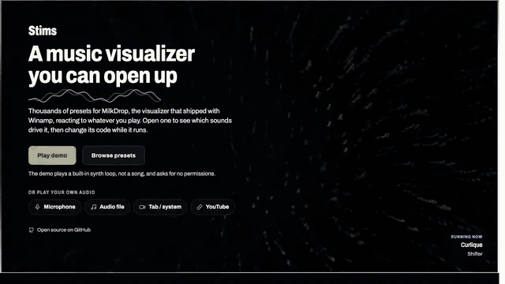
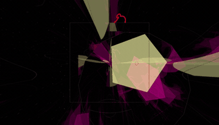
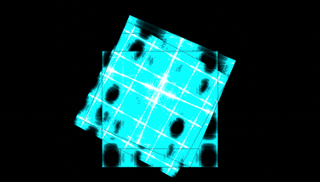
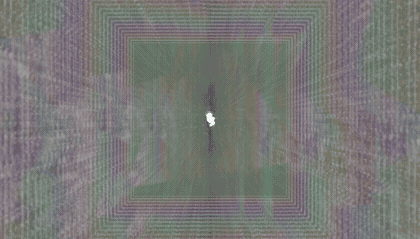

<div align="center">

# Stims

**Play and live-edit MilkDrop presets in your browser.**

The original `.milk` files by Geiss, Rovastar, Flexi, Eo.S., Martin and ~130 more authors. Point them at any audio, change the equations while they play, and share what you see as a link.

### [▶ Open toil.fyi](https://toil.fyi)

<sub>Stims lives at toil.fyi. Any WebGL2 browser; no account, no install.</sub>

<a href="./docs/assets/clips/stims-workflow.mp4"></a>

<sub>Play → edit → share. This preview is accelerated; <a href="./docs/assets/clips/stims-workflow.mp4">watch the 25-second workflow</a> at recorded speed. The capture is silent.</sub>

<table>
  <tr>
    <td width="50%"><a href="https://toil.fyi/?preset=krash-rovastar-cerebral-demons-stars"></a></td>
    <td width="50%"><a href="https://toil.fyi/?preset=zylot-crosshair-dimension-light-of-ages"></a></td>
  </tr>
  <tr>
    <td align="center"><sub><b>Krash &amp; Rovastar</b> — Cerebral Demons</sub></td>
    <td align="center"><sub><b>Zylot</b> — Crosshair Dimension</sub></td>
  </tr>
  <tr>
    <td width="50%"><a href="https://toil.fyi/?preset=eos-starburst-05-phasing"></a></td>
    <td width="50%"><a href="https://toil.fyi/?preset=eos-glowsticks-v2-03-music"></a></td>
  </tr>
  <tr>
    <td align="center"><sub><b>Eo.S.</b> — Starburst 05 Phasing</sub></td>
    <td align="center"><sub><b>Eo.S.</b> — Glowsticks v2</sub></td>
  </tr>
</table>

<sub>The clips are silent. Each one opens its preset live, and a click on the page turns the sound on.</sub>

[](https://toil.fyi)
[](https://github.com/zz-plant/stims/actions/workflows/ci.yml)
[](./LICENSE)

</div>

- **Play** a 1,787-preset catalog of the originals, curated picks first. Presets stay `.milk` files: there is no conversion step, and export gives you `.milk` back.
- **Edit while it plays**, as MilkDrop 2 let you. The source opens in an editor with completions and compiler diagnostics; `zoom`, `warp`, `rot` and `decay` are sliders. When an equation drives one, the slider names the audio that reaches it (`eq · bass`), read from the code.
- **Point it at anything:** a browser tab, a YouTube link, your microphone, a local file, or the built-in demo loop.
- **Send a link.** The address bar is the session. Whoever opens it sees the same preset, edits included, and one click turns the sound on.
- **Calm by default.** Nothing plays until you start audio, one action stops everything, and motion follows your system's reduce-motion setting.

**Why "Stims"?** It's built for stimmers as much as for MilkDrop fans: the [sensory controls](./docs/guides/accessibility.md) let you decide how much happens on screen and when it stops. MilkDrop presets can flash. Presets measured as frequent flashers carry a warning, and Settings → Reduce flashing hides them; most presets haven't been measured yet.

## How it compares

Butterchurn and projectM are the renderers most people embed or run today. Stims is a whole app, on a renderer of its own.

| | Stims | Butterchurn | projectM |
| --- | --- | --- | --- |
| **What it is** | A browser app you open | A JS renderer you embed | A native library and player |
| **Presets** | `.milk` files, as-is | Converted to JSON first | `.milk` files |
| **Editing** | Live editor with diagnostics and sliders | None built in | None built in |
| **Finding presets** | Search, collections, previews, favorites, history, links | Up to the host app | Playlist files |

**How close to MilkDrop is it?** A CI test compiles all 1,750 presets in the bundled Butterchurn pack for both WebGL2 and WebGPU. None is unsupported on either, and 1,578 run with no approximation on both; the other 172 approximate a shader on WebGPU or use a name the expression VM doesn't know ([the test](./tests/corpus/butterchurn-corpus-support.test.ts)). Matching projectM pixel for pixel is a stricter check, made one preset at a time against native projectM captures, and it covers only a few presets so far ([results](./src/data/milkdrop-parity/measured-results.json), [method](./docs/MILKDROP_PROJECTM_PARITY_PLAN.md)). If a preset looks wrong, [report it](#help-out); that is the most useful help there is.

The [full comparison](./docs/learn/milkdrop-vs-butterchurn-projectm.md) says which one to pick for what.

## What's new here

Playing MilkDrop presets in a browser isn't new: Butterchurn did it first. Neither is the live editor, which brings back what MilkDrop 2 had built in. These three are:

- **Per-pixel equations run on the GPU.** On WebGPU, per-pixel and custom-wave equations compile into the shader and run for every vertex at once; that covers 1,094 of the 1,102 catalog presets with per-pixel code. Butterchurn and projectM run them on the CPU, one grid point at a time. Seeded differential fuzz tests hold the GPU, the JIT and the interpreter to the same results. Their first runs found 18 shipped preset blocks the JIT couldn't compile and divergent results in 32% of GPU-lowered programs.
- **Fidelity is measured against native projectM.** Both renderers are stepped on a fixed clock, and a difference counts only when it exceeds that preset's own run-to-run noise. Every result is published per preset, passing or not ([scoreboard](./docs/MILKDROP_PROJECTM_PARITY_PLAN.md#current-state-2026-08-27)), and promotion refuses a reference that a blank frame would pass.
- **The corpus is analysed as programs.** `bun run lab:dataflow` reads which audio reaches each control and each drawn program from the equations alone, and the editor shows the same reading beside each slider. In 73 of 2,679 presets, the audio reaches nothing on screen. Used as training data, the corpus shows presets behave as threshold programs: gradient-boosted trees beat every network tried, and 41% of memoryless audio-driven controls come back as exact equations from their behaviour ([findings](./docs/guides/training-models.md)).

## How it works

| Part | What it does | Code |
| --- | --- | --- |
| Compiler and VM | Parses preset equations (EEL2) into an IR and runs them on an interpreter or a JIT, lowering per-pixel equations into the shader on WebGPU; translates preset shaders to GLSL and WGSL | `packages/milkdrop-toolchain/src/compiler/`, `src/js/milkdrop/vm.ts` |
| Renderer | WebGL2 is the baseline; an optional WebGPU path falls back to it when a preset needs something WebGPU can't run yet | `src/js/milkdrop/` |
| Audio | FFT, bands and transients computed in an AudioWorklet, packed into a GPU texture | `src/js/core/audio-handler.ts`, `packages/audio-reactive/src/` |
| App | The React workspace: browsing, the editor, and the URL as session state | `src/js/frontend/` |
| Edge (optional) | Cloudflare Worker routes for model-backed preset generation, blending and visual search; playback and editing don't need them | `functions/` |

[Technical foundations](./docs/TECHNICAL_ACHIEVEMENTS.md) has the system diagram and what each part has proven so far, [the architecture overview](./docs/ARCHITECTURE.md) follows one frame through the code, and [the docs index](./docs/README.md) has the rest.

## Quick start

You need [Bun](https://bun.sh) 1.3.14+ and a browser with WebGL2. WebGPU is optional.

```bash
git clone https://github.com/zz-plant/stims.git
cd stims
bun install
bun run dev
```

Then open `http://localhost:5173`. The git history is large: `git clone --filter=blob:none https://github.com/zz-plant/stims.git` skips its old binaries and clones much faster.

### Use the compiler without the app

The compiler is a plain module, so scripts and CI can check `.milk` files the same way the live editor does:

```ts
// compile.ts — print the errors the editor would show
import { readFileSync } from 'node:fs';
import { compileMilkdropPresetSource } from './packages/milkdrop-toolchain/src/compiler.ts';

const { diagnostics } = compileMilkdropPresetSource(
  readFileSync(process.argv[2] ?? '', 'utf8'),
);
for (const d of diagnostics.filter((d) => d.severity === 'error')) {
  console.log(`${d.line ?? '?'}: ${d.message}`);
}
```

```bash
bun compile.ts public/milkdrop-presets/eos-glowsticks-v2-03-music.milk
```

To learn the equation language, start with [the authoring curriculum](./docs/authoring/README.md); `bun run lab:dataflow -- --preset <id>` reports which audio signals reach each control of any catalog preset.

### Standalone packages

Four parts of Stims are standalone packages under [`packages/`](./packages/README.md): the app imports them, they have no dependency on the app, and each has a read-only mirror repository, a demo site and an npm-ready build.

| Package | What it is |
| --- | --- |
| [`milkdrop-toolchain`](./packages/milkdrop-toolchain) | The parser, EEL2 interpreter and JIT, IR, HLSL analysis with GLSL emission, EEL-to-WGSL lowering, formatter and MilkDrop 2 exporter above, as an npm package. |
| [`eel-conformance`](./packages/eel-conformance) | An executable specification of the preset expression language: 82 portable JSON cases any MilkDrop implementation can run. |
| [`flash-guard`](./packages/flash-guard) | The WCAG 2.3.1 flash analysis behind the catalog's flash warnings, and the live governor behind Reduce flashing. |
| [`audio-reactive`](./packages/audio-reactive) | The AudioWorklet FFT, harmonic/percussive separation, beat tracking and reactivity metrics behind the audio path. |

## Verification commands

```bash
bun run check:quick   # lint, types and repo guards; no tests (under a minute)
bun run check         # the PR gate: check:quick plus unit, compatibility and corpus tests (2,800+)
bun run test          # every test, including the slower browser e2e suite
bun run build         # production bundle
```

## Help out

The most useful things, roughly in order of effort:

- **Tell us when a preset looks wrong.** The link in your address bar reproduces the exact session, so that link, plus a screenshot of the same preset in MilkDrop or projectM if you have one, is a complete bug report: [report a preset that renders wrong](https://github.com/zz-plant/stims/issues/new?template=preset-renders-wrong.yml).
- **Share presets and finds** in [Discussions](https://github.com/zz-plant/stims/discussions): a preset you wrote or restored, a collection worth curating, a song that makes one sing. [The remix thread](https://github.com/zz-plant/stims/discussions/1341) collects one-equation edits of a featured preset.
- **Send code.** Start with [CONTRIBUTING.md](./CONTRIBUTING.md); [docs/ONBOARDING.md](./docs/ONBOARDING.md) maps the codebase and says which parts are hard. The [good first issues](https://github.com/zz-plant/stims/issues?q=is%3Aissue+is%3Aopen+label%3A%22good+first+issue%22) are scoped small on purpose. Compatibility changes should bring a test and its evidence.

What changed recently is in [the changelog](./CHANGELOG.md).

For recording or streaming, start with [the OBS setup recipe](./docs/OBS.md). It covers a Browser Source demo, regular-browser capture, and separate audio routing; native OBS verification is still pending.

## Acknowledgments and lineage

Stims depends on work by:

- **Ryan Geiss**, who wrote MilkDrop, the Winamp plugin, and the per-frame and per-pixel equation language presets are written in.
- **Jordan Berg (`jberg`) and the Butterchurn contributors**, who first ran MilkDrop presets in WebGL and whose preset parsing Stims learned from.
- **Carmelo Piccione, Mischa Spiegelmock, and the projectM maintainers**, whose C++ implementation is the reference Stims measures itself against.
- **The MilkDrop preset authors**, who wrote the 1,787 presets in the catalog. The most-credited handles in the shipped catalog, counting every appearance in an accretive credit chain rather than only solo bylines, are *Geiss, Flexi, Martin, Rovastar, Eo.S., Stahlregen, Unchained, fiShbRaiN, Phat, Aderrasi, Shifter, Zylot, ORB, suksma, Cope, Goody, and Krash* — alongside roughly 120 more.
- **Nullsoft**, whose Winamp is where MilkDrop ran.

Stims is an independent implementation. MilkDrop, Butterchurn, and projectM are credited as creative and technical lineage; no official affiliation is implied. See [Lineage and Credits](./docs/LINEAGE_AND_CREDITS.md).

Licensed under [the Unlicense](./LICENSE) — public domain.
