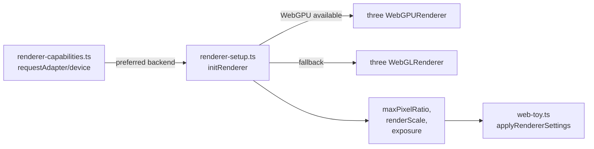
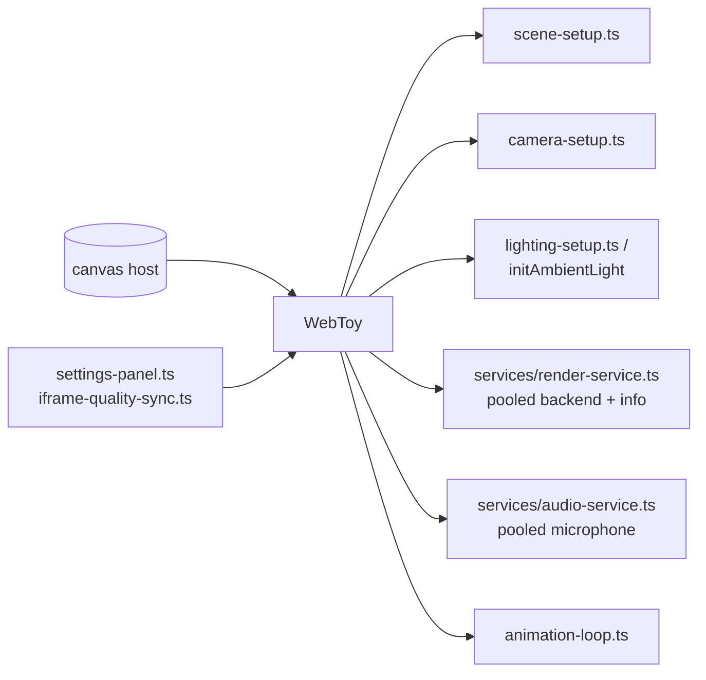

# Architecture Overview

This document summarizes how the Stim Webtoys app is assembled, from the entry HTML shells through module loading, rendering, audio, and quality controls. It is meant as a quick map for contributors adding new toys or extending the core runtime.

## Runtime Layers

- **HTML entry points** (`toy.html`, `brand.html`, etc.) load the bundled shell and pass query params like `?toy=<slug>`.
- **Loader + routing** (`assets/js/loader.ts`, `assets/js/router.ts`) coordinate navigation, history, and the active toy lifecycle.
- **UI views** (`assets/js/toy-view.ts`, `assets/js/library-view.js`) render the library grid, active toy container, loading/error states, and renderer status badges.
- **Manifest resolution** (`assets/js/utils/manifest-client.ts`) maps logical module paths to the correct dev/build URLs for dynamic `import()`.
- **Core runtime** (`assets/js/core/*`) initializes the scene, camera, renderer (WebGPU or WebGL), audio pipeline, and quality controls. Helpers such as `animation-loop.ts`, `settings-panel.ts`, and `iframe-quality-sync.ts` manage per-frame work and preset propagation.
- **Shared services** (`assets/js/core/services/*`) pool renderers and microphone streams so toys can hand off resources without re-allocating (and re-prompting for mic access).
- **Toys** (`assets/js/toys/*.ts`) compose the core primitives, export a `start` entry, and provide a cleanup hook (commonly via `dispose`).

## App Shell and Loader Flow

```mermaid
flowchart TD
  Entry[HTML shell
  toy.html, brand.html...] --> Loader[loader.ts
  createLoader()]
  Loader --> Router[router.ts
  query param sync]
  Loader --> Views[toy-view.ts /
  library-view.js]
  Loader --> Manifest[manifest-client.ts
  resolve module URL]
  Loader -->|import| ToyModule[assets/js/toys/<slug>.ts]
  ToyModule --> WebToy[core/web-toy.ts
  scene/camera/renderer/audio]
  WebToy --> Caps[renderer-capabilities.ts
  detect WebGPU/WebGL]
  WebToy --> Audio[microphone-flow.ts
  utils/audio-handler.ts]
  WebToy --> Settings[settings-panel.ts
  iframe-quality-sync.ts]
  Views -->|back/escape| Loader
```

### Loader lifecycle

1. **Resolve toy**: look up the slug in `assets/js/toys-data.js` and ensure rendering support (`ensureWebGL`). Renderer capabilities and microphone permission checks are prewarmed so subsequent toy loads skip redundant probes/prompts.
2. **Navigate**: push state with the router when requested, set up Escape-to-library, and clear any previous toy.
3. **Render shell**: ask `toy-view` to show the active toy container and loading indicator; bubble capability status to the UI.
4. **Import module**: resolve a Vite-friendly URL via the manifest client and `import()` it.
5. **Start toy**: call the module’s `start` or default export; normalize the returned reference so `dispose` can be called on navigation.
6. **Cleanup**: on Escape/back, dispose the active toy, clear the container, and reset renderer status in the view.

## Rendering and Capability Detection



- **Capability probe**: `renderer-capabilities.ts` caches the adapter/device decision and records fallback reasons so the UI can surface retry prompts.
- **Initialization**: `renderer-setup.ts` builds a renderer using the preferred backend, applies tone mapping, sets pixel ratio/size, and returns metadata consumed by `web-toy.ts`.
- **Quality presets**: `settings-panel.ts` and `iframe-quality-sync.ts` broadcast max pixel ratio, render scale, and exposure; `WebToy.updateRendererSettings` re-applies them without a reload.

## WebToy Composition



- **Renderer pooling**: `services/render-service.ts` initializes WebGPU/WebGL once, applies the active quality preset from `settings-panel.ts`, and hands a typed handle (`renderer`, `canvas`, `backend`, `applySettings`, `release`) to toys. Returning the handle releases the canvas back into the pool without disposing the renderer, so switching toys avoids expensive re-creation.
- **Resize safety**: `web-toy.ts` hooks window resize to update aspect ratio and renderer size via the pooled handle.
- **Lifecycle cleanup**: disposal tears down animation loops, disposes geometries/materials, releases audio/renderer handles back to their pools, and clears the DOM container.

## Audio Path

- `services/audio-service.ts` reuses a single `MediaStream` to avoid repeat prompts; each acquisition gets a fresh `THREE.AudioListener`/`THREE.Audio`/`AudioAnalyser` while sharing the mic stream. Release the handle to stop the analyser and return the stream to the pool.
- `resetAudioPool({ stopStreams: true })` is used by the loader on navigation back to the library to fully stop tracks; `prewarmMicrophone()` can be called before a toy starts to hide mic latency when permission is already granted.
- `microphone-flow.ts` remains the UI flow for permission buttons; it can be wired to `prewarmMicrophone`/`acquireAudioHandle` to respect pooling.

## Renderer + Audio Pooling Guidance

- Default to the shared services (`services/render-service.ts` and `services/audio-service.ts`) inside new toys so renderer/mic acquisition is cached between toys.
- Quality presets from `settings-panel.ts` are re-applied whenever a pooled renderer is handed off. If a toy needs bespoke renderer settings, call `handle.applySettings()` with overrides after acquisition.
- Specialized toys that need their own renderer/mic can opt out: pass `{ reuseMicrophone: false }` to `acquireAudioHandle`, or bypass `requestRenderer` in favor of a bespoke renderer. In those cases, clean up aggressively and avoid modifying the pooled handles.

## Adding or Debugging Toys

- **Start from a slug**: register the module in `assets/js/toys-data.js` and ensure there is an HTML entry point (often `toy.html?toy=<slug>`).
- **Use the core**: instantiate `WebToy` (or its helpers) to get camera/scene/renderer/audio defaults and return a `dispose` function for safe teardown.
- **Respect presets**: honor `updateRendererSettings` for max pixel ratio and render scale; avoid hard-coding devicePixelRatio.
- **Surface errors**: throw or log during init so the loader’s import error UI can respond; avoid swallowing dynamic import failures silently.

## Troubleshooting Signals

- **WebGPU unavailable**: `renderer-capabilities.ts` writes a fallback reason and toggles `shouldRetryWebGPU`; the view surfaces a retry button that re-probes with `forceRetry`.
- **Import failures**: the loader’s `view.showImportError` shows the module URL and offers a back link.
- **Performance**: lower `maxPixelRatio`/`renderScale` via the settings panel; heavy scenes should debounce allocations in animation loops.
