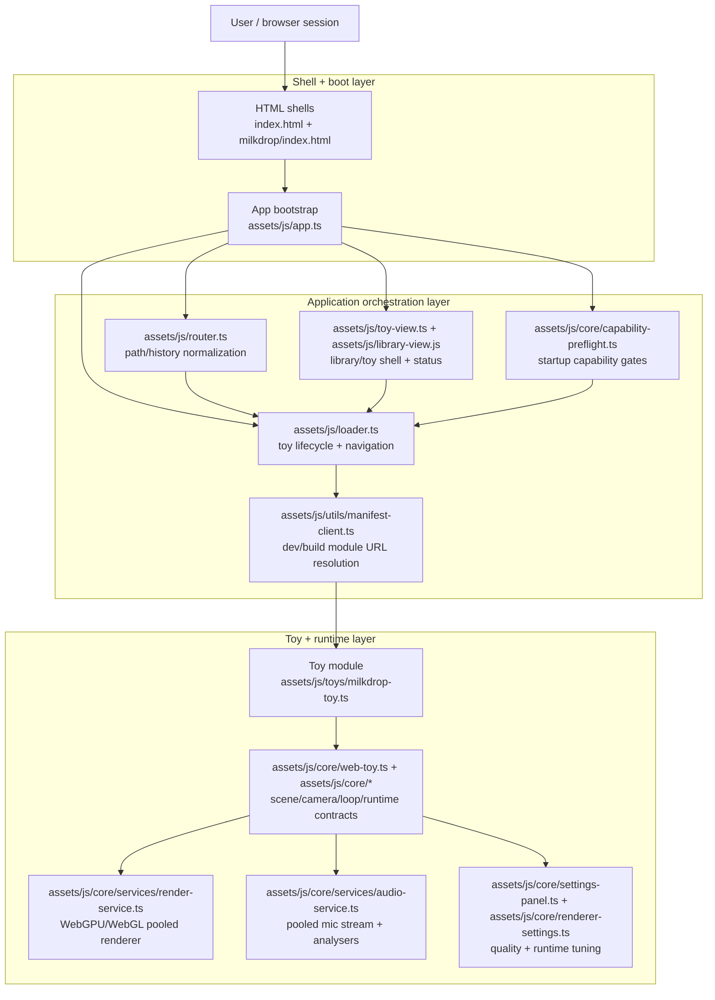
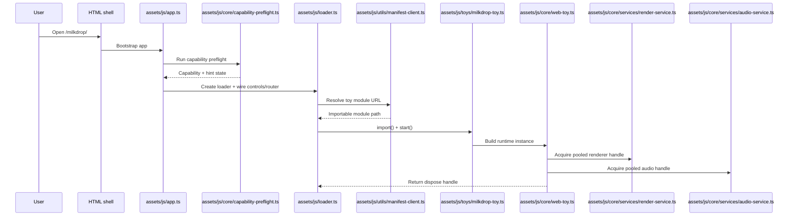
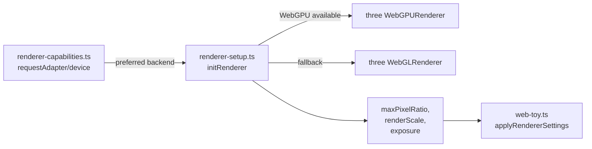
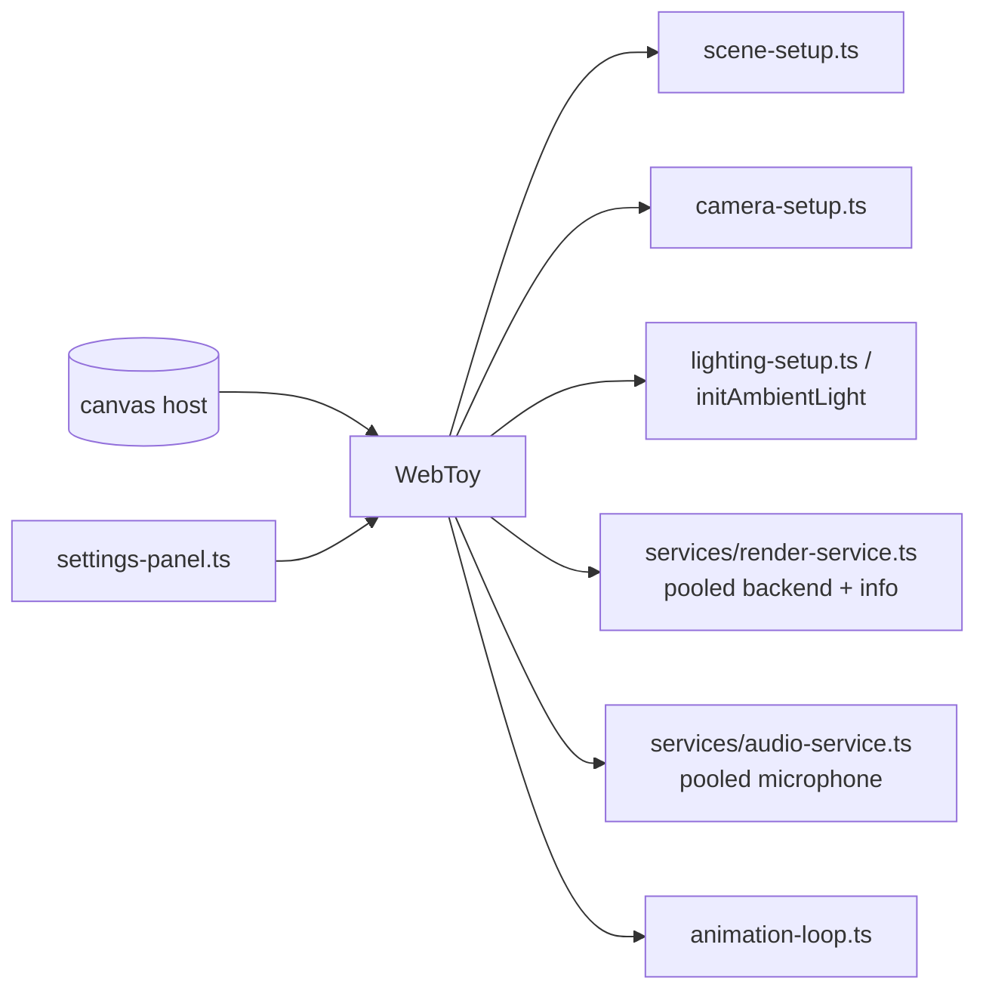

# Architecture Overview

This document summarizes how the Stims app is assembled, from the entry HTML shells through module loading, rendering, audio, and quality controls. Stims is positioned as an independent browser-native visualizer in the lineage of Ryan Geiss's MilkDrop, and this guide maps the runtime layers that support the shipped `milkdrop` flow.

## Architecture at a Glance

- **Entry shells** (`index.html` and `milkdrop/index.html`) are the user-facing HTML shells that bootstrap `assets/js/app.ts`; `/` is the editorial homepage, `/milkdrop/` is the immersive-first playback route, and the live overlay becomes the in-session workspace for presets and deeper tools.
- **App + loader orchestration** (`assets/js/app.ts`, `assets/js/loader.ts`, `assets/js/router.ts`) owns page boot, capability preflight, navigation, lifecycle boundaries, and loader state.
- **View state** (`assets/js/toy-view.ts`, `assets/js/library-view.js`) renders the library, toy container, and status banners.
- **Runtime core** (`assets/js/core/*`) encapsulates rendering, audio, settings, and per-frame loop wiring.
- **Toy module** (`assets/js/toys/milkdrop-toy.ts`) provides the shipped visualizer start/dispose entrypoint.

Use this section as a quick compass: if you need to change how a toy starts or stops, look at the loader and core runtime; if you need to change UI state or status messaging, look at the views; if you need to change toy behavior, look at the toy modules and `WebToy` helpers.

## High-level architecture diagrams

### 1) Layered system context

```mermaid
flowchart TB
  User[User / browser session]

  subgraph ShellLayer[Shell + boot layer]
    Shell[HTML shells\nindex.html + milkdrop/index.html]
    App[App bootstrap\nassets/js/app.ts]
  end

  subgraph AppLayer[Application orchestration layer]
    Router[assets/js/router.ts\npath/history normalization]
    Loader[assets/js/loader.ts\ntoy lifecycle + navigation]
    Views[assets/js/toy-view.ts + assets/js/library-view.js\nlibrary/toy shell + status]
    Preflight[assets/js/core/capability-preflight.ts\nstartup capability gates]
    Manifest[assets/js/utils/manifest-client.ts\ndev/build module URL resolution]
  end

  subgraph RuntimeLayer[Toy + runtime layer]
    Toy[Toy module\nassets/js/toys/milkdrop-toy.ts]
    Core[assets/js/core/web-toy.ts + assets/js/core/*\nscene/camera/loop/runtime contracts]
    Renderer[assets/js/core/services/render-service.ts\nWebGPU/WebGL pooled renderer]
    Audio[assets/js/core/services/audio-service.ts\npooled mic stream + analysers]
    Settings[assets/js/core/settings-panel.ts + assets/js/core/renderer-settings.ts\nquality + runtime tuning]
  end

  User --> Shell --> App
  App --> Router
  App --> Loader
  App --> Views
  App --> Preflight
  Loader --> Manifest --> Toy --> Core
  Core --> Renderer
  Core --> Audio
  Core --> Settings
  Router --> Loader
  Views --> Loader
  Preflight --> Loader
```

### 2) Startup handoff sequence (happy path)

```mermaid
sequenceDiagram
  participant U as User
  participant S as HTML shell
  participant A as assets/js/app.ts
  participant P as assets/js/core/capability-preflight.ts
  participant L as assets/js/loader.ts
  participant M as assets/js/utils/manifest-client.ts
  participant T as assets/js/toys/milkdrop-toy.ts
  participant C as assets/js/core/web-toy.ts
  participant R as assets/js/core/services/render-service.ts
  participant Au as assets/js/core/services/audio-service.ts

  U->>S: Open /milkdrop/
  S->>A: Bootstrap app
  A->>P: Run capability preflight
  P-->>A: Capability + hint state
  A->>L: Create loader + wire controls/router
  L->>M: Resolve toy module URL
  M-->>L: Importable module path
  L->>T: import() + start()
  T->>C: Build runtime instance
  C->>R: Acquire pooled renderer handle
  C->>Au: Acquire pooled audio handle
  C-->>L: Return dispose handle
```

Legend:
- **Boot/orchestration**: shell + app + loader/router/view/preflight.
- **Runtime**: toy module and shared `core/*` systems.
- **Services**: pooled renderer/audio resources reused across toy loads.

## Architecture tiers (what is required vs optional)

- **Tier 0: Site runtime (required).** HTML entry points, loader/router, views, runtime core, and toy modules. This tier is enough to run and deploy the web toy experience.
- **Tier 1: Automation and external transports (optional).** MCP stdio/Worker transports and agent-oriented automation workflows. This tier is only needed when integrating MCP clients or agent tooling.

Use this split when making trade-offs: keep Tier 0 reliable first, and treat Tier 1 as an add-on surface that can evolve independently.

## Runtime Layers

- **HTML entry points** (`index.html` and `milkdrop/index.html`) load `assets/js/app.ts`; `index.html` is now a pure homepage surface, and query params refine launch state on the dedicated visualizer route.
- **App bootstrap** (`assets/js/app.ts`) detects library vs toy pages, wires controls, runs capability preflight, and starts loader flows.
- **Loader + routing** (`assets/js/loader.ts`, `assets/js/router.ts`) coordinate navigation, history, active toy lifecycle, and dynamic module loading.
- **UI views** (`assets/js/toy-view.ts`, `assets/js/library-view.js`) render the library grid, active toy container, loading/error states, and renderer status badges.
- **Manifest resolution** (`assets/js/utils/manifest-client.ts`) maps logical module paths to the correct dev/build URLs for dynamic `import()`.
- **Core runtime** (`assets/js/core/*`) initializes the scene, camera, renderer (WebGPU or WebGL), audio pipeline, and quality controls. Helpers such as `animation-loop.ts` and `settings-panel.ts` manage per-frame work and preset propagation.
- **Capability + startup contracts** (`assets/js/core/renderer-capabilities.ts`, `assets/js/core/capability-preflight.ts`, `assets/js/core/toy-audio-startup.ts`) provide the unified rendering-support probe and typed toy-audio start flow used by both `app.ts` and `loader.ts`.
- **Shared services** (`assets/js/core/services/*`) pool renderers and microphone streams so toys can hand off resources without re-allocating (and re-prompting for mic access).
- **Toy module** (`assets/js/toys/milkdrop-toy.ts`) exports the shipped MilkDrop visualizer entrypoint.

## Shell Contract

Both public HTML shells load the same shared CSS bundle and bootstrap `assets/js/app.ts`. The contract is:

- `index.html` owns editorial marketing content, preset discovery teasers, and links into the live visualizer session.
- `milkdrop/index.html` owns the dedicated launchpad shell, including the audio/settings panel slots needed before or during session start.
- `assets/js/app.ts` is the only runtime bootstrap entrypoint. It reads `data-page`, chooses the matching page bootstrap, and hands session work to loader/core modules.
- Query-driven session state belongs on `/milkdrop/`; the homepage should only link into those states, not recreate launch logic inline.
- Neither HTML shell should contain direct toy/runtime logic beyond declarative slots (`data-top-nav-container`, `data-audio-controls`, `data-settings-panel`) and page identity (`data-page`).

Use this to keep future changes honest: homepage work should stay editorial, launch-route work should stay session-oriented, and cross-shell runtime behavior should be implemented once in JavaScript modules rather than duplicated in HTML.

## Runtime Ownership Map

| Layer | Owns | May depend on | Must not depend on |
| --- | --- | --- | --- |
| `app` | page-type detection, top-level bootstrap handoff, global device/telemetry boot | `bootstrap/*`, `loader.ts`, `router.ts`, boot-safe `core/*`, leaf `utils/*` | toy modules, `ui/*` internals beyond bootstrap wiring, `milkdrop/*` runtime internals |
| `loader` | route sync, capability gating, toy lifecycle orchestration, dynamic module loading | `loader/*`, `router.ts`, `toy-view.ts`, `core/*`, manifest/data helpers | `bootstrap/*`, page-specific editorial code, direct `ui/*` controller composition |
| `core` | renderer/audio/runtime systems, shared services, toy runtime starter/quality primitives | `core/*`, `data/*`, leaf `utils/*` adapters that touch browser/platform APIs | `app`, `loader`, `bootstrap`, page-level DOM composition in `ui/*` |
| `ui` | nav, audio/system controls, DOM-level affordances and control rendering | public `core/*` state/services, leaf `utils/*` helpers | `app`, `loader/*` internals, toy-specific runtime modules |
| `utils` | pure helpers, manifest adapters, environment/browser convenience wrappers | `utils/*`, `data/*`; narrow `core/*` imports only when acting as a compatibility adapter pending promotion | `app`, `loader`, page bootstraps, toy modules |

Current migration note: runtime-critical starter and quality helpers for the shipped MilkDrop path now live in `assets/js/core/toy-runtime-starter.ts` and `assets/js/core/toy-quality.ts`, while homepage/library boot initializers now live under `assets/js/bootstrap/*` and `assets/js/ui/nav-scroll-effects.ts` instead of `utils/`.

## Source Map (Where Things Live)

| Concern | Primary files | Notes |
| --- | --- | --- |
| Entry points | `index.html`, `milkdrop/index.html` | Public HTML shells are intentionally slim; runtime logic starts in `app.ts`. |
| App bootstrap | `assets/js/app.ts` | Chooses library vs toy boot flow, connects controls, and runs capability preflight before toy start. |
| Page bootstraps | `assets/js/bootstrap/*` | Home, library, and experience shells compose page-level DOM wiring without owning runtime internals. |
| Loader + routing | `assets/js/loader.ts`, `assets/js/router.ts` | Navigation, lifecycle, and dynamic imports live here. |
| Views | `assets/js/toy-view.ts`, `assets/js/library-view.js` | UI for the library grid, toy container, loading, and error states. |
| Core runtime | `assets/js/core/web-toy.ts` + `assets/js/core/*` | Rendering, audio, settings, and the animation loop. |
| Pools/services | `assets/js/core/services/*` | Renderer and microphone pooling. |
| Toy registry | `assets/data/toys.json` | Toy metadata and slug registration. |
| Toy implementation | `assets/js/toys/milkdrop-toy.ts` | Shipped MilkDrop visualizer entrypoint. |

## App Shell and Loader Flow

```mermaid
flowchart TD
  Entry[HTML shell
  index.html, milkdrop/index.html] --> App[app.ts
  startApp()]
  App --> Loader[loader.ts
  createLoader()]
  Loader --> Router[router.ts
  route + path sync]
  App --> Preflight[capability-preflight.ts
  gate/start hints]
  App --> Controls[ui/audio-controls.ts
  ui/system-controls.ts]
  Loader --> Views[toy-view.ts /
  library-view.js]
  Loader --> Manifest[manifest-client.ts
  resolve module URL]
  Loader -->|import| ToyModule[assets/js/toys/<slug>.ts]
  ToyModule --> WebToy[core/web-toy.ts
  scene/camera/renderer/audio]
  WebToy --> Caps[renderer-capabilities.ts
  detect WebGPU/WebGL]
  WebToy --> Audio[microphone-flow.ts
  utils/audio-handler.ts]
  WebToy --> Settings[settings-panel.ts]
  Views -->|back/escape| Loader
  Preflight --> Loader
  Controls --> Loader
```

## Documentation verification status

Last verified against the current runtime structure: **2026-03-31**.

Verification checks performed:

- Confirmed active source entry pages are `index.html` and `milkdrop/index.html` and that they bootstrap `assets/js/app.ts`.
- Confirmed runtime boot orchestration now starts in `assets/js/app.ts`, which then initializes loader/router plus capability and control wiring.
- Confirmed architecture-critical modules documented here still exist (`loader.ts`, `router.ts`, `toy-view.ts`, `core/*`, and `core/services/*`).

## Priority architecture changes (proposal)

These are the highest-value architecture changes to reduce drift, lower onboarding cost, and improve runtime predictability.

### P0 — Consolidate startup and capability surfaces

Status: ✅ Implemented in code (`renderer-capabilities` now owns rendering support detection, and `toy-audio-startup` centralizes toy audio start orchestration).

- **Unify rendering/capability entry points** by converging legacy capability wrappers into `utils/webgl-check.ts` plus the core-facing APIs in `core/capability-preflight.ts` and `core/renderer-capabilities.ts`.
- **Define one startup contract** from `app.ts` → `loader.ts` → toy module start/dispose so all toy flows (mic/demo/tab/YouTube) follow the same typed path.
- **Why first:** startup paths are currently split across `app.ts`, loader helpers, and utility wrappers, which increases regression risk whenever permission or renderer logic changes.

### P1 — Clarify core vs utils boundaries

Status: ✅ Implemented for startup/audio contracts and extended through the first pilot migration (`ToyAudioRequest`, option resolution, and `startToyAudio` now live in `assets/js/core/toy-audio.ts`; shipped MilkDrop starter/quality helpers now live in `assets/js/core/toy-runtime-starter.ts` and `assets/js/core/toy-quality.ts`).

- **Promote runtime-critical utilities into `core/`** (or create a documented `runtime/` namespace) so ownership is obvious for long-lived services.
- **Keep `utils/` for leaf helpers only** (pure helpers/UI convenience code) and avoid placing lifecycle-critical modules there.
- **Why next:** current cross-import patterns (`core/*` depending on `utils/*` for startup/audio/types) make architecture intent harder to reason about for contributors.

### P2 — Shrink shell and toy entry fragmentation

Status: ✅ Documented and aligned in code; `index.html` remains editorial and `milkdrop/index.html` remains the only query-driven launch shell.

- **Standardize shell responsibilities** across `index.html` and `milkdrop/index.html` with a single documented shell contract and minimal per-page variation.
- **Why this matters:** reducing entry ambiguity helps avoid accidental fixes in generated or non-authoritative pages.

### Cross-cutting implementation guardrails

- Add an explicit “runtime ownership map” in this doc (`app`, `loader`, `core`, `utils`, `ui`) with allowed dependency directions.
- Introduce architecture lint checks (import-boundary rules) to enforce the intended layering over time.
- Track migration progress with a small checklist in `docs/FULL_REFACTOR_PLAN.md` so architecture updates stay visible across PRs.

### Loader lifecycle

1. **Resolve toy**: look up the slug in `assets/data/toys.json` and ensure rendering support (`ensureWebGL`). Renderer capabilities and microphone permission checks are prewarmed so subsequent toy loads skip redundant probes/prompts.
2. **Navigate**: push state with the router when requested, set up Escape-to-library, and clear any previous toy.
3. **Render shell**: ask `toy-view` to show the active toy container and loading indicator; bubble capability status to the UI.
4. **Import module**: resolve a Vite-friendly URL via the manifest client and `import()` it.
5. **Start toy**: call the module’s `start` or default export; normalize the returned reference so `dispose` can be called on navigation.
6. **Cleanup**: on Escape/back, dispose the active toy, clear the container, and reset renderer status in the view.

### Lifecycle responsibilities

| Phase | Owner | Notes |
| --- | --- | --- |
| Navigation | `router.ts` | Syncs canonical launch paths, legacy query params, and back/forward navigation. |
| UI scaffolding | `toy-view.ts` | Shows loader, active toy shell, and status badges. |
| Module load | `loader.ts` + `manifest-client.ts` | Resolves module URLs for both dev and build. |
| Runtime init | `web-toy.ts` | Builds scene, camera, renderer, and audio loop wiring. |
| Cleanup | `web-toy.ts` + toy `dispose` | Releases pooled resources and removes canvas/audio refs. |

## Rendering and Capability Detection

```mermaid
flowchart LR
  CapProbe[renderer-capabilities.ts
  requestAdapter/device] -->|preferred backend| RenderInit[renderer-setup.ts
  initRenderer]
  RenderInit -->|WebGPU available| WebGPU[three WebGPURenderer]
  RenderInit -->|fallback| WebGL[three WebGLRenderer]
  RenderInit --> Info[maxPixelRatio,
  renderScale,
  exposure]
  Info --> WebToyApply[web-toy.ts
  applyRendererSettings]
```

- **Capability probe**: `renderer-capabilities.ts` caches the adapter/device decision and records fallback reasons so the UI can surface retry prompts. WebGPU probing is feature-based (`navigator.gpu`) rather than user-agent gated, so supported mobile browsers can use WebGPU.
- **Initialization**: `renderer-setup.ts` builds a renderer using the preferred backend, applies tone mapping, sets pixel ratio/size, and returns metadata consumed by `web-toy.ts`.
- **Quality presets**: `settings-panel.ts` broadcasts max pixel ratio, render scale, and exposure; `WebToy.updateRendererSettings` re-applies them without a reload.
- **Renderer settings**: `renderer-settings.ts` merges quality presets, render preferences, and per-toy overrides so pooled renderers can be reconfigured on the fly.
- **Experimental worker render track**: `worker-renderer-track.ts` and `renderer-worker.ts` define an opt-in OffscreenCanvas path for future WebGPU render submission off the main thread. The gate reuses `renderer-capabilities.ts` worker/offscreen checks plus an explicit opt-in flag (`?render-worker=1` or `localStorage['stims:experiments:render-worker']='enabled'`). The current track only owns renderer initialization, resize/quality propagation, preset messages, and per-frame signal/input submission; DOM-driven overlay, catalog, and editor flows remain on the main thread until parity is proven.
- **MilkDrop WebGPU descriptor rollout guards**: `assets/js/milkdrop/webgpu-optimization-flags.ts` resolves per-path rollout flags from query params or `localStorage`, then `runtime.ts`, `vm.ts`, and `renderer-adapter.ts` apply the effective subset before enabling WebGPU-only descriptor work. Supported params/storage pairs are `milkdrop-webgpu-main-wave`/`stims:experiments:milkdrop-webgpu-main-wave`, `milkdrop-webgpu-trail-waves`/`stims:experiments:milkdrop-webgpu-trail-waves`, `milkdrop-webgpu-custom-waves`/`stims:experiments:milkdrop-webgpu-custom-waves`, `milkdrop-webgpu-mesh`/`stims:experiments:milkdrop-webgpu-mesh`, `milkdrop-webgpu-motion-vectors`/`stims:experiments:milkdrop-webgpu-motion-vectors`, `milkdrop-webgpu-feedback`/`stims:experiments:milkdrop-webgpu-feedback`, and the fallback guard `milkdrop-webgpu-fallback`/`stims:experiments:milkdrop-webgpu-fallback`. Disabled paths emit a concise overlay status message so validation runs can confirm which optimizations are still gated.

### Incremental MilkDrop WebGPU rollout sequence

Use the descriptor flags to land and validate each optimization independently:

| Rollout step | Flag | Scope | Recommended enable order |
| --- | --- | --- | --- |
| 1 | `milkdrop-webgpu-main-wave` | Main waveform descriptor path | Enable first on supported presets. |
| 2 | `milkdrop-webgpu-trail-waves` | Trail waveform descriptor path | Enable after main-wave parity is stable. |
| 3 | `milkdrop-webgpu-custom-waves` | Custom-wave descriptor uploads | Enable once representative authored presets hold parity. |
| 4 | `milkdrop-webgpu-mesh` | Per-pixel mesh-field descriptor execution | Enable after procedural wave coverage is stable. |
| 5 | `milkdrop-webgpu-motion-vectors` | Motion-vector descriptor execution | Enable after mesh validation, especially on presets with legacy controls. |
| 6 | `milkdrop-webgpu-feedback` | Direct feedback shader execution | Enable last among descriptor optimizations. |

Keep `milkdrop-webgpu-fallback` enabled while validating each stage so unsupported presets still auto-switch to WebGL. Only consider relaxing that final backend guard after the representative unsupported fixture set and manual browser validation confirm the remaining WebGPU path is safe.

## WebToy Composition

```mermaid
graph LR
  Canvas[(canvas host)] --> WebToy
  WebToy --> Scene[scene-setup.ts]
  WebToy --> Camera[camera-setup.ts]
  WebToy --> Lighting[lighting-setup.ts /
  initAmbientLight]
  WebToy --> Renderer[services/render-service.ts
  pooled backend + info]
  WebToy --> Audio[services/audio-service.ts
  pooled microphone]
  WebToy --> Loop[animation-loop.ts]
  Settings[settings-panel.ts] --> WebToy
```

- **Renderer pooling**: `services/render-service.ts` initializes WebGPU/WebGL once, applies the active quality preset from `settings-panel.ts`, and hands a typed handle (`renderer`, `canvas`, `backend`, `applySettings`, `release`) to toys. Returning the handle releases the canvas back into the pool without disposing the renderer, so switching toys avoids expensive re-creation.
- **Resize safety**: `web-toy.ts` hooks window resize to update aspect ratio and renderer size via the pooled handle.
- **Lifecycle cleanup**: disposal tears down animation loops, disposes geometries/materials, releases audio/renderer handles back to their pools, and clears the DOM container.

## Runtime State and Data Flow

- **Active toy state**: the loader owns the active toy reference and is responsible for calling `dispose`. The toy should only manage its own scene resources (geometries, materials, textures).
- **Renderer state**: pooled renderers are configured by `renderer-settings.ts`; toys can layer overrides via `handle.applySettings` but should not mutate shared renderer state permanently.
- **Audio state**: the audio service owns the shared `MediaStream`, while each toy owns its `AudioAnalyser` instance. Release the handle so the pool can reuse the stream.
- **Settings propagation**: `settings-panel.ts` updates propagate to `web-toy.ts`, keeping both the shell UI and toy renderer in sync.

## Audio Path

- `services/audio-service.ts` reuses a single `MediaStream` to avoid repeat prompts; each acquisition gets a fresh `THREE.AudioListener`/`THREE.Audio`/`AudioAnalyser` while sharing the mic stream. Release the handle to stop the analyser and return the stream to the pool.
- `resetAudioPool({ stopStreams: true })` is used by the loader on navigation back to the library to fully stop tracks; `prewarmMicrophone()` can be called before a toy starts to hide mic latency when permission is already granted.
- `microphone-flow.ts` remains the UI flow for permission buttons; it can be wired to `prewarmMicrophone`/`acquireAudioHandle` to respect pooling.

## Renderer + Audio Pooling Guidance

- Default to the shared services (`services/render-service.ts` and `services/audio-service.ts`) inside new toys so renderer/mic acquisition is cached between toys.
- Quality presets from `settings-panel.ts` are re-applied whenever a pooled renderer is handed off. If a toy needs bespoke renderer settings, call `handle.applySettings()` with overrides after acquisition.
- Specialized toys that need their own renderer/mic can opt out: pass `{ reuseMicrophone: false }` to `acquireAudioHandle`, or bypass `requestRenderer` in favor of a bespoke renderer. In those cases, clean up aggressively and avoid modifying the pooled handles.

## Adding or Debugging Toys

- **Start from a slug**: register the module in `assets/data/toys.json` and ensure there is a canonical HTML entry point or route mapping (for the shipped product, `/milkdrop/`).
- **Use the core**: instantiate `WebToy` (or its helpers) to get camera/scene/renderer/audio defaults and return a `dispose` function for safe teardown.
- **Respect presets**: honor `updateRendererSettings` for max pixel ratio and render scale; avoid hard-coding devicePixelRatio.
- **Surface errors**: throw or log during init so the loader’s import error UI can respond; avoid swallowing dynamic import failures silently.
- **Maintain quality**: Run `bun run check` to ensure core services and toys adhere to the project's type-safety and Biome standards.

## Troubleshooting Signals

- **WebGPU unavailable**: `renderer-capabilities.ts` writes a fallback reason and toggles `shouldRetryWebGPU`; the view surfaces a retry button that re-probes with `forceRetry`.
- **Import failures**: the loader’s `view.showImportError` shows the module URL and offers a back link.
- **Performance**: lower `maxPixelRatio`/`renderScale` via the settings panel; heavy scenes should debounce allocations in animation loops.

## Common Extension Points

- **Shipped entrypoint changes**: keep `assets/data/toys.json` aligned with `assets/js/toys/milkdrop-toy.ts` and return a `dispose` for safe cleanup.
- **New runtime services**: add to `assets/js/core/services/*` and thread through `web-toy.ts` so toys can request handles consistently.
- **New settings controls**: extend `settings-panel.ts` and `renderer-settings.ts`, then ensure updates flow through `web-toy.ts` for running sessions.
