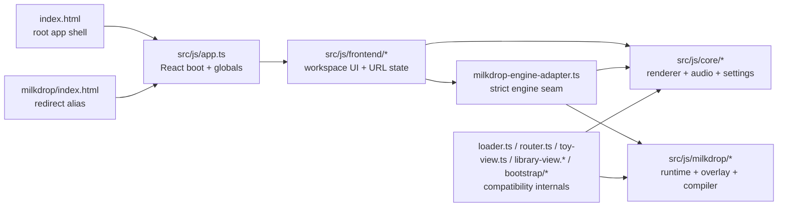

# Architecture Overview

This document describes the current shipped frontend architecture for Stims after the React workspace cutover. The root route at `/` is the product surface. `milkdrop/index.html` exists only as a compatibility alias that redirects into `/`.

## Current shape

- `index.html` is the single app shell and bootstraps `src/js/app.ts`.
- `src/js/app.ts` mounts the React workspace and global runtime affordances.
- `src/js/frontend/*` owns route state, workspace UI, and the engine adapter seam.
- `src/js/milkdrop/*` remains the imperative visualizer engine, overlay, compiler, and catalog runtime.
- Workspace-scene decorative layers are rendered with imperative Three.js, not a secondary React renderer.
- `src/js/core/*` owns shared renderer, audio, quality, persistence, and input systems.
- `src/js/loader.ts`, `src/js/router.ts`, `src/js/toy-view.ts`, `src/js/library-view.js`, `src/js/library-view/*`, and `src/js/bootstrap/*` are legacy compatibility/test-support internals for older non-root shell flows. They are not the production root app surface anymore.

## Runtime map


```mermaid
flowchart LR
  Entry["index.html<br/>root app shell"]
  Alias["milkdrop/index.html<br/>redirect alias"]
  App["src/js/app.ts<br/>React boot + globals"]
  Frontend["src/js/frontend/*<br/>workspace UI + URL state"]
  Adapter["milkdrop-engine-adapter.ts<br/>strict engine seam"]
  Core["src/js/core/*<br/>renderer + audio + settings"]
  Milkdrop["src/js/milkdrop/*<br/>runtime + overlay + compiler"]
  Legacy["loader.ts / router.ts / toy-view.ts / library-view.* / bootstrap/*<br/>compatibility internals"]

  Entry --> App
  Alias --> App
  App --> Frontend
  Frontend --> Adapter
  Frontend --> Core
  Adapter --> Core
  Adapter --> Milkdrop
  Legacy --> Core
  Legacy --> Milkdrop
```

## URL state (no router)

Stims uses the native History API instead of a client-side router. The app is a single-page SPA with one route (`/`); all persistent state lives in URL search params.

- URL reads → `window.location.search` via `readSessionRouteState()`
- URL writes → `window.history.replaceState(null, '', newUrl)` on state changes
- Back/forward → `popstate` event listener re-reads the URL

Legacy query params still read on boot:
  - `experience`
  - `panel`
  - `collection`
  - `preset`
  - `audio`
  - `agent`
Canonical query params written by the app:
  - `tool`
  - `collection`
  - `preset`
  - `audio`
  - `agent`
- Unknown query params are preserved during canonicalization.
- Unsupported legacy `experience` slugs are surfaced as an invalid-experience state instead of silently booting another shell.

Primary implementation:
- [`src/js/frontend/url-state.ts`](../src/js/frontend/url-state.ts)
- [`src/js/frontend/contracts.ts`](../src/js/frontend/contracts.ts)
- URL synchronization hook: `useWorkspaceRouteState()` in [`src/js/frontend/workspace-hooks.ts`](../src/js/frontend/workspace-hooks.ts)

## Frontend ownership

### App bootstrap

- [`src/js/app.ts`](../src/js/app.ts) installs telemetry persistence, the agent API, and gamepad navigation.
- It renders [`src/js/frontend/App.tsx`](../src/js/frontend/App.tsx) into `#app`.
- It no longer delegates root ownership to the old DOM loader stack.

### Workspace UI

- [`src/js/frontend/App.tsx`](../src/js/frontend/App.tsx) owns:
  - top navigation
  - launch controls
  - preset browsing and search
  - session stage container
  - settings surface
  - canonical URL synchronization
  - focused-session state
- [`assets/css/app-shell.css`](../assets/css/app-shell.css) owns the new workspace presentation layer.

### Engine seam

- [`src/js/frontend/engine/milkdrop-engine-adapter.ts`](../src/js/frontend/engine/milkdrop-engine-adapter.ts) is the only frontend-facing engine boundary.
- New UI code should not import deep `src/js/milkdrop/*` runtime internals directly.
- Decorative shell visuals are handled with imperative Three.js, not a secondary React renderer. Keep actual MilkDrop rendering in the imperative engine.
- The adapter owns:
  - mount and dispose
  - preset loading
  - audio source changes
  - panel/tool opening
  - collection changes
  - import/export
  - diagnostics and snapshot subscription

## MilkDrop engine ownership

- [`src/js/milkdrop/runtime.ts`](../src/js/milkdrop/runtime.ts) remains the long-lived imperative session runtime.
- [`src/js/milkdrop/overlay.ts`](../src/js/milkdrop/overlay.ts) and `overlay/*` still provide the editor, inspector, browse, and shortcut HUD surfaces.
- [`src/js/milkdrop/compiler.ts`](../src/js/milkdrop/compiler.ts), `compiler/*`, and [`src/js/milkdrop/vm.ts`](../src/js/milkdrop/vm.ts) remain the preset compilation and execution path.

Important boundary rule:
- The React shell may drive engine capabilities through the adapter.
- The engine still owns actual visualization rendering and its internal overlay/editor composition for v1.

## Shared systems

- [`src/js/core/renderer-capabilities.ts`](../src/js/core/renderer-capabilities.ts) probes WebGPU/WebGL support.
- [`src/js/core/settings-panel.ts`](../src/js/core/settings-panel.ts) owns shared quality preset state.
- [`src/js/core/state/render-preference-store.ts`](../src/js/core/state/render-preference-store.ts) owns renderer preferences.
- [`src/js/core/motion-preferences.ts`](../src/js/core/motion-preferences.ts) owns motion-state persistence.
- [`src/js/core/agent-api.ts`](../src/js/core/agent-api.ts) exposes automation-friendly session state and control hooks.
- The renderer support rule is: WebGL is the baseline compatibility path, and WebGPU is an additive path that should not regress WebGL behavior. See [`VERIFICATION_MATRIX.md`](./VERIFICATION_MATRIX.md) for the short verification matrix.

## Legacy compatibility modules

These modules still exist and are tested, but they are not the production root app surface:

- [`src/js/loader.ts`](../src/js/loader.ts)
- [`src/js/router.ts`](../src/js/router.ts)
- [`src/js/toy-view.ts`](../src/js/toy-view.ts)
- [`src/js/library-view.js`](../src/js/library-view.js)
- [`src/js/library-view/*`](../src/js/library-view)
- [`src/js/bootstrap/*`](../src/js/bootstrap)

Treat them as compatibility-support code for:
- older route assumptions
- non-root loader flows
- lower-level lifecycle tests
- historical/manual workflows that have not been fully retired

Do not route new product work through them when the feature belongs to the root workspace.

## Verification anchors

Use these checks when changing architecture-sensitive areas:

```bash
bun run check
bun run test tests/frontend-url-state.test.ts tests/app-shell.test.js tests/agent-integration.test.ts
```

The architecture boundary gate remains:

```bash
bun run check:architecture
```

When changing compatibility-only shell code, also run:

```bash
bun run test:legacy-frontend
```
