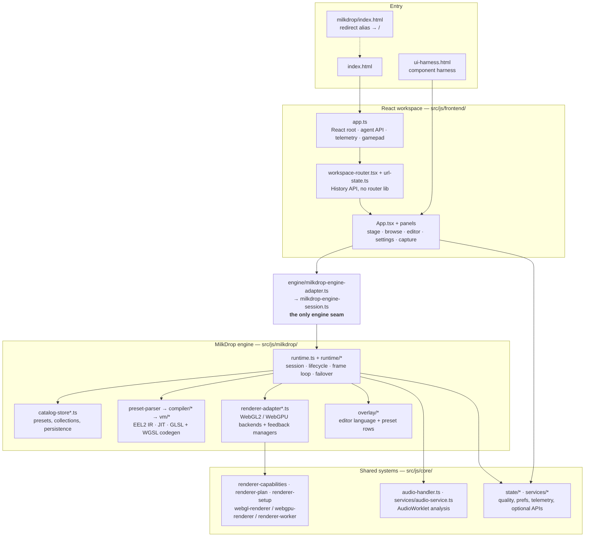
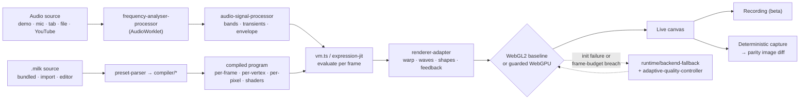

# Architecture Overview

This document describes the current shipped frontend architecture for Stims after the React workspace cutover. The root route at `/` is the product surface. `milkdrop/index.html` exists only as a compatibility alias that redirects into `/`.

## Current shape

- `index.html` is the single app shell and bootstraps `src/js/app.ts`.
- `src/js/app.ts` mounts the React workspace and global runtime affordances.
- `src/js/frontend/*` owns route state, workspace UI, and the engine adapter seam.
- `src/js/milkdrop/*` remains the imperative visualizer engine, overlay, compiler, and catalog runtime.
- Workspace-scene decorative layers are rendered with imperative Three.js, not a secondary React renderer.
- `src/js/core/*` owns shared renderer, audio, quality, persistence, and input systems, including the Three.js scene bootstrap (`toy-runtime*`, `web-toy.ts`, `toy-*-session.ts`) that the engine session mounts onto.
- The old DOM shell modules (`loader.ts`, `router.ts`, `toy-view.ts`, `library-view*`, `bootstrap/*`) have been deleted. Nothing outside the React workspace boots the engine anymore.
- There is no toy plugin layer. The old toys directory, the generated toy manifest, and the registry tooling around them were removed once it was clear they described a registry of one; `src/data/toys.json` survives purely as product metadata for the MCP server.

## Runtime map

Boot path and module ownership. The adapter is the only edge crossing from React into the engine.


```mermaid
flowchart TB
  subgraph shell["Entry"]
    Entry["index.html"]
    Alias["milkdrop/index.html<br/>redirect alias → /"]
    Harness["ui-harness.html<br/>component harness"]
  end

  subgraph react["React workspace — src/js/frontend/"]
    App["app.ts<br/>React root · agent API · telemetry · gamepad"]
    Router["workspace-router.tsx + url-state.ts<br/>History API, no router lib"]
    UI["App.tsx + panels<br/>stage · browse · editor · settings · capture"]
  end

  Adapter["engine/milkdrop-engine-adapter.ts<br/>→ milkdrop-engine-session.ts<br/><b>the only engine seam</b>"]

  subgraph engine["MilkDrop engine — src/js/milkdrop/"]
    Runtime["runtime.ts + runtime/*<br/>session · lifecycle · frame loop · failover"]
    Catalog["catalog-store*.ts<br/>presets, collections, persistence"]
    Compile["preset-parser → compiler/* → vm/*<br/>EEL2 IR · JIT · GLSL + WGSL codegen"]
    RAdapter["renderer-adapter*.ts<br/>WebGL2 / WebGPU backends + feedback managers"]
    Overlay["overlay/*<br/>editor language + preset rows"]
  end

  subgraph core["Shared systems — src/js/core/"]
    Audio["audio-handler.ts · services/audio-service.ts<br/>AudioWorklet analysis"]
    Render["renderer-capabilities · renderer-plan · renderer-setup<br/>webgl-renderer / webgpu-renderer / renderer-worker"]
    State["state/* · services/*<br/>quality, prefs, telemetry, optional APIs"]
  end

  Entry --> App
  Alias -.-> Entry
  Harness --> UI
  App --> Router --> UI
  UI --> Adapter
  UI --> State
  Adapter --> Runtime
  Runtime --> Catalog
  Runtime --> Compile
  Runtime --> RAdapter
  Runtime --> Overlay
  Runtime --> Audio
  RAdapter --> Render
  Runtime --> State
```

## Frame data flow

What moves per frame, once a session is running.


```mermaid
flowchart LR
  Src["Audio source<br/>demo · mic · tab · file · YouTube"] --> Worklet["frequency-analyser-processor<br/>(AudioWorklet)"]
  Worklet --> Signals["audio-signal-processor<br/>bands · transients · envelope"]
  Milk[".milk source<br/>bundled · import · editor"] --> Parser["preset-parser → compiler/*"]
  Parser --> IR["compiled program<br/>per-frame · per-vertex · per-pixel · shaders"]
  Signals --> VM["vm.ts / expression-jit<br/>evaluate per frame"]
  IR --> VM
  VM --> Draw["renderer-adapter<br/>warp · waves · shapes · feedback"]
  Draw --> Backend{"WebGL2 baseline<br/>or guarded WebGPU"}
  Backend --> Canvas["Live canvas"]
  Backend -.->|init failure or<br/>frame-budget breach| Fallback["runtime/backend-fallback<br/>+ adaptive-quality-controller"]
  Fallback -.-> Backend
  Canvas --> Rec["Recording (beta)"]
  Canvas --> Cap["Deterministic capture<br/>→ parity image diff"]
```

## URL state (no router)

Stims uses the native History API instead of a client-side router. The app is a single-page SPA with one route (`/`); all persistent state lives in URL search params.

- URL reads → `window.location.search` via `readSessionRouteState()`
- URL writes → `window.history.replaceState(null, '', newUrl)` on state changes
- Back/forward → `popstate` event listener re-reads the URL

All URL reads go through one parser, [`src/js/core/url-params.ts`](../src/js/core/url-params.ts)
(`parseURLParams`), so the parameter surface is auditable in one file.

Canonical session params (read + written by the app):
- `preset` — active preset id
- `collection` — collection tag (normalized to `collection:<tag>`)
- `tool` — active panel: `browse` | `capture` | `editor` | `settings`
- `audio` — audio source: `demo` | `file` | `microphone` | `tab` | `youtube`
- `agent` — automation/testing mode (`true`)
- `embedded` — embed/player mode (`true`)
- `yt` / `t` — shared YouTube video id and start offset in seconds
- `experience` — written only when a legacy slug must be surfaced as invalid

Legacy aliases still read on boot: `panel` (`looks` → `browse`), `preview` →
`embedded`, `audio=sample` → `demo`, `audio=mic` → `microphone`.

Read-only QA / override params:
- `renderer` — `webgl` | `webgpu` | `auto`
- `corpus` — deterministic corpus override (e.g. `certification`)
- `stats` — `1` | `0` (stats-gl overlay)
- `tv` / `tvMode` — smart-TV override
- `maxPixelRatio`, `particleBudget`, `shaderQuality`, `lockQualityStep`, `powerSaver`
- `mockAudio`, `mockFrequency`
- `milkdrop-webgpu-{main-wave,trail-waves,custom-waves,mesh,motion-vectors,feedback,fallback,compute-vm,render-bundles}`
- `component`, `props`, `grid` — UI harness page (`ui-harness.html`)
- `debug=hud` — on-canvas debug HUD
- `liveTiles`, `strudel` — prototype flags (presence-only)

Feature-local params (read and written within one feature, not session state):
- `sync` — watch-together room name (sync transport; `SyncSessionBridge`)
- `modal` — rendering-capability dialog state (`webgl-check.ts`)

Hash params:
- `#code=<base64>` — a full `.milk` source to load in the editor
- `#t=<seconds>` — YouTube start offset, only for pasted YouTube URLs

- Unknown query params are preserved during canonicalization.
- Unsupported legacy `experience` slugs are surfaced as an invalid-experience state instead of silently booting another shell.

Primary implementation:
- [`src/js/core/url-params.ts`](../src/js/core/url-params.ts) — single read parser
- [`src/js/frontend/url-state.ts`](../src/js/frontend/url-state.ts) — session route read/write + canonicalization
- [`src/js/frontend/contracts.ts`](../src/js/frontend/contracts.ts)
- URL synchronization hook: `useWorkspaceRouteState()` in [`src/js/frontend/workspace-hooks.ts`](../src/js/frontend/workspace-hooks.ts)

## Frontend ownership

### App bootstrap

- [`src/js/app.ts`](../src/js/app.ts) installs telemetry persistence, the agent API, and gamepad navigation.
- It renders [`src/js/frontend/App.tsx`](../src/js/frontend/App.tsx) into `#app`.
- It no longer delegates root ownership to the old DOM loader stack.

### Workspace UI

- [`src/js/frontend/App.tsx`](../src/js/frontend/App.tsx) owns:
  - top navigation
  - launch controls
  - preset browsing and search
  - session stage container
  - settings surface
  - canonical URL synchronization
  - focused-session state
- [`src/css/app-shell.css`](../src/css/app-shell.css) owns the workspace presentation layer, scoped with `@scope (.stims-shell)`.

### Engine seam

- [`src/js/frontend/engine/milkdrop-engine-adapter.ts`](../src/js/frontend/engine/milkdrop-engine-adapter.ts) is the only frontend-facing engine boundary.
- New UI code should not import deep `src/js/milkdrop/*` runtime internals directly.
- Decorative shell visuals are handled with imperative Three.js, not a secondary React renderer. Keep actual MilkDrop rendering in the imperative engine.
- The adapter owns:
  - mount and dispose
  - preset loading
  - audio source changes
  - panel/tool opening
  - collection changes
  - import/export
  - diagnostics and snapshot subscription

## MilkDrop engine ownership

- [`src/js/milkdrop/runtime.ts`](../src/js/milkdrop/runtime.ts) is the long-lived imperative session runtime; it composes the collaborators in [`runtime/`](../src/js/milkdrop/runtime) (lifecycle, frame loop, catalog coordinator, backend failover, persistence, presentation).
- [`src/js/milkdrop/overlay/`](../src/js/milkdrop/overlay) provides editor language support and preset-row rendering. The browse, editor, settings, and capture surfaces themselves are React panels in `src/js/frontend/`.
- [`src/js/milkdrop/compiler.ts`](../src/js/milkdrop/compiler.ts), [`compiler/`](../src/js/milkdrop/compiler), [`vm.ts`](../src/js/milkdrop/vm.ts), and [`vm/`](../src/js/milkdrop/vm) are the preset compilation and execution path (EEL2 → IR → JIT/GLSL/WGSL). There are two shader codegen targets, not three: [`shader-analysis-glsl.ts`](../src/js/milkdrop/compiler/shader-analysis-glsl.ts) and [`wgsl-generator.ts`](../src/js/milkdrop/compiler/wgsl-generator.ts). TSL is used by the WebGPU feedback managers directly, not emitted by the compiler.
- [`src/js/milkdrop/renderer-adapter.ts`](../src/js/milkdrop/renderer-adapter.ts) and its WebGL/WebGPU siblings own draw submission and the feedback-buffer chain.

Important boundary rule:
- The React shell may drive engine capabilities through the adapter.
- The engine still owns actual visualization rendering and its internal overlay/editor composition for v1.

## Shared systems

- [`src/js/core/renderer-capabilities.ts`](../src/js/core/renderer-capabilities.ts) probes WebGPU/WebGL support.
- [`src/js/core/settings-panel.ts`](../src/js/core/settings-panel.ts) owns shared quality preset state, alongside [`state/quality-preset-store.ts`](../src/js/core/state/quality-preset-store.ts) and [`services/adaptive-quality-controller.ts`](../src/js/core/services/adaptive-quality-controller.ts).
- [`src/js/core/state/browser-storage.ts`](../src/js/core/state/browser-storage.ts) is the single defensive accessor for `localStorage`/`sessionStorage`. Reach for it instead of hand-rolling try/catch around storage.
- [`src/js/core/audio-handler.ts`](../src/js/core/audio-handler.ts) and [`services/audio-service.ts`](../src/js/core/services/audio-service.ts) own source selection and the AudioWorklet analysis chain.
- [`src/js/core/state/render-preference-store.ts`](../src/js/core/state/render-preference-store.ts) owns renderer preferences. Import it directly — the old `core/render-preferences.ts` re-export shim is gone.
- [`src/js/core/motion-preferences.ts`](../src/js/core/motion-preferences.ts) owns motion-state persistence.
- [`src/js/core/agent-api.ts`](../src/js/core/agent-api.ts) exposes automation-friendly session state and control hooks.
- [`src/js/core/services/webmidi-controller.ts`](../src/js/core/services/webmidi-controller.ts) owns MIDI device tracking, per-device persisted CC mappings, learn mode, and hot-plug recovery; a virtual "Claude (MCP)" device shares the same pipeline so MCP `session_midi_*` tools and physical hardware bind and drive parameters identically. The live binding to engine parameters is mounted in `App.tsx` rather than inside a settings panel, so it keeps working regardless of which UI is open.
- For an implementation map that separates shipped systems, partial certification, beta behavior, optional APIs, and scaffolding, see [`TECHNICAL_ACHIEVEMENTS.md`](./TECHNICAL_ACHIEVEMENTS.md).
- The renderer support rule is: WebGL is the baseline compatibility path, and WebGPU is an additive path that should not regress WebGL behavior. See [`VERIFICATION_MATRIX.md`](./VERIFICATION_MATRIX.md) for the short verification matrix.

## Edge runtime & Cloudflare architecture

Stims pairs its browser-native visualizer client with a serverless edge backend on Cloudflare Workers:

- **Site Worker with Static Assets**: The entire production bundle (`dist/`) is served at the edge with smart routing. Navigations hit [`functions/_middleware.ts`](../functions/_middleware.ts) first for dynamic SEO, JSON-LD, and Open Graph rewrites via `HTMLRewriter`.
- **Workers AI & Vectorize**: `/api/visual-search` runs semantic search using `@cf/baai/bge-base-en-v1.5` embeddings over Vectorize indices (with fallback to cosine scanning over D1 database storage). `/api/generate-preset` uses reasoning and coding models to synthesize `.milk` source on the fly.
- **D1 SQL & R2 Storage**: Persistent preset galleries, author registries, and social preview assets (`stims-gallery` and `stims-static`).
- **Durable Objects & WebSockets (Hibernation API)**: [`scripts/sync-room-worker.ts`](../scripts/sync-room-worker.ts) powers real-time watch-together sync rooms where hosts stream visualizer parameters to viewers with zero idle cost.
- **Vite & Vinext Edge Toolchain**: The codebase uses standard Vite Environment APIs and worker entrypoints (`dist/_worker.js`), ensuring seamless compatibility with modern fullstack edge frameworks like Vinext.

## Retired compatibility layer

The old DOM shell (`loader.ts`, `router.ts`, `toy-view.ts`, `library-view*`, `bootstrap/*`) is gone. The only surviving compatibility surface is `milkdrop/index.html`, which preserves search and hash while redirecting to `/`. Route new work through the React workspace and the engine adapter.

## Verification anchors

Use these checks when changing architecture-sensitive areas:

```bash
bun run check
```

```bash
bun run test tests/unit/frontend-url-state.test.ts tests/unit/app-shell-route-sync.test.ts tests/unit/agent-api.test.ts
```

The architecture boundary gate:

```bash
bun run check:architecture
```

Stale documentation paths are themselves gated:

```bash
bun run check:stale-paths
```
