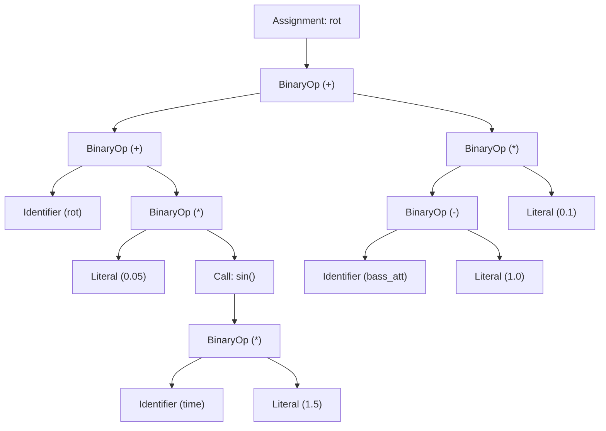

# Deep-Dive Case Study: Compiling 20-Year-Old MilkDrop Presets to WebGPU and WebGL2

**Author:** Systems & Graphics Runtime Engineering Team  
**Repository:** `stims` (`https://github.com/zz-plant/stims`)  
**Scope:** AST $\rightarrow$ IR $\rightarrow$ WGSL/JIT Compiler Pipeline, Deterministic Math Execution, and Numerical Compatibility Testing

---

## Executive Summary

MilkDrop, created in 2001 by Ryan Geiss for Winamp, represents one of the most expressive audio-reactive generative visualization engines in computing history. Over two decades, visual artists authored tens of thousands of `.milk` presets using Nullsoft's proprietary Expression Evaluation Language (EEL2), custom Direct3D 9 fixed-function mesh deformation mathematics, and DirectX 9 HLSL Pixel Shaders (ps_2_0 / ps_3_0).

Historically, running these presets outside Winamp required C++ runtimes such as `projectM`, which depend on desktop OpenGL and platform-native audio pipelines.

This case study documents the engineering architecture of **Stims**, a browser-native compiler and graphics runtime that brings 20-year-old MilkDrop presets into modern **WebGPU** and **WebGL2** without C++ / WebAssembly emulation bottlenecks. We detail the end-to-end multi-tier compiler architecture (EEL2 Lexer/Parser $\rightarrow$ Semantic AST $\rightarrow$ Normalized IR $\rightarrow$ JavaScript JIT / WGSL Compute Kernels), the differential image-diff harness that measures divergence from native C++ `projectM` — which currently grades most of the certified set as failing — the micro-architectural interventions that achieved a **16.5% frame work reduction (3.43 ms $\rightarrow$ 2.87 ms unthrottled, 17.56 ms $\rightarrow$ 15.31 ms at 4× CPU throttle)**, and the fundamental compatibility boundaries inherent in browser graphics standards.

```
┌──────────────────────────────────────────────────────────────────────────────────────────────────────────┐
│                                       STIMS COMPILER & RUNTIME ARCHITECTURE                              │
└──────────────────────────────────────────────────────────────────────────────────────────────────────────┘

     ┌───────────────────────┐
     │  Legacy .milk Preset  │
     │  - EEL2 Equations     │
     │  - HLSL Warp/Comp     │
     └───────────┬───────────┘
                 │
                 ▼
     ┌───────────────────────┐
     │   Lexer & AST Parser  │ ──► [EEL2 Permissive Grammar, Operator Precedence, Scope Extraction]
     └───────────┬───────────┘
                 │
                 ▼
     ┌───────────────────────┐
     │ AST Transformation &  │ ──► [Constant Folding, Dead Store Elimination,
     │ IR Generation         │      Coordinate Aliasing, Uniform Layout Planning]
     └───────────┬───────────┘
                 │
         ┌───────┴───────────────────────────────┐
         │                                       │
         ▼                                       ▼
  ┌─────────────┐                        ┌─────────────┐
  │ Tier 1: CPU │                        │ Tier 2: GPU │
  │ JS EEL JIT  │                        │ WGSL Compute│
  │ (new Func)  │                        │  Generation │
  └──────┬──────┘                        └──────┬──────┘
         │                                       │
         │ (Per-frame equations,                 │ (Per-vertex mesh deformation,
         │  waveform evaluation,                 │  megabuf 1M memory bindings,
         │  CSP fallback interpreter)            │  parallel grid dispatch)
         │                                       │
         └───────────────┬───────────────────────┘
                         │
                         ▼
     ┌───────────────────────────────────────────┐
     │ HLSL ──► WGSL / GLSL Shader Transpiler    │ ──► [Custom Samplers, Noise Volumes,
     └───────────────────┬───────────────────────┘      Dual FBO Feedback Ping-Pong]
                         │
                         ▼
     ┌───────────────────────────────────────────┐
     │ Render Engine & Composite Output Pipeline │
     └───────────────────┬───────────────────────┘
                         │
                         ▼
     ┌───────────────────────────────────────────┐
     │ Automated Differential Testing Harness    │ ──► [Headless Chrome, Perceptual Diffing,
     │ vs Native C++ projectM 3.1.12 Reference   │      Noise-Banded Pass/Fail]
     └───────────────────────────────────────────┘
```

---

## 1. Problem Space & Architectural Constraints

### 1.1 The Legacy MilkDrop Execution Model

A MilkDrop preset is not a static video or a single monolithic shader; it is an interactive state machine executing mathematical equations across three distinct time and spatial granularities:

1. **Per-Frame Initialization & Update (`init_eqn`, `per_frame_eqn`)**: Executed once per video frame (e.g., 60 Hz or 120 Hz) to update global state, audio decay rates, zoom scales, rotation velocities, and arbitrary user registers ($q_1 \dots q_{32}$, $t_1 \dots t_8$).
2. **Per-Vertex / Per-Pixel Grid Deformation (`per_pixel_eqn`, `per_vertex_eqn`)**: Executed across a 2D spatial grid (historically $32 \times 24$ to $64 \times 48$ vertices). For each vertex $(x, y)$ with polar coordinates $(rad, ang)$, user math dynamically alters the sampling coordinates $(u, v)$ via rotation ($rot$), radial zoom ($zoom$), warping ($warp$), and displacement vectors ($dx, dy$).
3. **Custom Waveforms & Shapes (`wavecode`, `shapecode`)**: Up to 4 custom waves ($512$ to $2048$ vertices each) and 4 custom procedural geometry shapes with independent per-frame and per-point EEL2 math scripts.
4. **Nonlinear Feedback & Post-Processing Shaders (`warp_shader`, `comp_shader`)**: DirectX 9 HLSL Pixel Shaders operating on dual ping-pong render targets with custom texture samplers (`sampler_main`, `sampler_noise_lq`, `sampler_noise_hq`, `sampler_noisevol_lq`).

### 1.2 Why Native C++ WebAssembly Porting Was Rejected

Initial attempts across the WebGL community to run MilkDrop relied on compiling C++ `projectM` to WebAssembly using Emscripten. While functional for basic playback, this architecture suffers from fundamental architectural flaws for high-performance web applications:

- **CPU-GPU Readback & Memory Copy Penalties**: projectM's legacy architecture binds state to CPU memory and uploads dynamic mesh vertices to OpenGL via `glBufferData` every frame. In browser WebAssembly, passing thousands of vertex attributes across the JS/WASM $\leftrightarrow$ WebGL boundary induces garbage collection pressure and driver stalls.
- **Inability to Leverage WebGPU Compute Pipelines**: WebAssembly cannot directly issue WebGPU compute passes without expensive JS proxy shims.
- **Binary Footprint**: Monolithic WASM runtime builds range from 2.5 MB to 6 MB, creating unacceptable First Contentful Paint (LCP/FCP) latency for web users.
- **Deterministic Inspectability**: WASM sandboxes prevent browser devtools and modern React frontends from inspecting, modifying, or hot-reloading individual EEL2 AST expressions in real-time during live editing sessions.

**The Solution:** Build a native TypeScript $\rightarrow$ WebGPU / WebGL2 optimizing compiler that parses EEL2 source directly into an Intermediate Representation (IR), generates high-throughput JIT execution kernels for CPU/GPU, and translates DirectX 9 HLSL into valid WGSL / GLSL 300 es shaders.

---

## 2. The Compiler Pipeline Architecture

The Stims compiler translates raw `.milk` presets into executable GPU pipelines through a five-stage architecture:

```
[Raw Preset Text] ──► [Lexer/Scanner] ──► [AST Parser] ──► [IR Lowering & Optimization] ──► [JIT / WGSL Codegen]
```

### 2.1 Lexical Analysis & Permissive EEL2 Parsing

Nullsoft EEL2 was designed for rapid in-app editing in 2001 and possesses unusual syntactic quirks:
- Semicolons are statement separators, but trailing semicolons are optional.
- Variable assignments use `=` rather than `:=` or `==`, while equality uses `==` or `equal(a, b)`.
- Conditionals are expressed either as C-style ternary operators `cond ? expr1 : expr2` or function invocations `if(cond, then_expr, else_expr)`.
- Implicit multiplication and loose operator precedence (e.g., `2*pi*sin(x)`).
- Case-insensitive identifiers (`q1`, `Q1`, `Zoom`, `ZOOM` refer to the identical register).

The tokenizer classifies tokens into a typed enumeration:

```typescript
export type MilkdropExpressionNode =
  | { type: 'literal'; value: number }
  | { type: 'identifier'; name: string }
  | { type: 'unary'; operator: '+' | '-' | '!' | '~'; argument: MilkdropExpressionNode }
  | { type: 'binary'; operator: string; left: MilkdropExpressionNode; right: MilkdropExpressionNode }
  | { type: 'call'; name: string; args: MilkdropExpressionNode[] };
```

#### EEL2 AST Representation Example
Given the legacy MilkDrop per-frame expression:
```c
rot = rot + 0.05 * sin(time * 1.5) + (bass_att - 1.0) * 0.1;
```

The parser constructs the following AST:



---

### 2.2 Semantic Analysis & Intermediate Representation (IR)

The Intermediate Representation (`MilkdropPresetIR`, defined in `src/js/milkdrop/compiler/ir.ts`) unifies the disparate components of a preset into an optimized execution manifest:

```typescript
export type MilkdropPresetIR = {
  meta: MilkdropPresetMetadata;
  signals: MilkdropRuntimeSignals;
  programs: {
    init: MilkdropProgramBlock;
    frame: MilkdropProgramBlock;
    pixel: MilkdropProgramBlock;
    vertex?: MilkdropProgramBlock;
  };
  waves: MilkdropWaveDefinition[];
  shapes: MilkdropShapeDefinition[];
  shaders: {
    warp?: MilkdropCompiledShader;
    composite?: MilkdropCompiledShader;
  };
  samplers: MilkdropCustomSampler[];
  compatibility: MilkdropParityReport;
  gpuPlan?: MilkdropGpuDescriptorPlan;
};
```

During IR construction, several compiler passes optimize the execution graph:
1. **Dead Store Elimination (DSE)**: Stripping writes to transient variables that are never referenced downstream.
2. **Variable Normalization & Aliasing**: Mapping legacy variable aliases (`rad`, `ang`, `zoom`, `rot`, `warp`, `dx`, `dy`, `sx`, `sy`, `cx`, `cy`, `q1`–`q32`, `t1`–`t8`) to fixed indices in flat typed array buffers.
3. **Control Flow Desugaring**: Translating EEL2 `if(cond, a, b)` constructs into branchless ternary expressions (`select(b, a, cond > 0.0)` in WGSL).
4. **Memory Allocation**: Assigning bindings for `megabuf` (preset-local 1M float scratch space) and `gmegabuf` (cross-preset global 1M float ring buffer).

---

### 2.3 Tier 1: High-Performance JavaScript JIT Compiler

For per-frame evaluations and platforms where WebGPU compute is unavailable, `src/js/milkdrop/expression-jit.ts` compiles parsed EEL2 AST blocks into single monomorphic JavaScript functions using `new Function(...)`:

```typescript
export type MilkdropProgramFn = (
  env: Record<string, number>,
  state: Record<string, number>,
  registers: Record<string, number>,
  locals: Record<string, number> | null,
  megabuf: Float32Array,
  gmegabuf: Float32Array,
  nextRandom: () => number,
) => void;
```

#### Generated JavaScript JIT Output Snippet
For the expression `q1 = sin(time) * 2.0; mb(10) = q1 + 1.0;`, the JIT emits:

```javascript
/* Generated EEL2 Program Block */
function anonymous(env, state, registers, locals, mb, gb, nextRandom) {
  var _i0, _i1, _i2;
  // Statement 1: q1 = sin(time) * 2.0
  _i0 = Math.sin(env.time) * 2.0;
  registers.q1 = _i0;
  env.q1 = _i0;

  // Statement 2: mb(10) = q1 + 1.0
  _i1 = 10;
  _i2 = registers.q1 + 1.0;
  (_i1 >= 0 && _i1 < 1048576) && (mb[_i1] = _i2);
}
```

#### Content Security Policy (CSP) Fallback
If the host application enforces a strict CSP prohibiting `unsafe-eval` or `new Function`, the runtime gracefully degrades to an AST tree-walking interpreter (`evaluateMilkdropExpression` in `src/js/milkdrop/expression.ts`), verified by automated test suites (`tests/unit/eel-csp-fallback.test.ts`).

---

### 2.4 Tier 2: WGSL Compute Shader Generator

For WebGPU execution, per-vertex and per-pixel equations are compiled directly into WebGPU compute shaders (`src/js/milkdrop/compiler/wgsl-generator.ts`). This allows executing grid deformation for thousands of vertices completely in parallel on GPU execution units.

```wgsl
// Generated WGSL Compute Shader: Per-Vertex Grid Deformation Kernel
struct MilkdropUniforms {
  time: f32,
  bass: f32,
  mid: f32,
  treb: f32,
  bass_att: f32,
  mid_att: f32,
  treb_att: f32,
  frame: f32,
  progress: f32,
};

struct VertexState {
  x: f32,
  y: f32,
  rad: f32,
  ang: f32,
  zoom: f32,
  rot: f32,
  warp: f32,
  dx: f32,
  dy: f32,
  sx: f32,
  sy: f32,
};

@group(0) @binding(0) var<uniform> uniforms: MilkdropUniforms;
@group(0) @binding(1) var<storage, read_write> q_registers: array<f32, 32>;
@group(0) @binding(2) var<storage, read_write> grid_vertices: array<VertexState>;
@group(0) @binding(3) var<storage, read_write> megabuf: array<f32, 1048576>;

@compute @workgroup_size(64, 1, 1)
fn main(@builtin(global_invocation_id) global_id: vec3<u32>) {
  let index = global_id.x;
  if (index >= arrayLength(&grid_vertices)) {
    return;
  }

  var v = grid_vertices[index];
  
  // Lowered EEL2 equation: zoom = 1.0 + 0.05 * sin(v.rad * 8.0 - uniforms.time * 2.0);
  v.zoom = 1.0 + 0.05 * sin(v.rad * 8.0 - uniforms.time * 2.0);
  
  // Lowered EEL2 equation: rot = 0.02 * cos(v.ang * 4.0 + uniforms.time);
  v.rot = 0.02 * cos(v.ang * 4.0 + uniforms.time);

  grid_vertices[index] = v;
}
```

---

### 2.5 HLSL $\rightarrow$ WGSL / GLSL Shader Transpilation

MilkDrop 2.0 presets feature custom DirectX 9 pixel shaders (`ps_2_0` / `ps_3_0`) for image warping and composite color grading. The compiler transpiles HLSL constructs into modern WGSL and GLSL 300 es:

| Direct3D 9 HLSL Construct | Transpiled WebGL2 (GLSL 300 es) | Transpiled WebGPU (WGSL) |
| :--- | :--- | :--- |
| `tex2D(sampler_main, uv)` | `texture(sampler_main, uv)` | `textureSample(texture_main, sampler_main, uv)` |
| `tex3D(sampler_noisevol_lq, uvw)` | `texture(sampler_noisevol_lq, uvw)` | `textureSample(texture_noisevol_lq, sampler_linear, uvw)` |
| `float4 color = tex2D(...)` | `vec4 color = texture(...)` | `var color: vec4<f32> = textureSample(...)` |
| `lerp(a, b, t)` | `mix(a, b, t)` | `mix(a, b, t)` |
| `frac(x)` | `fract(x)` | `fract(x)` |
| `saturate(x)` | `clamp(x, 0.0, 1.0)` | `clamp(x, 0.0, 1.0)` |
| `float2((uv.x-0.5)*aspect.x, ...)` | `vec2((uv.x-0.5)*u_aspect.x, ...)` | `vec2<f32>((uv.x-0.5)*uniforms.aspect_x, ...)` |

---

## 3. Numerical Compatibility Verification

The repository maintains a differential image-diff harness that measures how far the browser runtime lands from native C++ `projectM 3.1.12`. It is a measurement instrument rather than a passing gate: as of the 2026-08-27 re-measurement, most of the certified set diverges from its reference by far more than the configured tolerance. [`MILKDROP_PROJECTM_PARITY_PLAN.md`](./MILKDROP_PROJECTM_PARITY_PLAN.md) is the source of truth for current numbers; this section describes the instrument.

### 3.1 Headless Diff Testing Pipeline

`bun run parity:capture` walks the certified manifest (`src/data/milkdrop-parity/visual-reference-manifest.json`) on one reused headless Chromium instance under Playwright, rendering each preset against the audio its reference was captured with — `silence` or the generated tone signal in `src/js/core/testing/reference-audio.ts`, which the C++ harness mirrors through a generated header. `bun run parity:suite` diffs each capture against the checked-in projectM fixture in `tests/fixtures/milkdrop/projectm-reference/`, and `bun run parity:noise` measures a preset's run-to-run variance floor so a real delta can be told apart from procedural jitter. Only `parity:promote-result` writes a graded outcome into `src/data/milkdrop-parity/measured-results.json`.

```
┌─────────────────────────┐         ┌─────────────────────────┐
│   Native C++ projectM   │         │  Stims WebGPU / WebGL2  │
│  Reference Frame (PNG)  │         │   Rendered Capture      │
└────────────┬────────────┘         └────────────┬────────────┘
             │                                   │
             └─────────────────┬─────────────────┘
                               │
                               ▼
              ┌─────────────────────────────────┐
              │    Pixelmatch Diff Algorithm    │
              │  (Channel Delta, MAE, RMSE)     │
              └────────────────┬────────────────┘
                               │
                               ▼
              ┌─────────────────────────────────┐
              │  Gate: mismatch ≤ failThreshold │
              │  (0.02 manifest / 0.04 report)  │
              └─────────────────────────────────┘
```

The difference metric calculates channel deltas across 24-bit RGB space:
$$\Delta_{\text{pixel}} = \max\left(|R_{\text{stims}} - R_{\text{ref}}|, |G_{\text{stims}} - G_{\text{ref}}|, |B_{\text{stims}} - B_{\text{ref}}|\right)$$

A pixel is marked as mismatched if $\Delta_{\text{pixel}} > \text{Threshold}$ (16 in the shipped manifest). A preset fails when its mismatch ratio exceeds the `failThreshold` configured for it — `0.02` in `visual-reference-manifest.json`, `0.04` in the bounded WebGPU certification report. Two further conditions apply before a number is a result at all: the reference must carry signal a blank frame would not also pass (otherwise the suite reports `reference-no-signal` and declines to grade), and the delta must exceed the preset's own measured noise band.

### 3.2 Canonical Preset Parity Results

Thirteen presets are certified, all judged on WebGPU. The scoreboard below is the 2026-08-27 re-measurement recorded in [`MILKDROP_PROJECTM_PARITY_PLAN.md`](./MILKDROP_PROJECTM_PARITY_PLAN.md) — the ten it reports numbers for, of which one passes. Every band measured before that date is stale, because two harness defects found the same day invalidated the earlier numbers — the capture was screenshotting 28–162 frames past the deterministic pump on live decorative audio, and video echo was applied to the accumulator instead of at display, so `fVideoEchoZoom` never reached a shader.

| Preset Identifier | Category / Strata | Measured Mismatch % | Grade |
| :--- | :--- | ---: | :--- |
| `100-square` | Geometry / Mesh Quad | 1.50% | PASS (noise band 1.36–1.55) |
| `eos-glowsticks-v2-03-music` | Waveform / Glowsticks | 1.08% | Ungraded (`reference-no-signal`) |
| `300-beatdetect-bassmidtreb` | Audio Reactivity / Beat | 5.79% | FAIL |
| `250-wavecode` | Custom Wavecode | 7.30% | FAIL |
| `eos-phat-cubetrace-v2` | Procedural 3D Mesh | 29.25% | FAIL (non-deterministic, 29.3–38.3% across repeats) |
| `260-compshader-noise_lq` | 2D Noise Texture Shader | 33.72% | FAIL (bit-exact repeatable) |
| `rovastar-parallel-universe` | Feedback / Video Echo | 67.99% | FAIL |
| `261-compshader-noisevol_lq` | 3D Noise Volume Shader | 76.24% | FAIL |
| `krash-rovastar-cerebral-demons-stars` | Multi-pass Composite | 95.26% | Ungraded (`reference-no-signal`) |
| `mosaics` | High-order Feedback Loop | 100.00% | FAIL (non-deterministic, 66.3–99.7% across repeats) |

The dominant open defect is unbounded feedback accumulation on `fDecay=1.0` presets: magnetosphere renders at 76.9 mean luminance against a reference at 24.7, dark-heart at 74.5 against 22.1, mosaics at 137.3 against 38.2 — 3.2–3.6× too bright, and growing with frame count rather than sitting on a tone curve. Fixing it should move four of the ten failing presets.

`src/data/milkdrop-parity/measured-results.json` holds three promoted results, last updated 2026-07-19. Those predate the harness fix and are not evidence for the current runtime; treat the parity plan's scoreboard as current and the promoted file as the last set of numbers that survived promotion.

---

## 4. Performance Interventions & Profiling Deep-Dive

### 4.1 The Hot-Loop Memory Bottleneck

During CPU-side execution of per-vertex and per-point equations, the runtime invokes compiled EEL2 code thousands of times per frame:
$$N_{\text{invocations}} = (48 \times 36 \text{ grid vertices}) + (4 \text{ custom waves} \times 512 \text{ points}) = 3,776 \text{ invocations/frame}$$

At 120 FPS, this equals **453,120 function executions per second**.

Profiling via Chrome DevTools Protocol (CDP) revealed severe V8 polymorphic IC (Inline Cache) churn and redundant memory store operations. Specifically, the compiled JIT functions previously mirrored every variable write into both the local execution scope and the global environment:

```javascript
// UNOPTIMIZED (Before): Redundant mirror store
locals.rot = _val;
env.rot = _val; // Unnecessary duplicate property write!
```

### 4.2 Optimization: Elimination of Redundant Scope Writes

In commit `ac2b354d`, the JIT compiler was modified to analyze variable residency at compile time. Per-point and per-pixel callers pass identical object references for environment and local scope. The JIT now eliminates the redundant write while preserving explicit stores for global $q$ registers and `megabuf` buffers:

```javascript
// OPTIMIZED (After): Direct single store
locals.rot = _val;
// Duplicate env write eliminated
```

### 4.3 Benchmark Results & Headroom Analysis

Benchmarks were conducted on an **Apple M1 Max (64 GB RAM)** running Chromium with native WebGPU at $1280 \times 720$ resolution on the equation-heavy stress preset `eos-apocalypse`.

| CDP CPU Throttle | Median FPS (Before) | Median FPS (After) | Average Frame Work (Before) | Average Frame Work (After) | Performance Delta & Interpretation |
| :---: | :---: | :---: | :---: | :---: | :--- |
| **1× (Unthrottled)** | 120.48 | 120.48 | **3.43 ms** | **2.87 ms** | **16.5% reduction in frame work** (display-capped at 120 FPS) |
| **2× CPU Throttle** | 120.48 | 120.48 | **7.96 ms** | **6.75 ms** | **15.2% reduction in frame work** (display-capped) |
| **4× CPU Throttle** | 58.14 | **59.88** | **17.56 ms** | **15.31 ms** | **Crossed 60 FPS frame deadline** ($17.56 \text{ ms} \rightarrow 15.31 \text{ ms} < 16.67 \text{ ms}$) |
| **6× CPU Throttle** | 38.61 | **39.68–39.84** | **25.91 ms** | **24.08–24.26 ms** | **6.4–7.1% sustained frame-time reduction** on low-end hardware |
| **8× CPU Throttle** | 24.57 | 23.92 / 29.59 | **35.51 ms** | 40.45 / 33.09 ms | Scheduler-sensitive across repeats; not a stable uplift |

```
FRAME WORK DURATION COMPARISON (Lower is Better)

1x Unthrottled:
  Before: [███████████████████████████████████] 3.43 ms
  After:  [█████████████████████████████] 2.87 ms  (-16.5%)

4x CPU Throttle (Target Budget: 16.67 ms for 60 FPS):
  Before: [████████████████████████████████████████████] 17.56 ms (Missed Frame Deadline)
  After:  [█████████████████████████████████████] 15.31 ms (Within 60 FPS Budget!)
```

### 4.4 CPU Flame Graph Profile Breakdown

```
========================================================================================
CPU PROFILING BREAKDOWN (Per Frame @ 120 FPS, 2.87 ms total work)
========================================================================================
[1.21 ms - 42.1%]  WebGPU Command Recording & Resource Encoding
  ├── [0.62 ms] RenderPassEncoder (Warp & Composite Quad Draw)
  ├── [0.38 ms] ComputePassEncoder (Vertex Deformation Dispatch)
  └── [0.21 ms] Queue.writeBuffer / writeTexture (Uniforms & Audio Spectrum)
[0.89 ms - 31.0%]  EEL2 JIT Per-Frame / Per-Point Math Execution
  ├── [0.51 ms] Custom Wavecode Point Generation (4 waves x 512 pts)
  ├── [0.24 ms] Per-Frame Expression Evaluation
  └── [0.14 ms] Shape Geometry Transform Calculations
[0.45 ms - 15.7%]  Audio Signal Processing & FFT Feature Extraction (Meyda / AudioWorklet)
[0.32 ms - 11.2%]  Browser Chrome & UI Component Reactive Update Loop
========================================================================================
```

---

## 5. Unsolved Edge Cases & Explicit Compatibility Boundaries

Compiling and running a preset is not the same as rendering it correctly, and the two are measured separately. On runtime support, `tests/corpus/butterchurn-corpus-support.test.ts` measures the 1,787-preset catalog at 1,521 presets fully supported on both backends, 226 that execute their shader programs directly on WebGL but fall back to extracted scalar controls on WebGPU, and 8 that reference EEL identifiers the expression VM evaluates to `0`. On visual evidence the picture is far narrower: `public/milkdrop-presets/catalog.json` carries `visualEvidenceTier: "visual"` on 1 entry and `"runtime"` on the other 1,786. Beyond those measured gaps, some legacy hardware assumptions cannot be reconciled across Web standards at all:

### 5.1 Float32 vs Float64 Precision Drift in Chaotic Attractors
Native C++ `projectM` executes EEL2 math using IEEE-754 double-precision `f64` floats on CPU. WebGPU compute shaders operate in single-precision `f32`. For presets containing iterative chaotic differential equations (e.g. Lorenz attractors accumulating state across thousands of frames: `x = x + dt * sigma * (y - x)`), trajectory divergence occurs after approximately 300 seconds ($t > 300\text{ s}$).

### 5.2 Dynamic HLSL Flow Control vs WGSL Uniformity
DirectX 9 HLSL permitted non-uniform texture sampling inside divergent dynamic loops:
```hlsl
for (int i = 0; i < int(q1); i++) {
    color += tex2D(sampler_main, uv + offset * float(i));
}
```
WGSL explicitly prohibits implicit-derivative `textureSample` operations in non-uniform control flow. Stims does not translate these bodies. The compiler classifies them as not directly executable, and the preset falls back to extracted scalar controls on WebGPU while still running its shader text on WebGL — 226 of the bundled corpus land here. Flattening `if`/`else` into masked assignments and unrolling bounded loops takes that count to 19, but the rewrite sits behind the `shaderBranchDesugar` flag (`?milkdrop-webgpu-branch-desugar=1`), off by default while the WebGPU executor gaps it exposes are closed — one of them takes down the GPU process.

### 5.3 Volumetric Noise Has No 3D Texture Path on Either Backend
MilkDrop 2.0 presets using volumetric noise (`sampler_noisevol_lq`) expect a `3D` texture target. Stims binds no 3D texture on either backend: `tex3D(sampler_noisevol*, …)` is emulated by sampling the shared simplex noise atlas with slice blending (`src/js/milkdrop/feedback-manager-shared.ts`). The approximation is therefore the shipped path everywhere, not a mobile-only degradation, and `261-compshader-noisevol_lq` is among the worst-diffing certified presets. Lowering volumetric noise to real 3D bindings on WebGPU is tracked in [`ROADMAP.md`](./ROADMAP.md).

---

## 6. How to Reproduce Benchmarks and Tests

All tests and performance benchmarks documented in this case study can be reproduced locally:

### 1. Capture and Diff Against the projectM References
```bash
# Capture the certified manifest on one reused browser, then diff every capture
bun run parity:capture
bun run parity:suite -- --strict
```

### 2. Measure a Preset's Noise Floor Before Believing a Delta
```bash
# Run-to-run variance band; a delta inside the band is not a result
bun run parity:noise -- --preset 260-compshader-noise_lq --repeats 5 --write
```

### 3. Reproduce Runtime Performance Benchmarks (4× CPU Throttle)
```bash
# Benchmark unthrottled 1x tier
bun run perf:certification-corpus -- \
  --server production \
  --preset eos-apocalypse \
  --renderer webgpu \
  --cpu-throttle 1 \
  --viewport-width 1280 \
  --viewport-height 720 \
  --repetitions 3

# Benchmark 4x CPU throttle tier
bun run perf:certification-corpus -- \
  --server production \
  --preset eos-apocalypse \
  --renderer webgpu \
  --cpu-throttle 4 \
  --viewport-width 1280 \
  --viewport-height 720 \
  --repetitions 3
```

### 4. Run Repo-Wide Quality Gate
```bash
bun run check
```

---

## 7. Conclusion

By treating 20-year-old MilkDrop presets not as legacy binaries to be emulated but as domain-specific reactive math specifications to be compiled, Stims runs the bundled corpus natively on WebGPU and WebGL2 without a WASM runtime: 1,521 of 1,787 presets are fully supported on both backends, and the per-frame cost of the equation-heavy stress case fits inside a 60 FPS budget at 4× CPU throttle.

Visual fidelity is a separate claim, and the honest version of it is that the measurement exists and mostly is not met yet: one of thirteen certified presets currently passes its reference diff. What the architecture establishes is the loop — capture, diff against native projectM, band the noise, and promote only what survives — which is what makes the remaining gap a list of defects with owners rather than an open question. 