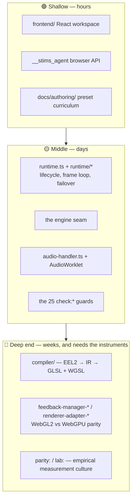

# Onboarding: what's hard here, and in what order to learn it

`CONTRIBUTING.md` tells you how to install and run the repo. `docs/DEVELOPMENT.md` tells you which commands exist. This document tells you something neither does: **which parts of Stims are genuinely hard, why they are hard, and what order to meet them in** so the difficulty arrives in a survivable sequence.

Read this once, early. It is a map of the terrain, not a tutorial.

## The shape of the repo

| | |
| --- | --- |
| TypeScript in `src/` | ~111,000 lines |
| ↳ `src/js/milkdrop/` (engine, compiler, VM, backends) | ~62,500 lines |
| ↳ `src/js/frontend/` (React workspace) | ~23,600 lines |
| ↳ `src/js/core/` (audio, renderer capability, services) | ~19,700 lines |
| Files in `scripts/` | 121 |
| `package.json` scripts | 131 |
| Test files under `tests/` | 272 |
| Docs under `docs/` | 84 |
| Agent skills in `.agent/skills/` | 20 |

The volume is not the problem. The problem is that a few small regions concentrate almost all of the difficulty, and they are not the regions a newcomer opens first.

## The difficulty is not evenly spread



---

## 🔴 The four genuinely hard things

### 1. The preset compiler — `src/js/milkdrop/compiler/`

21 files. This is the hardest thing in the repository, and it is hard for a reason that reading the code will not reveal.

A `.milk` preset is a Winamp-era file containing **EEL2**, a small 1990s expression language, plus HLSL-flavored shader source. The compiler parses that into an IR (`compiler/ir.ts`), then emits *three* execution targets: a CPU interpreter (`vm.ts`), a JIT path (`expression-jit.ts`), and GPU shader code in both GLSL (`compiler/shader-analysis-glsl.ts`) and WGSL (`compiler/wgsl-generator.ts`).

The difficulty is that **"correct" is not defined by a specification.** It is defined by bug-compatibility with a twenty-year-old binary. `compiler/shader-analysis.ts` (~1,900 lines) and `compiler/shader-analysis-helpers.ts` (~1,700 lines) are largely pattern-recognizers over parsed shader ASTs, carrying names like `isShaderSolarizeSampleExpression` and `extractScaledShaderSampleExpression`. Each one exists because some real preset in the wild does a specific thing and the original renderer responded a specific way.

To be productive here you need four things at once: EEL2 semantics, GLSL, WGSL, and a way to find out what MilkDrop actually did. The fourth is the one people skip, and it is the one that matters — see §3.

**Do not start here.** Start here only with `bun run lab:replay` and `bun run parity:capture` already in your hands.

### 2. Two rendering backends that must agree pixel-for-pixel

Seven `renderer-adapter-*.ts` files and seven `feedback-manager-*.ts` files, including `feedback-manager-webgpu-tsl.ts` (~3,300 lines) and `feedback-manager-shared.ts` (~2,650 lines).

WebGL2 is the baseline. WebGPU is a guarded second path with its own TSL materials, bind-group layouts, and segment batching. On top of that, the expression VM itself has a CPU tier and a GPU compute tier that are supposed to produce identical numbers.

The trap: **a change to one backend is silently wrong until you diff it against the other.** Nothing fails loudly. The preset just looks a little different, on hardware you may not have. The tooling that exists precisely for this:

```bash
bun run lab:replay -- --preset <id> --record trace.json   # record a deterministic VM trace
bun run lab:replay -- --replay trace.json --tier gpu      # first divergent frame, CPU vs GPU
bun run lab:gpu-differential
```

Read `docs/architecture/fallback-state-machine.md` (the longest architecture doc, and load-bearing) before touching capability probing or `renderScale`.

### 3. The parity culture — the thing newcomers most reliably get wrong

This is a methodology, not a module, which is why it is easy to miss and expensive to miss.

Ground truth for this project lives **outside the repository** — in the behavior of MilkDrop and projectM. It is reachable only through capture-and-diff:

```bash
bun run parity:capture           # capture a reference
bun run parity:diff              # diff a candidate against it
bun run parity:promote-result    # accept a new reference, deliberately
bun run parity:suite             # every certified reference vs latest captures
bun run trace:butterchurn        # which variable diverged, on which frame
bun run bench:butterchurn        # per-frame cost vs Butterchurn
```

The newcomer instinct on a fidelity bug is to write a unit test. That instinct is wrong here and will waste days. A unit test can only encode what you *already believe* the answer is; the whole difficulty is that you do not know the answer. The correct move is to capture a reference and diff frames.

Corollary: **a preset that "looks right" is not evidence.** `docs/evidence/` and the parity backlog exist because this project has been burned by eyeballing.

### 4. The instrument cabinet — 131 scripts

Discovery is solved. `bun run help` lists every script with a one-line purpose generated from its file's docblock, so the index cannot drift from the code (`bun run check:script-docs` enforces it).

What is *not* solved is **knowing which instrument answers your question.** These are all real, all different, and choosing wrong costs an afternoon:

| Question | Instrument |
| --- | --- |
| Is this preset reacting to audio at all? | `bun run lab:reactivity` (~15s, no browser) |
| Does it react *visually*, in pixels? | `bun run lab:visual` (1–3 min) |
| Does anything in the corpus produce NaN / fail to compile? | `bun run lab:nan-sweep` (~5–10 min) |
| Did my VM change alter semantics? | `bun run lab:replay` |
| Do WebGL and WebGPU agree? | `bun run lab:gpu-differential` |
| Is this preset a seizure risk? | `bun run lab:flash-audit` (the real WCAG 2.3.1 instrument, ~12 min) |
| Which presets render blank or frozen? | `bun run sweep:milkdrop-loops` |
| Is the frame budget blown? | `bun run perf:certification-corpus` |

Internalizing this table is weeks of tacit knowledge. It is also the single highest-leverage thing to front-load.

---

## 🟡 The middle tier

**Runtime lifecycle** — `src/js/milkdrop/runtime.ts` plus 36 files in `src/js/milkdrop/runtime/`: session setup, lifecycle, frame loop, backend failover, and a transition controller that runs on its own simulation clock. Manageable, but stateful in ways that punish guessing.

**The engine seam** — `src/js/frontend/engine/milkdrop-engine-adapter.ts` (into `milkdrop-engine-session.ts`) is the **only** legal crossing from React into the imperative engine. It is easy to violate by accident and `bun run check:architecture` will catch you. Treat the adapter as a hard membrane, not a convenience.

**Audio** — `src/js/core/audio-handler.ts` (~1,860 lines) plus AudioWorklet processors extracting bands, transients, and envelopes that feed the VM every frame. Ordinary Web Audio knowledge transfers; the subtlety is timing and smoothing, not API surface.

**The 25 `check:*` guards** — `no-ts-nocheck`, `css-tokens`, `agent-action-ids`, `script-docs`, `readme-claims`, `cache-bounds`, `stale-paths`, `doc-references`, `duplicate-css`, `unused-exports`, and more. These encode the repo's unwritten rules. You will mostly discover them by tripping them. **This is fine** — they are mechanical, fast, and their messages point at the fix. Run `bun run check:quick` early and often so you trip them in seconds rather than at PR time.

---

## 🟢 What is actually easy

Say this out loud, because the sections above are intimidating and most of the repo is not:

- **The React workspace** (`src/js/frontend/`, ~40 components) is conventional. Panels, hooks, URL state via the History API, no router library. If you know React you can contribute here on day one.
- **The agent API** (`src/js/frontend/agent-state.ts`) is one of the best-designed surfaces in the repo. `__stims_agent.getState()`, `waitFor(predicate)`, `run(actionId)`, `captureStats()`. Never scrape the DOM and never write sleep-and-poll loops — see `docs/agents/browser-automation.md`.
- **Preset authoring** has a real ten-chapter curriculum in `docs/authoring/` with runnable examples, plus a language reference generated from the compiler's own builtin table.

---

## The honest summary

The steep part is not code volume. It is that **three separate expert domains stack on top of each other**:

> EEL2 / MilkDrop semantics → dual-target GPU shader codegen → empirical parity measurement

You cannot shortcut any layer by reading harder, because the ground truth is not in the repository. That is the whole difficulty, stated in one sentence.

## A survivable order

1. **Day one.** `bun run setup`, then `bun run dev` and open `http://localhost:5173/?agent=true`. Play with the actual product for an hour. Everything below makes more sense once you have seen presets run.
2. **First week.** Ship something small in `src/js/frontend/`. Learn `bun run check:quick` and trip a few guards on purpose.
3. **Second week.** Read `docs/ARCHITECTURE.md` end to end. Follow one preset from `.milk` file to pixels: `preset-parser.ts` → `compiler/` → `vm.ts` → `renderer-adapter-*.ts`. Don't try to understand it — just walk it.
4. **Then.** Move into `src/js/milkdrop/runtime/`. Real work, bounded blast radius.
5. **Before ever opening `compiler/`.** Run `lab:reactivity`, `lab:visual`, `lab:replay`, and a full `parity:capture` → `parity:diff` cycle on a preset you did not write. Get fluent with the instruments *before* you need them under pressure.
6. **Deep end.** `compiler/` and `feedback-manager-webgpu-*`. Expect to be slow. Expect to measure everything.

## Where to go next

| You want… | Read |
| --- | --- |
| Setup and daily commands | `CONTRIBUTING.md`, `docs/DEVELOPMENT.md` |
| The system map | `docs/ARCHITECTURE.md` |
| Compiler and VM internals | `docs/MILKDROP_PRESET_RUNTIME.md` |
| Writing presets | `docs/authoring/README.md` |
| Driving the running app | `docs/agents/browser-automation.md` |
| Test suites and profiles | `docs/TESTING.md` |
| What's being worked on | `docs/MILKDROP_SUCCESSOR_WORKSTREAMS.md` |
| Every script, with purpose | `bun run help` |
