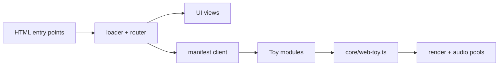

# Developer and Contributor Docs

This folder is organized by **audience + workflow** so humans and coding agents can quickly find the right guidance.

## Start here by audience

- **Human contributors:** [`../CONTRIBUTING.md`](../CONTRIBUTING.md) for setup + contribution flow, then [`DEVELOPMENT.md`](./DEVELOPMENT.md) for day-to-day commands.
- **Toy builders:** [`TOY_DEVELOPMENT.md`](./TOY_DEVELOPMENT.md), [`TOY_SCRIPT_INDEX.md`](./TOY_SCRIPT_INDEX.md), and [`toys.md`](./toys.md).
- **Agents / automation contributors:** root [`../AGENTS.md`](../AGENTS.md) first, then [`agents/README.md`](./agents/README.md).

## Docs map by purpose

### Build, test, and ship

- [`DEVELOPMENT.md`](./DEVELOPMENT.md): setup, scripts, workflow, performance/testing expectations.
- [`QA_PLAN.md`](./QA_PLAN.md): highest-impact QA flows and automated coverage.
- [`DEPLOYMENT.md`](./DEPLOYMENT.md): build, preview, static hosting, and Cloudflare deployment.

### Runtime and implementation reference

- [`ARCHITECTURE.md`](./ARCHITECTURE.md): runtime composition, loader flow, and diagrams.
- [`TOY_DEVELOPMENT.md`](./TOY_DEVELOPMENT.md): implementation playbook for toy work.
- [`TOY_SCRIPT_INDEX.md`](./TOY_SCRIPT_INDEX.md): toy slug to JS/TS entry-point map.
- [`PAGE_SPECIFICATIONS.md`](./PAGE_SPECIFICATIONS.md): page-level data/layout/accessibility expectations.
- [`MCP_SERVER.md`](./MCP_SERVER.md): MCP stdio server usage (`scripts/mcp-server.ts`).

### Product, research, and assessment docs

- [`FEATURE_SPECIFICATIONS.md`](./FEATURE_SPECIFICATIONS.md): current shipped behavior specs.
- [`FEATURE_AUDIT.md`](./FEATURE_AUDIT.md): coverage matrix + open documentation gaps.
- [`stim-assessment.md`](./stim-assessment.md): assessment findings + remediation directions.
- [`stim-user-critiques.md`](./stim-user-critiques.md): toy-by-toy UX critique notes.
- [`LITERATURE.md`](./LITERATURE.md): scientific references informing design.
- [`TECH_STACK_CAPABILITY_RESEARCH_2026-02.md`](./TECH_STACK_CAPABILITY_RESEARCH_2026-02.md): capability snapshot for core tooling.

### Agent-oriented overlays

- [`agents/README.md`](./agents/README.md): progressive-disclosure map for agent workflows.
- [`agents/tooling-and-quality.md`](./agents/tooling-and-quality.md): required checks and Bun-first commands.
- [`agents/metadata-and-docs.md`](./agents/metadata-and-docs.md): commit/PR/doc hygiene conventions.
- [`agents/toy-development.md`](./agents/toy-development.md): code locations and toy patterns.
- [`agents/toy-workflows.md`](./agents/toy-workflows.md): common toy-task runbooks.
- [`agents/reference-docs.md`](./agents/reference-docs.md): fast links into core docs + code hotspots.

If you add new tooling or patterns, update these docs so the next contributor has a reliable starting point.

## Architecture quick diagrams



```mermaid
flowchart TD
  Prewarm[prewarmMicrophone + renderer probe] --> Loader[loader.ts]
  Loader --> ViewState[toy-view.ts]
  Loader --> Import[dynamic import]
  Import --> Start[start()/default export]
  Start --> Cleanup[dispose + release pools]
```

## How to add or move a guide

1. Create the Markdown file under `docs/` with a clear title and a short purpose statement in the first paragraph.
2. Add or update links in this README under the **purpose category** where it best fits.
3. Cross-link from the most relevant audience entry point (`CONTRIBUTING.md`, `AGENTS.md`, or a primary workflow doc).
4. If the guide introduces scripts, toy entry points, or deployment steps, update the checklists and indexes they depend on.

## Onboarding highlights

- Use **Bun 1.3+** for installs and scripts. Run `bun install` in a fresh clone to populate `bun.lock`-aligned dependencies.
- Run a **dev server smoke test** without opening a browser via `bun run dev:check` to confirm Vite wiring before you start coding.
- Use `bun run check:quick` as a fast local gate to run **Biome** and TypeScript checks.
- When adding or renaming toys, run `bun run check:toys` to ensure `assets/data/toys.json` entries, TypeScript modules, standalone HTML files, and `docs/TOY_SCRIPT_INDEX.md` stay in sync.

## Navigation tips

- Start with [`DEVELOPMENT.md`](./DEVELOPMENT.md) if you’re getting your environment ready; it mirrors the quick start in the repo root but adds tooling details and command matrices.
- Jump to [`TOY_DEVELOPMENT.md`](./TOY_DEVELOPMENT.md) when you’re building or adjusting an experience; it links back to reusable components in `assets/js/core/` and the toy index.
- Check [`DEPLOYMENT.md`](./DEPLOYMENT.md) before shipping changes to production so your build/preview/Pages flow matches the current configuration.
- Review [`ARCHITECTURE.md`](./ARCHITECTURE.md) when you need a refresher on renderer wiring, data flow, or how audio/motion inputs are shared.

## Doc maintenance checklist

- Keep this file audience-oriented: if docs move, preserve a clear path for contributors, toy builders, and agents.
- Add or update a link here whenever you create a new guide under `docs/` so contributors can discover it.
- Cross-link new scripts or workflows from the relevant guide (for example, record new Bun scripts in `DEVELOPMENT.md` and toy-scaffolding changes in `TOY_DEVELOPMENT.md`).
- Keep toy-related documentation synchronized: update `TOY_DEVELOPMENT.md`, `TOY_SCRIPT_INDEX.md`, and `toys.md` when adding, renaming, or removing a toy entry point.
- Before shipping a PR, skim the docs above for stale script names, flags, or file paths introduced by your change.
