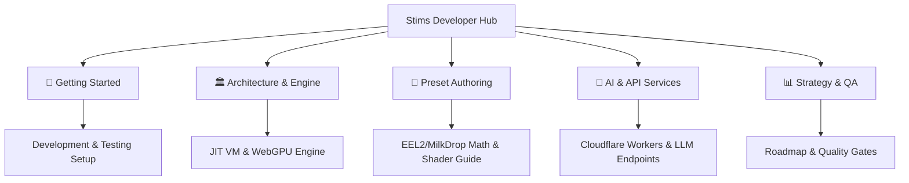

# Stims Developer Documentation Portal

Welcome to the **Stims** developer documentation portal. This hub provides guides, technical specifications, architecture overviews, and API references for building, extending, and authoring presets on Stims.

---

## 🧭 Developer Tracks

Choose a track below based on what you are looking to accomplish:


```mermaid
flowchart TD
  Start["Stims Developer Hub"]
  Start --> GS["🚀 Getting Started"]
  Start --> Arch["🏛️ Architecture & Engine"]
  Start --> Preset["🎨 Preset Authoring"]
  Start --> AI["🤖 AI & API Services"]
  Start --> Strat["📊 Strategy & QA"]

  GS --> Dev["Development & Testing Setup"]
  Arch --> JIT["JIT VM & WebGPU Engine"]
  Preset --> EEL["EEL2/MilkDrop Math & Shader Guide"]
  AI --> Edge["Cloudflare Workers & LLM Endpoints"]
  Strat --> Road["Roadmap & Quality Gates"]
```

---

### 🚀 1. Getting Started & Workflows

Everything you need to set up your environment, run the local dev server, run quality gates, and deploy.

| Document | Description |
| --- | --- |
| 🛠️ [**Development Setup**](./DEVELOPMENT.md) | Local environment setup (Bun 1.3+), scripts, dev server, and troubleshooting |
| 🚀 [**Deployment Guide**](./DEPLOYMENT.md) | Cloudflare Pages deployment pipeline, environment variables, and wrangler configuration |
| 🧪 [**Testing & Quality Gate**](./TESTING.md) | Running unit/integration tests, `bun run check`, and automated verification matrices |
| 📝 [**Commit & Review Conventions**](./COMMIT_CONVENTIONS.md) | Git workflow, Conventional Commits format, and PR contribution rules |

---

### 🏛️ 2. Core Architecture & Engine Internals

Deep-dive specifications into the JIT VM, dual WebGPU/WebGL2 rendering pipeline, and audio processing.

| Document | Description |
| --- | --- |
| 📐 [**Architecture Overview**](./ARCHITECTURE.md) | High-level system architecture, SPA URL state, React workspace, and engine seams |
| 🏆 [**Technical Achievements**](./TECHNICAL_ACHIEVEMENTS.md) | Comprehensive breakdown of the 8 flagship technical achievements and engineering innovations |
| ⚡ [**MilkDrop Preset Runtime**](./MILKDROP_PRESET_RUNTIME.md) | Preset compiler lifecycle, EEL2 expression execution, memory buffers, and signal contracts |
| 🖥️ [**WebGPU Architectural Revamp**](./WEBGPU_ARCHITECTURAL_REVAMP.md) | WebGPU TSL/WGSL pipeline design, feature rollout flags, and WebGL2 fallback chains |

---

### 🎨 3. Preset Authoring & Parity

Guides for writing MilkDrop equations, shader math, and projectM compatibility specs.

| Document | Description |
| --- | --- |
| ✒️ [**MilkDrop Coding Guide**](./MILKDROP_CODING_GUIDE.md) | Authoring visualizer presets, MilkDrop math functions, per-frame/per-pixel equations, and top 1% patterns |
| 🎯 [**ProjectM Parity Plan**](./MILKDROP_PROJECTM_PARITY_PLAN.md) | Parity milestone objectives, feature coverage targets, and test suites |
| 📋 [**ProjectM Parity Backlog**](./MILKDROP_PROJECTM_PARITY_BACKLOG.md) | Detailed feature audit and parity item checklist against original Winamp MilkDrop / projectM |

---

### 🤖 4. AI Infrastructure & APIs

Edge AI models, vector search endpoints, and Model Context Protocol (MCP) integrations.

| Document | Description |
| --- | --- |
| 🌐 [**API Reference**](./api.md) | Cloudflare Worker endpoints for `generate-preset`, `blend-presets`, `visual-search`, and `batch-generate` |
| 🔌 [**MCP Server Guide**](./MCP_SERVER.md) | Integrating Stims with AI coding tools, LLM tools, and MCP servers |

---

### 📊 5. Strategy, QA & Project Lineage

Roadmap priorities, QA verification suites, and historical context.

| Document | Description |
| --- | --- |
| 🗺️ [**Project Roadmap**](./ROADMAP.md) | Quarterly milestones, feature roadmap, and active architectural priorities |
| 📈 [**Implementation Status**](./IMPLEMENTATION_STATUS.md) | Consolidated tracking of refactor milestones, completed features, and active debt queues |
| 🔍 [**QA Plan & Baseline**](./QA_PLAN.md) | Manual smoke testing baseline, automated verification suites, and regression matrices |
| 📜 [**Lineage & Credits**](./LINEAGE_AND_CREDITS.md) | Project history, homage to Ryan Geiss's MilkDrop, Butterchurn, and projectM |

---

## ⚡ Quick Reference Commands

```bash
bun install           # Install dependencies
bun run dev           # Start local development server (http://localhost:5173)
bun run check:quick   # Fast quality gate (lint + types + catalog check)
bun run check         # Full quality gate (lint + types + unit tests + architecture check)
bun run build         # Production web bundle build
```

---

## 📂 Codebase Directory Overview

```
stims/
├── functions/api/      # Cloudflare Workers serverless API routes (AI generation, visual search)
├── src/
│   ├── js/
│   │   ├── app.ts      # Application entrypoint & React mounting
│   │   ├── core/       # Shared renderer capabilities, audio handlers, agent API
│   │   ├── frontend/   # React workspace UI, URL state synchronization, engine adapter
│   │   └── milkdrop/   # Imperative MilkDrop engine, JIT VM, compiler, TSL/WGSL generators
│   └── data/           # Preset manifests and schemas
├── tests/              # Unit, integration, and agent verification test suites
└── docs/               # Technical documentation portal
```
