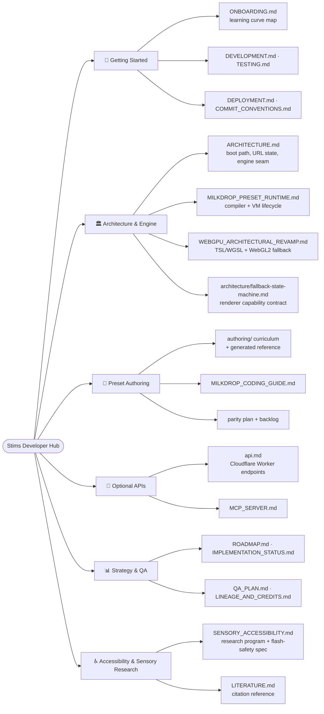

# Stims Developer Documentation Portal

Welcome to the **Stims** developer documentation portal. This hub provides guides, technical specifications, architecture overviews, and API references for building, extending, and authoring presets on Stims.

---

## 🧭 Developer Tracks

Choose a track below based on what you are looking to accomplish:


```mermaid
flowchart LR
  Start(["Stims Developer Hub"])

  Start --> GS["🚀 Getting Started"]
  Start --> Arch["🏛️ Architecture & Engine"]
  Start --> Preset["🎨 Preset Authoring"]
  Start --> API["🔌 Optional APIs"]
  Start --> Strat["📊 Strategy & QA"]
  Start --> Access["♿ Accessibility & Sensory Research"]

  GS --> GS0["ONBOARDING.md<br/>learning curve map"]
  GS --> GS1["DEVELOPMENT.md · TESTING.md"]
  GS --> GS2["DEPLOYMENT.md · COMMIT_CONVENTIONS.md"]

  Arch --> A1["ARCHITECTURE.md<br/>boot path, URL state, engine seam"]
  Arch --> A2["MILKDROP_PRESET_RUNTIME.md<br/>compiler + VM lifecycle"]
  Arch --> A3["WEBGPU_ARCHITECTURAL_REVAMP.md<br/>TSL/WGSL + WebGL2 fallback"]
  Arch --> A4["architecture/fallback-state-machine.md<br/>renderer capability contract"]

  Preset --> P0["authoring/ curriculum<br/>+ generated reference"]
  Preset --> P1["MILKDROP_CODING_GUIDE.md"]
  Preset --> P2["parity plan + backlog"]

  API --> E1["api.md<br/>Cloudflare Worker endpoints"]
  API --> E2["MCP_SERVER.md"]

  Access --> AC1["SENSORY_ACCESSIBILITY.md<br/>research program + flash-safety spec"]
  Access --> AC2["LITERATURE.md<br/>citation reference"]

  Strat --> S1["ROADMAP.md · IMPLEMENTATION_STATUS.md"]
  Strat --> S2["QA_PLAN.md · LINEAGE_AND_CREDITS.md"]
```

---

### 🚀 1. Getting Started & Workflows

Everything you need to set up your environment, run the local dev server, run quality gates, and deploy.

| Document | Description |
| --- | --- |
| 🧭 [**Onboarding Map**](./ONBOARDING.md) | Which parts of the codebase are hard, why, and what order to learn them in — read first |
| 🛠️ [**Development Setup**](./DEVELOPMENT.md) | Local environment setup (Bun 1.3+), scripts, dev server, and troubleshooting |
| 🚀 [**Deployment Guide**](./DEPLOYMENT.md) | Cloudflare Pages deployment pipeline, environment variables, and wrangler configuration |
| 🧪 [**Testing & Quality Gate**](./TESTING.md) | Running unit/integration tests, `bun run check`, and automated verification matrices |
| 📝 [**Commit & Review Conventions**](./COMMIT_CONVENTIONS.md) | Git workflow, Conventional Commits format, and PR contribution rules |

---

### 🏛️ 2. Core Architecture & Engine Internals

Deep-dive specifications into the JIT VM, dual WebGPU/WebGL2 rendering pipeline, and audio processing.

| Document | Description |
| --- | --- |
| 📐 [**Architecture Overview**](./ARCHITECTURE.md) | High-level system architecture, SPA URL state, React workspace, and engine seams |
| 🧱 [**Technical Foundations**](./TECHNICAL_ACHIEVEMENTS.md) | Implemented systems, evidence boundaries, beta behavior, optional services, and non-shipped scaffolding |
| ⚡ [**MilkDrop Preset Runtime**](./MILKDROP_PRESET_RUNTIME.md) | Preset compiler lifecycle, EEL2 expression execution, memory buffers, and signal contracts |
| 🖥️ [**WebGPU Architectural Revamp**](./WEBGPU_ARCHITECTURAL_REVAMP.md) | WebGPU TSL/WGSL pipeline design, feature rollout flags, and WebGL2 fallback chains |
| 🎯 [**Renderer Capability Contract**](./architecture/fallback-state-machine.md) | Fallback state machine, capability probing, and the renderScale propagation contract |
| 🔍 [**Shader Support Inventory**](./architecture/shader-support-inventory.md) | MilkDrop compiler shader-capability audit |
| 📐 [**Rasterization Fidelity Audit**](./architecture/rasterization-fidelity-audit.md) | WebGL vs WebGPU output divergence across waves, shapes, and borders |

---

### 🎨 3. Preset Authoring & Parity

Guides for writing MilkDrop equations, shader math, and projectM compatibility specs.

| Document | Description |
| --- | --- |
| 🎓 [**Preset Authoring Curriculum**](./authoring/README.md) | Learn-by-doing course with live runnable examples — start here if you're new to writing presets |
| 📖 [**Language Reference**](./authoring/reference.md) | Generated from the compiler's builtin table: every function, signal, state variable, and register |
| ✒️ [**MilkDrop Coding Guide**](./MILKDROP_CODING_GUIDE.md) | Authoring visualizer presets, MilkDrop math functions, per-frame/per-pixel equations, and top 1% patterns |
| 🗺️ [**Authoring Docs Master Plan**](./PRESET_AUTHORING_DOCS_PLAN.md) | Landscape assessment and the roadmap for the full curriculum, cookbook, and compatibility matrix |
| 🎯 [**ProjectM Parity Plan**](./MILKDROP_PROJECTM_PARITY_PLAN.md) | Parity milestone objectives, feature coverage targets, and test suites |
| 📋 [**ProjectM Parity Backlog**](./MILKDROP_PROJECTM_PARITY_BACKLOG.md) | Detailed feature audit and parity item checklist against original Winamp MilkDrop / projectM |

---

### 🔌 4. Optional APIs

Deployment-dependent generation, search, community, and Model Context Protocol (MCP) integrations. Local playback, browsing, editing, and import/export do not require these services.

| Document | Description |
| --- | --- |
| 🌐 [**API Reference**](./api.md) | Cloudflare Worker endpoints for `generate-preset`, `blend-presets`, `visual-search`, and `batch-generate` |
| 🔌 [**MCP Server Guide**](./MCP_SERVER.md) | Integrating Stims with AI coding tools, LLM tools, and MCP servers |

---

### 📊 5. Strategy, QA & Project Lineage

Roadmap priorities, QA verification suites, and historical context.

| Document | Description |
| --- | --- |
| 🗺️ [**Project Roadmap**](./ROADMAP.md) | Quarterly milestones, feature roadmap, and active architectural priorities |
| 🤖 [**Generative AI Use Cases**](./GENERATIVE_AI_USE_CASES.md) | Proposal for extending the shipped AI surface: quality gates, new UI surfaces, closed-loop iteration, and benchmarks |
| 📈 [**Implementation Status**](./IMPLEMENTATION_STATUS.md) | Consolidated tracking of refactor milestones, completed features, and active debt queues |
| 📊 [**Release Evidence Ledger**](./evidence/RELEASE_EVIDENCE_LEDGER_2026-05.md) | Source of truth on certified, baseline-measured, and unmeasured presets plus fidelity gaps by subsystem |
| 🧹 [**Recurring Fix Patterns Audit**](./evidence/RECURRING_FIX_PATTERNS_AUDIT_2026-05.md) | Root-cause analysis of the recurring regression clusters |
| 🔍 [**QA Plan & Baseline**](./QA_PLAN.md) | Manual smoke testing baseline, automated verification suites, and regression matrices |
| 📜 [**Lineage & Credits**](./LINEAGE_AND_CREDITS.md) | Project history, homage to Ryan Geiss's MilkDrop, Butterchurn, and projectM |

---

### ♿ 6. Accessibility & Sensory Research

Research grounding for Stims' sensory-control claims, open research questions, and the flash-safety specification — no therapeutic claims.

| Document | Description |
| --- | --- |
| 🧠 [**Sensory Accessibility & Control Research**](./SENSORY_ACCESSIBILITY.md) | The distinctive-control claim, layered research program, literature status table, and flash-safety spec |
| 📚 [**Literature Reference Map**](./LITERATURE.md) | Citation list grouped by theme, for UI-copy grounding and the research program above |
| ♿ [**Sensory Control Guide**](./guides/accessibility.md) | User-facing story of how Stims lets you decide how much is on screen |

---

## ⚡ Quick Reference Commands

```bash
bun install           # Install dependencies
bun run dev           # Start local development server (http://localhost:5173)
bun run check:quick   # Fast quality gate (lint + types + catalog check)
bun run check         # Full quality gate (lint + types + unit tests + architecture check)
bun run build         # Production web bundle build
```

---

## 📂 Codebase Directory Overview

```
stims/
├── index.html          # Single app shell (milkdrop/index.html is a redirect alias)
├── functions/api/      # Cloudflare Workers serverless API routes (AI generation, visual search)
├── src/
│   ├── js/
│   │   ├── app.ts      # Application entrypoint & React mounting
│   │   ├── core/       # Renderer capabilities, audio, quality, state stores, services (incl. MIDI)
│   │   ├── frontend/   # React workspace UI, URL state synchronization, engine adapter
│   │   ├── lighting/   # Three.js scene-light configuration
│   │   ├── milkdrop/   # Imperative MilkDrop engine, JIT VM, compiler, TSL/WGSL generators
│   │   ├── ui/         # Framework-free UI helpers (audio controls, identicons, YouTube)
│   │   └── utils/      # Audio, browser, and media utilities
│   ├── css/            # tokens.css, chrome.css, app-shell.css, component modules
│   └── data/           # Preset manifests and parity fixtures
├── scripts/            # Quality gates, parity capture, perf and reactivity labs
├── tests/              # unit · compat · corpus · e2e · accessibility suites
└── docs/               # Technical documentation portal
```
