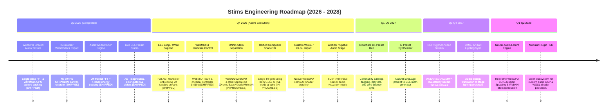

# Stims Strategic Product & Engineering Roadmap

This document outlines the product vision, market positioning, competitive research insights, and engineering milestone roadmap for **Stims**.

---

## 🔍 2026 Market & Competitive Intelligence Summary

Our 2026 competitive research across web visualizer tools (*IKANDY*, *WaveScope*, *ShaderToy*, *Butterchurn*, *Neural Frames*, *Beatsee*) reveals five dominant technology and product trends:

1. **Hybrid WebGPU / Legacy Engine Architecture**: Leading 2026 visualizers process audio data (FFT, waveforms, frequency bands) into shared GPU textures once. This enables legacy MilkDrop/Butterchurn EEL presets and modern WGSL compute shaders to read identical zero-copy audio textures.
2. **Stem-Aware Audio Reactivity**: Client-side ML stem separation (isolating kick/snare transients, sub-bass, synths, and vocal stems using ONNX Runtime Web and WebNN/WebGPU) drives distinct visual layers with "hand-timed" precision.
3. **In-Browser Content Export Pipeline**: Short-form video platforms (TikTok, Spotify Canvas, YouTube Shorts) drive demand for direct 1080p/4K 60FPS WebCodecs/MP4 canvas recording directly inside the browser without requiring external software like OBS.
4. **WebXR Spatial Audio Visualizers**: Apple Vision Pro and Meta Quest web browsers enable immersive 6DoF spatial 3D audio reactive visual stages.
5. **AI-Assisted Preset Generation**: Creative coders and VJs benefit from natural language prompt-to-preset synthesis engines that generate valid shader math and parameters on demand.
6. **Pro VJ Hardware & Networked Projection Integration**: Physical VJ hardware control (WebMIDI learn, OSC), low-latency NDI/Syphon canvas video streaming, and DMX stage lighting sync.
7. **Neural Real-Time Audio-to-Visual Generation**: Next-generation web visualizers leveraging WebNN and WebGPU for on-device 3D Gaussian Splatting and audio-driven neural latent synthesis.

---

## 🎯 Strategic Vision

Stims aims to be the premier open-web platform for real-time, ultra-high-performance audio-reactive visualizers, MilkDrop legacy preset execution, and WebGPU-accelerated interactive webtoys.

---

## 📅 Roadmap Overview

---

## 🚀 Detailed Workstreams

### Q3 2026 — WebGPU Architecture & Creator Tools (Completed / Shipped)

| Initiative | Description | Status & Impact |
| :--- | :--- | :--- |
| **Shared Audio GPU Texture** | Write audio FFT, waveform, and energy envelopes directly into a single WebGPU 2D/1D texture pass. | **Shipped.** Zero-copy audio state shared across MilkDrop VM & WGSL shaders. |
| **In-Browser Canvas Video Export** | Integrated `WebCodecs` / `MediaRecorder` exporter allowing 1080p/4K 60FPS video capture. | **Shipped.** Direct 4K 60FPS export for Spotify Canvas, TikTok, and YouTube Shorts. |
| **AudioWorklet DSP Migration** | Move Web Audio API FFT analysis off the main thread into a dedicated `AudioWorkletNode`. | **Shipped.** Zero main-thread audio hitches or frame drops during heavy UI activity. |
| **Live EEL Preset Studio** | Interactive live editor with real-time AST syntax diagnostics, console log navigation, and parameter sliders. | **Shipped.** Empower VJs and preset authors to craft and tweak MilkDrop presets in-browser. |

### Q4 2026 — Parity Engine Revamp, Stem Separation & Spatial XR (Near-Term)

| Initiative | Description | Status & Target Impact |
| :--- | :--- | :--- |
| **EEL `loop`/`while` Transpiler** | Extend EEL AST transpilation to handle control flow constructs (`loop`, `while`), `++`/`--` increment, and `exec2` sequence expressions. | **Shipped.** Unblocked 79 catalog presets (reducing untranslated count from 109 to 30) and emitted 163,887 EEL statements. |
| **WebMIDI Learn & Hardware Control** | WebMIDI API manager (`MidiControllerManager`) and interactive MIDI learn UI mapping physical faders/knobs to preset parameters (`zoom`, `warp`, `rot`, `decay`). | **Shipped.** Hardware fader & launchpad control for live VJ performances. |
| **ONNX Stem Separation Engine** | Client-side ML audio separation via ONNX Runtime Web & WebNN/WebGPU into 4 stems (*Drums*, *Bass*, *Vocals*, *Other*). | **In Progress.** `stem_drums`, `stem_bass`, `stem_vocals`, `stem_other` signals wired into runtime types and VM scope. |
| **Unified Composite Shader IR** | Replace dual GLSL/TSL feedback shaders with a single declarative IR (`CompositePassIR`) emitting both GLSL and TSL node graphs. | **In Progress.** Eliminates 1400 lines of TSL duplication and unifies WebGL/WebGPU composite rendering. |
| **Custom WGSL / GLSL Import** | Direct import pipeline for raw WebGPU compute shaders and ShaderToy GLSL fragments. | Expand Stims beyond MilkDrop into modern WebGPU shader art. |
| **WebXR Spatial Audio Stage** | Immersive WebXR VR/AR stage with spatial audio reactivity for Apple Vision Pro & Meta Quest. | Native spatial 3D listening & visual experience in VR web browsers. |
| **Automated Telemetry Benchmarks** | CI Playwright performance harness tracking frame-times, memory footprint, and GPU load. | Guarantee zero performance regressions in PRs. |

### Q1 - Q2 2027 — Cloud Ecosystem & AI Synthesis

| Initiative | Description | Target Impact |
| :--- | :--- | :--- |
| **Cloudflare D1 Preset Hub & Sync** | Cloud-backed community catalog with search, tagging, favorites, playlists, and Cloudflare D1/Workers sync. | Thriving user-generated content and preset sharing ecosystem. |
| **AI Preset Generator** | Generative AI pipeline translating text prompts into valid MilkDrop EEL code and shader uniforms. | Instant custom preset creation from natural language descriptions. |

### Q3 - Q4 2027 — Pro VJ Performance & Stage Network Production

| Initiative | Description | Target Impact |
| :--- | :--- | :--- |
| **Multi-Display Stage Sync** | WebSockets/WebRTC multi-window frame synchronization across master control and display nodes. | Multi-screen projection mapping and synchronized venue displays. |
| **NDI / Syphon Video Streaming** | WebCodecs/WebRTC low-latency canvas stream output into broadcast and video mixing tools. | Direct integration with OBS, Resolume, and venue media servers. |
| **DMX / Art-Net Lighting Bridge** | WebSockets bridge translating visual energy levels into DMX512 lighting control protocols. | Unified audio-visual-lighting control for live stages. |

### Q1 - Q2 2028 — Neural Generative Visuals & Open Plugin Hub

| Initiative | Description | Target Impact |
| :--- | :--- | :--- |
| **Neural Audio-to-Latent Generator** | Real-time WebGPU/WebNN 3D Gaussian Splatting and latent rendering driven by audio features. | Next-gen generative neural visualizers beyond procedural shader math. |
| **Modular Plugin & Shader Registry** | Package ecosystem for custom audio DSP processors, shader filters, and visualizer modules. | Open developer ecosystem for custom Stims extension packages. |
| **Desktop App & Native Audio Loopback** | Cross-platform Tauri/Electron desktop wrapper with system audio loopback and hardware acceleration. | Zero-setup system audio capture and desktop performance mode. |
