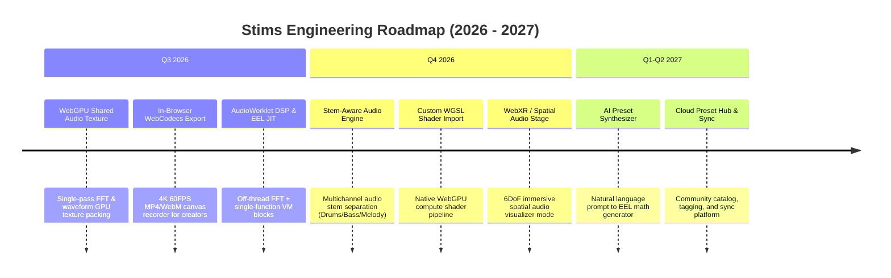

# Stims Strategic Product & Engineering Roadmap

This document outlines the product vision, market positioning, competitive research insights, and engineering milestone roadmap for **Stims**.

---

## 🔍 2026 Market & Competitive Intelligence Summary

Our 2026 competitive research across web visualizer tools (*IKANDY*, *WaveScope*, *ShaderToy*, *Butterchurn*, *Neural Frames*, *Beatsee*) reveals five dominant technology and product trends:

1. **Hybrid WebGPU / Legacy Engine Architecture**: Leading 2026 visualizers process audio data (FFT, waveforms, frequency bands) into shared GPU textures once. This enables legacy MilkDrop/Butterchurn EEL presets and modern WGSL compute shaders to read identical zero-copy audio textures.
2. **Stem-Aware Audio Reactivity**: Traditional single-channel FFT detection is being replaced by multi-stem separation (isolating kick/snare transients, sub-bass, synths, and vocal stems) to drive distinct visual layers with "hand-timed" precision.
3. **In-Browser Content Export Pipeline**: Short-form video platforms (TikTok, Spotify Canvas, YouTube Shorts) drive demand for direct 1080p/4K 60FPS WebCodecs/MP4 canvas recording directly inside the browser without requiring external software like OBS.
4. **WebXR Spatial Audio Visualizers**: Apple Vision Pro and Meta Quest web browsers enable immersive 6DoF spatial 3D audio reactive visual stages.
5. **AI-Assisted Preset Generation**: Creative coders and VJs benefit from natural language prompt-to-preset synthesis engines that generate valid shader math and parameters on demand.

---

## 🎯 Strategic Vision

Stims aims to be the premier open-web platform for real-time, ultra-high-performance audio-reactive visualizers, MilkDrop legacy preset execution, and WebGPU-accelerated interactive webtoys.

---

## 📅 Roadmap Overview

---

## 🚀 Detailed Workstreams

### Q3 2026 — WebGPU Architecture & Creator Tools (Near-Term)

| Initiative | Description | Target Impact |
| :--- | :--- | :--- |
| **Shared Audio GPU Texture** | Write audio FFT, waveform, and energy envelopes directly into a single WebGPU 2D/1D texture pass. | Zero-copy audio state shared across MilkDrop VM & WGSL shaders. |
| **In-Browser Canvas Video Export** | Integrated `WebCodecs` / `MediaRecorder` exporter allowing 1080p/4K 60FPS video capture. | Direct export for Spotify Canvas, TikTok, and YouTube Shorts creators. |
| **AudioWorklet DSP Migration** | Move Web Audio API FFT analysis off the main thread into a dedicated `AudioWorkletNode`. | Zero main-thread audio hitches or frame drops during heavy UI activity. |
| **Live EEL Preset Studio** | Interactive live editor with real-time syntax checking, AST diagnostics, and parameter sliders. | Empower VJs and preset authors to craft and tweak MilkDrop presets in-browser. |

### Q4 2026 — Stem Separation & Spatial XR (Medium-Term)

| Initiative | Description | Target Impact |
| :--- | :--- | :--- |
| **Stem-Aware Audio Reactivity** | Multi-channel audio reactivity engine isolating drums, bass, and vocal stems into separate uniforms. | High-precision visual beats and "hand-timed" audio reactivity. |
| **Custom WGSL / GLSL Import** | Direct import pipeline for raw WebGPU compute shaders and ShaderToy GLSL fragments. | Expand Stims beyond MilkDrop into modern WebGPU shader art. |
| **WebXR Spatial Audio Stage** | Immersive WebXR VR/AR stage with spatial audio reactivity for Apple Vision Pro & Meta Quest. | Native spatial 3D listening & visual experience in VR web browsers. |
| **Automated Telemetry Benchmarks** | CI Playwright performance harness tracking frame-times, memory footprint, and GPU load. | Guarantee zero performance regressions in PRs. |

### Q1 - Q2 2027 — Platform Ecosystem & AI Synthesis (Long-Term)

| Initiative | Description | Target Impact |
| :--- | :--- | :--- |
| **AI Preset Generator** | Generative AI pipeline translating text prompts into valid MilkDrop EEL code and shader uniforms. | Instant custom preset creation from natural language descriptions. |
| **Cloud Preset Catalog & Sync** | Cloud-backed community catalog with search, tagging, favorites, and playlist creation. | Thriving user-generated content and preset sharing ecosystem. |
