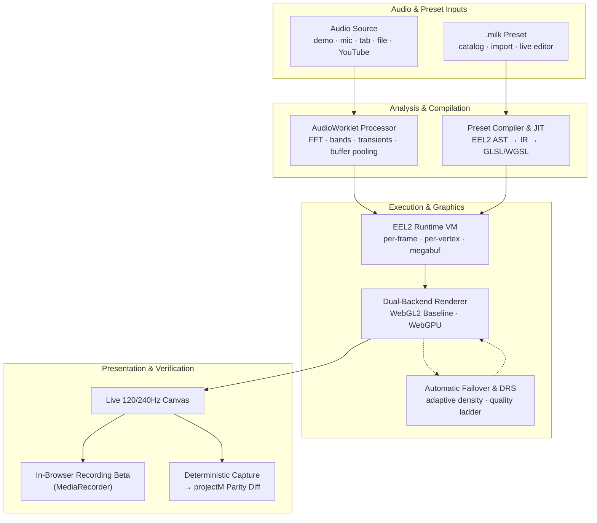

# Technical foundations and evidence status

Scaffolding, optional services, and roadmap work never count as shipped-product claims — each system is labeled with its evidence status. What is new compared with Butterchurn and projectM is stated once, in [What Stims contributes](./LINEAGE_AND_CREDITS.md#what-stims-contributes).

## System diagram

Audio and preset inputs through the compiler, VM and renderer:

## 1. Preset compiler and VM — implemented

- [`src/js/milkdrop/expression-jit.ts`](../src/js/milkdrop/expression-jit.ts) compiles preset equations into browser-executable functions.
- [`src/js/milkdrop/vm.ts`](../src/js/milkdrop/vm.ts) and its focused modules model preset state, registers, custom waves and shapes, `megabuf`, and `gmegabuf` behavior.
- [`src/js/milkdrop/compiler/ir.ts`](../src/js/milkdrop/compiler/ir.ts) provides a shared intermediate representation for runtime execution and backend-specific lowering.
- Equations parse to an AST and the IR, which runs on an interpreter or the CPU JIT. On WebGPU, per-pixel and custom-wave point programs that read only their own inputs are also lowered into the shader and evaluated for every vertex in parallel ([`gpu-field-planner.ts`](../src/js/milkdrop/compiler/gpu-field-planner.ts)); anything else stays on the JIT.
- The JIT compiles each program block into one function, clamps every stored value to a finite number, and bounds-checks `megabuf` indices. Where a Content Security Policy forbids `new Function`, the tree-walking interpreter in [`expression.ts`](../src/js/milkdrop/expression.ts) runs instead ([test](../tests/unit/eel-csp-fallback.test.ts)). Constant folding runs on the AST before either tier sees it ([`ast-constant-fold.ts`](../src/js/milkdrop/compiler/ast-constant-fold.ts)).
- A per-frame compute VM exists but is off by default (`?milkdrop-webgpu-compute-vm=1` opts in): a per-frame block is one invocation, so upload, dispatch and readback make it slower than the JIT. The measurement is recorded beside the flag in [`webgpu-optimization-flags.ts`](../src/js/milkdrop/webgpu-optimization-flags.ts).
- The 4 MB `megabuf` (per VM) and 4 MB `gmegabuf` (shared across preset switches) live on the CPU; the compute VM, when enabled, mirrors them to GPU storage buffers ([memory model](./architecture/eel-guest-memory.md)).
- Seeded differential fuzz tests hold the tiers to the same results: [`eel-tier-differential`](../tests/unit/eel-tier-differential.test.ts) compares the interpreter with the JIT, and [`gpu-field-tier-differential`](../tests/unit/gpu-field-tier-differential.test.ts) compares the JIT with the GPU lowering. Their first runs found 18 shipped preset blocks the JIT could not compile and six classes of CPU/GPU divergence across 32% of lowered programs.
- Direct `.milk` import and export keep the authoring format visible to users instead of requiring a renderer-specific JSON representation. There is no conversion step to run before a preset is usable, and no converted artifact to keep in sync with the original.

Compilation and runtime stepping are necessary compatibility evidence. They do not, by themselves, prove visual fidelity.

### Runtime performance evidence

The EEL2 JIT avoids duplicate ordinary property stores when per-point or
per-pixel callers deliberately alias the environment and local scopes. That
hot-path change is covered by write-count and interpreter/JIT differential
tests, then measured with a real-browser fixed-tier runner that records cadence,
simulation/render work, backend selection, fallback, and adaptive-quality
state. The bounded 2026-08-24 result and its reproduction contract live in
[`RUNTIME_PERFORMANCE.md`](./RUNTIME_PERFORMANCE.md); it is evidence for the
measured stress case, not a universal FPS claim.

Startup work is staged around the first paint: renderer-selection probes stay
on the critical path, while telemetry, automation, and gamepad services load
after the shell. The measured cold-load and deploy-build method lives in
[the front-end performance audit](./FRONTEND_PERFORMANCE_BOTTLENECKS.md#latest-startup-and-deploy-build-evidence).

## 2. WebGL2 baseline and guarded WebGPU path — implemented, partially certified

- WebGL2 remains the compatibility baseline.
- [`src/js/core/renderer-capabilities.ts`](../src/js/core/renderer-capabilities.ts) probes browser support and records renderer decisions.
- [`src/js/milkdrop/compiler/shader-execution-classification.ts`](../src/js/milkdrop/compiler/shader-execution-classification.ts) classifies shader programs before runtime selection.
- WebGPU batching, descriptors, WGSL generation, and TSL feedback work live behind independent rollout flags and fallback rules.
- Rendering pressure has an explicit fallback path: hardware-timed WebGPU pressure can trim render and feedback resolution continuously inside a quality tier, and sustained broader pressure steps down the discrete adaptive-quality ladder.

The WebGPU path is not presented as broadly visually equivalent. Current certification status lives in [`src/data/milkdrop-parity/webgpu-certification-report.json`](../src/data/milkdrop-parity/webgpu-certification-report.json), and measured results require trusted projectM reference captures.

## 3. Browser-native workspace — implemented

- [`src/js/frontend/App.tsx`](../src/js/frontend/App.tsx) owns the single product workspace.
- Catalog search, collection filters, rendered previews, favorites, queues, recent history, and session state are integrated around the running visualizer.
- [`src/js/frontend/url-state.ts`](../src/js/frontend/url-state.ts) retains preset, collection, audio, tool, and automation state in URL query parameters.
- Progressive catalog loading and bounded preview work keep the large imported library usable on constrained devices.

For someone using Stims, this workspace is what separates it from Butterchurn and projectM, which are engines for a host app to wrap. It is not the technical contribution; see [What Stims contributes](./LINEAGE_AND_CREDITS.md#what-stims-contributes).

## 4. Live preset editor — implemented

- [`src/js/milkdrop/overlay/editor-panel.ts`](../src/js/milkdrop/overlay/editor-panel.ts) integrates CodeMirror with MilkDrop-oriented completions, snippets, diagnostics, and line navigation.
- Live controls patch `zoom`, `warp`, `rot`, `decay`, `dx`, and `dy` in the active authoring session. If the preset's own equations overwrite a value every frame, the slider says so, and names the audio that reaches it (`eq · bass`). That comes from the static dataflow analysis in [`src/js/milkdrop/preset-dataflow.ts`](../src/js/milkdrop/preset-dataflow.ts), so it follows a signal through `q` variables, persistent state and the per-pixel program, and needs no music playing. The analysis reruns only when the equations change, not on every fader move. A fader the per-frame code drives also shows the value the frame used, a tick on its track fed by the Inspect tab's variable probe while Tune is on screen.
- Each custom wave and shape gets its own controls in Tune, picked there or from its Outline row ([`slot-controls.ts`](../src/js/milkdrop/slot-controls.ts)). The formatter reads a slot field under any spelling the compiler accepts. It also reads the slot's own code for the `eq` chip: `shapecode_1_rad` is `rad =` in `shape_1_per_frame*`.
- The Outline names the audio reaching each drawn part (the per-pixel equations, each enabled wave and shape). Its Solo and Mute cover every layer the preset draws: custom waves and shapes, the main waveform, borders and motion vectors ([`render-isolation.ts`](../src/js/milkdrop/render-isolation.ts)). The VM leaves a hidden layer out of the frame both renderers draw from, so nothing in the source changes.
- A/B snapshots: save the current state to slot A, keep editing in slot B, and switch between them with `Cmd/Ctrl+Shift+B` or the toolbar button.
- Import, edit, inspect, and export actions operate around the same running preset, so a change is visible in the same session that found the problem.

Optional edge-assisted fixes and blending are separate from the local editor contract and may require deployed API configuration.

## 5. Audio analysis and sources — implemented; stem separation not implemented

- [`src/js/utils/audio/frequency-analyser-processor.ts`](../src/js/utils/audio/frequency-analyser-processor.ts) calculates waveform, band-energy, transient, and envelope data in an AudioWorklet when available.
- [`src/js/core/audio-handler.ts`](../src/js/core/audio-handler.ts) coordinates demo, microphone, tab, YouTube, and local-file paths subject to browser support and permissions.
- [`src/js/core/audio-gpu-texture.ts`](../src/js/core/audio-gpu-texture.ts) packs frequency and waveform data into a shared GPU texture allocation for renderer consumption.
- Harmonic and percussive energy are separate signals, so presets can react to sustained tones and transients independently. This reads rhythm and melody apart; it does not separate instruments.

Stem-oriented runtime identifiers were retired: the reserved zero-filled fields and a disconnected band-derived pseudo-stem calculation were removed rather than shipped as fake signals. Stem-aware reactivity returns only with real on-device separation (see the roadmap's platform-expansion prerequisites).

## 6. Browser audio-video recording — beta, browser proof pending

- [`src/js/frontend/CapturePanel.tsx`](../src/js/frontend/CapturePanel.tsx) exposes landscape and portrait recording targets.
- [`src/js/utils/media/canvas-video-exporter.ts`](../src/js/utils/media/canvas-video-exporter.ts) records with `MediaRecorder`, can compose a cloned active audio track, and uses a native renderer-resize contract for the 4K target.
- [`src/js/frontend/engine/video-export-runtime.ts`](../src/js/frontend/engine/video-export-runtime.ts) switches renderer, camera, and MilkDrop targets to the requested native dimensions and restores the session afterward.

The implementation still depends on browser codec and allocation support. Unit coverage proves lifecycle and track composition; it does not yet prove encoded resolution, synchronization, frame pacing, or sustained 4K output in supported browsers.

## 7. Optional edge services — implemented routes, deployment-dependent product behavior

The repository contains Cloudflare Worker routes for preset generation, batch generation, blending, image-guided generation, visual search, and community storage. The local application does not require them for playback, catalog browsing, editing, or import/export.

The bundled Generate panel now calls [`src/js/milkdrop/preset-generator.ts`](../src/js/milkdrop/preset-generator.ts) through either a configured hosted route or a loopback OpenAI-compatible endpoint, and compiles the returned source before loading it. That implementation is model-backed, but hosted deployment availability, local browser configuration, output quality, and the full generated-preset user flow still require end-to-end verification. Blending and the other optional services are not part of that bundled flow.

## 8. Automation and visual evidence — implemented

- [`src/js/core/agent-api.ts`](../src/js/core/agent-api.ts) exposes session state and controls for headless verification.
- `?agent=true` provides the canonical automation route.
- Native projectM capture metadata, checked-in references, backend-aware browser captures, image diffs, and promoted measured results form the compatibility evidence chain.
- Reference frames come from native projectM (C++, SDL2, OpenGL) rendered offscreen, with a sidecar file recording how each was made. Each preset's run-to-run variation is measured first (`bun run parity:noise`), so a diff has to exceed it before it counts, and frames are stepped on a fixed clock (`renderFrames({ holdAfterPump })`) so Stims and the reference compare the same frame.
- A preset is visually certified only with a Stims capture on the requested backend, a provenance-checked projectM reference, an image diff within the declared tolerance, and promotion of that result into [`src/data/milkdrop-parity/measured-results.json`](../src/data/milkdrop-parity/measured-results.json). Compiling and running is tracked separately: [`tests/corpus/butterchurn-corpus-support.test.ts`](../tests/corpus/butterchurn-corpus-support.test.ts) compiles the whole Butterchurn pack for both backends and pins how many presets each one supports fully, partially, or not at all.
- [`scripts/check-readme-claims.ts`](../scripts/check-readme-claims.ts) prevents the public README preset count and selected product claims from drifting beyond their implementation evidence.

See [`MILKDROP_PROJECTM_PARITY_PLAN.md`](./MILKDROP_PROJECTM_PARITY_PLAN.md) for the complete capture and promotion workflow.

## 9. MIDI/VJ hardware workflow — implemented

- [`src/js/core/services/webmidi-controller.ts`](../src/js/core/services/webmidi-controller.ts) tracks connected devices, persists per-device CC mappings to `localStorage`, supports a learn mode (arm a target, move a control, it binds), and recovers from hot-plug via `navigator.requestMIDIAccess().onstatechange`.
- The live binding from MIDI/MCP input to engine parameters is mounted at the app-shell level in `App.tsx`, so it stays active independent of which settings panel is open.
- A virtual "Claude (MCP)" device participates in the same per-device binding and learn-mode pipeline as physical hardware, driven by four MCP tools — `session_midi_set`, `session_midi_cc`, `session_midi_bindings`, `session_midi_devices` — registered in [`scripts/mcp-server.ts`](../scripts/mcp-server.ts).
- The editor's Tune sliders and the CodeMirror gutter both surface live/shadowed status per bound target — whether the active preset's own `per_frame`/`per_pixel` equations would immediately overwrite a MIDI-driven value — computed in [`src/js/milkdrop/formatter.ts`](../src/js/milkdrop/formatter.ts) and covered by unit tests.

## 10. Corpus analysis — implemented

- [`src/js/milkdrop/preset-dataflow.ts`](../src/js/milkdrop/preset-dataflow.ts) interprets a compiled preset over dependency sets instead of numbers, following the VM's own reset, persistence and shared-`rand()` rules. `bun run lab:dataflow -- --all` labels every preset in the lab corpus by which audio signals reach each control and each drawn program.
- Checked against `lab:dataset` exports of 2,445 held-out presets, one of 215,160 cells varied with the song where the analysis found no audio path (a documented 5e-4 wobble). It is conservative by design, so precision is lower: 11,797 of the 13,532 cells it marks as audio-driven actually varied.
- The catalog's quality score and its `collection:audio-reactive` tag both read its tiers, and the editor's Tune pane reads it per control for the preset on stage ([§4](#4-live-preset-editor--implemented)).
- `lab:dataset`, `lab:vj-baseline`, `lab:memory-probe`, `lab:edit-eval` and `lab:shader-fix-bench` turn the corpus into training data and evaluations, split by remix family so near-copies never straddle train and test. The findings, including why gradient-boosted trees beat every network tried, are in [Training and evaluating models](./guides/training-models.md).

## Foundations that are not shipped workflows

| Foundation | Current status |
| --- | --- |
| Stem-oriented signals | Retired. Zero-filled runtime fields and an unwired pseudo-stem calculation were removed; reintroduction requires real separation with measured budgets. |
| Creator-certified high-resolution export | Native resize and audio-track composition are implemented; encoded output and synchronization still need browser-backed certification. |
| Model-backed Generate panel | Hosted and loopback provider paths are wired; availability, output quality, and the full browser flow still need end-to-end proof. |
