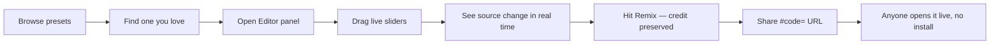

# Track 0 — Play

Fifteen minutes, no code. This track exists because it's how almost every real preset author actually started — including, going by the credits on half the catalog, people who now write raw GLSL from scratch. Remixing is not the beginner's version of authoring; it's the front door the whole hobby uses.

## 1 · Find one you love

Open [toil.fyi](https://toil.fyi) and hit **Browse presets**. Scroll, or use the search — it's a real semantic search (find "spinning geometric shapes" or "warm slow color drift" and it works, not just a keyword match against titles). Pick anything that grabs you. The catalog credits its authors on every entry — a lot of what you'll see traces back to Ryan Geiss himself, or to the community members who kept the format alive after him (Rovastar, Flexi, and the "cream of the crop" curators, among many others).

## 2 · Open it in the editor

With a preset playing, open the **Editor** panel. What you're looking at is not a settings screen bolted on top of the preset — it's the actual `.milk` source, the same text format covered starting in Track 1. Every visual you're seeing is produced by the code in that panel, and nothing is hidden from you.

## 3 · Turn the knobs

The editor rail has a dozen **live sliders** — zoom, warp, rot, decay, the pivot (`cx`/`cy`), the axis scales (`sx`/`sy`), the push (`dx`/`dy`), waveform alpha, border size. Drag any of them and watch the visual change instantly; double-click one to reset it. Under the hood, each slider is rewriting the corresponding line in the source text — so if you switch to reading the code after moving a slider, you'll see exactly what changed. This is deliberately the same interface as directly editing the values yourself; the sliders are just a friendlier way to turn knobs whose meaning Tracks 1–2 explain in depth.

If you want to go further than the sliders reach, the panel also has a small library of **cues** and **pattern moves** — named starting points ("Pulse zoom", "Hue drift", "Bass zoom", "Beat flash", …) you can drop straight into the source. Each is one or two lines, the same scale as the lessons in this curriculum.

## 4 · Remix, not overwrite

Hit **Remix**. This duplicates the preset into your own draft *and automatically preserves the credit lineage* — the new preset's authorship line records who you built on, in the same "Author A + Author B" convention the catalog itself uses everywhere (open a few preset titles in Browse and you'll see multi-author chains going back years). Nothing about editing a preset here erases whose work it started as.

## 5 · Ask the AI to explain what you're looking at

If the code is unfamiliar, the editor's **Explain** button asks the model to describe the preset's motion, color, and reactivity in a few plain sentences — a fast way to get oriented before Track 1 gives you the underlying mental model. There's also a free-text **Refine with AI** box for "make it faster" or "cooler colors" — every AI edit lands as an inspectable line diff you approve or discard, never a silent rewrite.

## 6 · Share it

Export produces a `.milk` file you can hand to anyone with a copy of Winamp, projectM, Butterchurn, or Stims. But you don't need a file at all: **copy the URL out of your browser's address bar.** Stims encodes the entire preset source directly into the link (`#code=…`) — the same mechanism every run-link in this curriculum uses. Send that URL to someone and it opens your exact remix, live, with nothing to install. This is also how you'll eventually publish your own original work — see the [contributing guide](../../CONTRIBUTING.md#contributing-presets) when you're ready.

---

### 🎯 Quick reference — Track 0

| Action | Where | What it does |
|--------|-------|--------------|
| Browse | Top nav | Semantic search over 1,787 presets |
| Editor panel | Right rail | Live source + sliders + cues |
| Remix button | Editor header | Forks preset, preserves credit chain |
| Explain button | Editor toolbar | AI describes motion/color/reactivity |
| Refine box | Editor toolbar | AI edits as line diffs you approve |
| URL share | Address bar | `#code=<base64>` = portable preset |

---

### 🔗 Where these techniques appear in the wild

| Technique | Glossary entry | Example presets |
|-----------|----------------|-----------------|
| Credit lineage | [Track 9 — Technique glossary](09-technique-glossary.md#component-credits) | `Aderrasi + Geiss - Airhandler (Painterly Relief Mix)` |
| Remix culture | [Track 9 — Technique glossary](09-technique-glossary.md#the-glossary) | `Jelly V2` → `V3` → `V4` → `V5.5` version discipline |

---

**Next: [Track 1 — How MilkDrop thinks](01-how-milkdrop-thinks.md)**, the mental model behind every knob you just turned.
