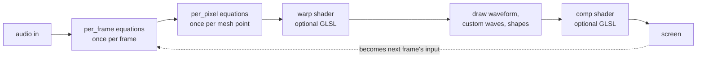

# Track 1 — How MilkDrop thinks

A MilkDrop preset is a text file of small equations. The engine runs them every frame, sixty times a second, and the numbers they produce steer the picture. Before learning any variable names, learn the one idea that makes every preset make sense.

## Lesson 1 · The screen is the memory

Every effect MilkDrop has ever produced — tunnels, trails, plasma, smoke — comes from one move, repeated forever:

1. Take the image currently on screen.
2. Redraw it, slightly transformed.
3. Draw this frame's audio waveform on top.
4. Repeat.

Start at the bench: a bright waveform and nothing else. The transform is "do nothing" (`zoom=1`), so old frames sit exactly where they were and slowly fade.

[**▶ Open the bench**](https://toil.fyi/?tool=editor#code=W3ByZXNldDAwXQovLyBUaGUgbGVzc29uIGJlbmNoOiBhIGJyaWdodCB3YXZlZm9ybSwgbm8gbW90aW9uLCBub3RoaW5nIGhpZGRlbi4KLy8gRXZlcnkgVHJhY2sgMSBhbmQgVHJhY2sgMiBleGFtcGxlIGlzIHRoaXMgZmlsZSB3aXRoIG9uZSBvciB0d28gbGluZXMgY2hhbmdlZC4KZlJhdGluZz01CmZEZWNheT0wLjk4CmZXYXZlQWxwaGE9MS4yCmZXYXZlU2NhbGU9MQpuV2F2ZU1vZGU9MApiV2F2ZVRoaWNrPTEKYk1heGltaXplV2F2ZUNvbG9yPTEKYlRleFdyYXA9MQp6b29tPTEKcm90PTAKY3g9MC41CmN5PTAuNQpkeD0wCmR5PTAKc3g9MQpzeT0xCndhcnA9MAp3YXZlX3I9MC4yCndhdmVfZz0wLjg1CndhdmVfYj0xCndhdmVfeD0wLjUKd2F2ZV95PTAuNQpvYl9hPTAKaWJfYT0wCm12X2E9MAo%3D "examples/10-bench.milk")

Now the entire lesson, in one changed line:

```text
zoom=1.01
```

[**▶ Run zoom=1.01**](https://toil.fyi/?tool=editor#code=W3ByZXNldDAwXQovLyBUaGUgbGVzc29uIGJlbmNoOiBhIGJyaWdodCB3YXZlZm9ybSwgbm8gbW90aW9uLCBub3RoaW5nIGhpZGRlbi4KLy8gRXZlcnkgVHJhY2sgMSBhbmQgVHJhY2sgMiBleGFtcGxlIGlzIHRoaXMgZmlsZSB3aXRoIG9uZSBvciB0d28gbGluZXMgY2hhbmdlZC4KZlJhdGluZz01CmZEZWNheT0wLjk4CmZXYXZlQWxwaGE9MS4yCmZXYXZlU2NhbGU9MQpuV2F2ZU1vZGU9MApiV2F2ZVRoaWNrPTEKYk1heGltaXplV2F2ZUNvbG9yPTEKYlRleFdyYXA9MQp6b29tPTEuMDEKcm90PTAKY3g9MC41CmN5PTAuNQpkeD0wCmR5PTAKc3g9MQpzeT0xCndhcnA9MAp3YXZlX3I9MC4yCndhdmVfZz0wLjg1CndhdmVfYj0xCndhdmVfeD0wLjUKd2F2ZV95PTAuNQpvYl9hPTAKaWJfYT0wCm12X2E9MAo%3D "examples/11-feedback-outward.milk")

Each frame, the previous image is redrawn 1% larger. One percent sounds like nothing, but it compounds sixty times a second — after one second the oldest paint is ~80% bigger and still growing. Every waveform the music draws becomes a trail streaming toward you.

Reverse it:

```text
zoom=0.99
```

[**▶ Run zoom=0.99**](https://toil.fyi/?tool=editor#code=W3ByZXNldDAwXQovLyBUaGUgbGVzc29uIGJlbmNoOiBhIGJyaWdodCB3YXZlZm9ybSwgbm8gbW90aW9uLCBub3RoaW5nIGhpZGRlbi4KLy8gRXZlcnkgVHJhY2sgMSBhbmQgVHJhY2sgMiBleGFtcGxlIGlzIHRoaXMgZmlsZSB3aXRoIG9uZSBvciB0d28gbGluZXMgY2hhbmdlZC4KZlJhdGluZz01CmZEZWNheT0wLjk4CmZXYXZlQWxwaGE9MS4yCmZXYXZlU2NhbGU9MQpuV2F2ZU1vZGU9MApiV2F2ZVRoaWNrPTEKYk1heGltaXplV2F2ZUNvbG9yPTEKYlRleFdyYXA9MQp6b29tPTAuOTkKcm90PTAKY3g9MC41CmN5PTAuNQpkeD0wCmR5PTAKc3g9MQpzeT0xCndhcnA9MAp3YXZlX3I9MC4yCndhdmVfZz0wLjg1CndhdmVfYj0xCndhdmVfeD0wLjUKd2F2ZV95PTAuNQpvYl9hPTAKaWJfYT0wCm12X2E9MAo%3D "examples/12-feedback-inward.milk")

Now history collapses toward the center instead.

> **If you know Shadertoy:** a fragment shader there is stateless — every frame is computed from scratch out of `time` and coordinates. MilkDrop is the opposite: every frame is a function of the *previous frame*. That's why a single constant produces motion, and why intuition from stateless shaders doesn't transfer until you internalize the loop.

**Turn one knob.** In either run link, edit the `zoom` value in the editor (it applies as you type — `Cmd/Ctrl+Enter` forces it). Find the value where motion is *barely* perceptible. Most of the presets you'll love live within a few percent of `1`.

## Lesson 2 · The pipeline

The loop has stations, and each section of a preset file runs at exactly one of them:



| Stage | Runs | You write it as | Typical job |
|---|---|---|---|
| per-frame | once per frame | `per_frame_N=` lines | Read audio, set the motion/color knobs |
| per-pixel | once per mesh point per frame | `per_pixel_N=` lines | Vary those knobs across the screen (Track 4) |
| warp shader | every pixel | `[warp_shader]` block | Distort the previous frame (Track 6) |
| draw | once per frame | wave/shape settings + equations | Add the new ink: waveform, custom waves, shapes (Track 5) |
| comp shader | every pixel | `[comp_shader]` block | Final color grade of everything (Track 6) |

Everything in Tracks 1–2 happens at the first station. `zoom` in the file is just the starting value of a knob; `per_frame` code can overwrite it every frame — that's Lesson 4.

## Lesson 3 · `decay` — the fade knob

Before the old image is redrawn, its brightness is multiplied by `decay` (set in the file as `fDecay`). It's the eraser that balances the loop's paint.

```text
fDecay=1        // nothing ever fades
```

[**▶ Run decay=1.0**](https://toil.fyi/?tool=editor#code=W3ByZXNldDAwXQovLyBUaGUgbGVzc29uIGJlbmNoOiBhIGJyaWdodCB3YXZlZm9ybSwgbm8gbW90aW9uLCBub3RoaW5nIGhpZGRlbi4KLy8gRXZlcnkgVHJhY2sgMSBhbmQgVHJhY2sgMiBleGFtcGxlIGlzIHRoaXMgZmlsZSB3aXRoIG9uZSBvciB0d28gbGluZXMgY2hhbmdlZC4KZlJhdGluZz01CmZEZWNheT0xCmZXYXZlQWxwaGE9MS4yCmZXYXZlU2NhbGU9MQpuV2F2ZU1vZGU9MApiV2F2ZVRoaWNrPTEKYk1heGltaXplV2F2ZUNvbG9yPTEKYlRleFdyYXA9MQp6b29tPTEuMDEKcm90PTAKY3g9MC41CmN5PTAuNQpkeD0wCmR5PTAKc3g9MQpzeT0xCndhcnA9MAp3YXZlX3I9MC4yCndhdmVfZz0wLjg1CndhdmVfYj0xCndhdmVfeD0wLjUKd2F2ZV95PTAuNQpvYl9hPTAKaWJfYT0wCm12X2E9MAo%3D "examples/13-decay-forever.milk") — with `zoom=1.01`, paint accumulates until the screen saturates. No eraser, all paint.

```text
fDecay=0.9      // 10% gone every frame
```

[**▶ Run decay=0.9**](https://toil.fyi/?tool=editor#code=W3ByZXNldDAwXQovLyBUaGUgbGVzc29uIGJlbmNoOiBhIGJyaWdodCB3YXZlZm9ybSwgbm8gbW90aW9uLCBub3RoaW5nIGhpZGRlbi4KLy8gRXZlcnkgVHJhY2sgMSBhbmQgVHJhY2sgMiBleGFtcGxlIGlzIHRoaXMgZmlsZSB3aXRoIG9uZSBvciB0d28gbGluZXMgY2hhbmdlZC4KZlJhdGluZz01CmZEZWNheT0wLjkKZldhdmVBbHBoYT0xLjIKZldhdmVTY2FsZT0xCm5XYXZlTW9kZT0wCmJXYXZlVGhpY2s9MQpiTWF4aW1pemVXYXZlQ29sb3I9MQpiVGV4V3JhcD0xCnpvb209MS4wMQpyb3Q9MApjeD0wLjUKY3k9MC41CmR4PTAKZHk9MApzeD0xCnN5PTEKd2FycD0wCndhdmVfcj0wLjIKd2F2ZV9nPTAuODUKd2F2ZV9iPTEKd2F2ZV94PTAuNQp3YXZlX3k9MC41Cm9iX2E9MAppYl9hPTAKbXZfYT0wCg%3D%3D "examples/14-decay-short.milk") — history vanishes in a blink; the waveform wears a short comet tail.

The useful range is narrow: `0.96–0.995` covers almost everything. The bench uses `0.98`. Motion (`zoom`, `rot`, …) spreads paint around; `decay` decides how long the paint survives the trip. Every trail length you've ever seen in a visualizer is this one number negotiating with the motion knobs.

## Lesson 4 · `time` is the heartbeat

So far the motion is frozen — the same transform every frame. `per_frame` equations unfreeze it. They run once per frame, before anything is drawn, and can overwrite any knob:

```text
per_frame_1=zoom = 1 + 0.02*sin(time*0.8);
```

[**▶ Run the breathing loop**](https://toil.fyi/?tool=editor#code=W3ByZXNldDAwXQovLyBUaGUgbGVzc29uIGJlbmNoOiBhIGJyaWdodCB3YXZlZm9ybSwgbm8gbW90aW9uLCBub3RoaW5nIGhpZGRlbi4KLy8gRXZlcnkgVHJhY2sgMSBhbmQgVHJhY2sgMiBleGFtcGxlIGlzIHRoaXMgZmlsZSB3aXRoIG9uZSBvciB0d28gbGluZXMgY2hhbmdlZC4KZlJhdGluZz01CmZEZWNheT0wLjk4CmZXYXZlQWxwaGE9MS4yCmZXYXZlU2NhbGU9MQpuV2F2ZU1vZGU9MApiV2F2ZVRoaWNrPTEKYk1heGltaXplV2F2ZUNvbG9yPTEKYlRleFdyYXA9MQp6b29tPTEKcm90PTAKY3g9MC41CmN5PTAuNQpkeD0wCmR5PTAKc3g9MQpzeT0xCndhcnA9MAp3YXZlX3I9MC4yCndhdmVfZz0wLjg1CndhdmVfYj0xCndhdmVfeD0wLjUKd2F2ZV95PTAuNQpvYl9hPTAKaWJfYT0wCm12X2E9MApwZXJfZnJhbWVfMT16b29tID0gMSArIDAuMDIqc2luKHRpbWUqMC44KTsK "examples/15-breathing.milk")

`time` is seconds since the preset started. `sin(time*0.8)` swings smoothly between −1 and 1, so `zoom` breathes between `0.98` and `1.02` — the image inhales and exhales about once every eight seconds.

Three timing variables cover nearly everything:

| Variable | What it is | Reach for it when |
|---|---|---|
| `time` | seconds, fractional | smooth motion — `sin(time*k)` is the heartbeat of the entire art form |
| `frame` | frames since start, integer | counting and stepping — `frame%40` fires every 40th frame |
| `fps` | current frame rate | correcting speed so the preset runs identically on slow and fast machines — the classic idiom is a `(75/fps)` factor on anything accumulated per frame |

Language notes you now need (the expression language is NS-EEL, inherited from Winamp):

- Every statement is an assignment ending in `;`. No declarations — assign to any name and it exists.
- Everything is a number. There are no strings or booleans; comparisons like `equal(a,b)` and `above(a,b)` return 1 or 0, and anything within 0.00001 of zero counts as false.
- Names are case-insensitive.

**Turn one knob.** In the breathing loop, change `0.02` (depth of breath), then `0.8` (breathing rate). Then try `zoom = 1 + 0.02*sin(time*0.8) + 0.01*sin(time*1.13);` — two sines at unrelated frequencies never quite repeat. That trick has a name and a pedigree; you'll meet it properly in the next track.

## What you can now predict

- Why `zoom=1.01` makes trails *stream* rather than *jump*: compounding.
- Why a bright flash lingers: `decay` is the only eraser.
- Why nothing in MilkDrop needs a "trail" feature: trails are what a feedback loop *is*.
- What any `per_frame` line does: overwrite a knob before this frame's redraw.

**Next:** [Track 2 — Motion](02-motion.md). Every remaining motion knob, one at a time, then a line-by-line read of a real Geiss preset.
