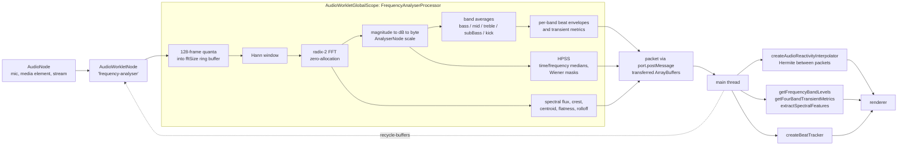

# audio-reactive

Audio analysis for visualizers, extracted from [Stims](https://toil.fyi) (the MilkDrop-compatible visualizer at toil.fyi) into a standalone package. It covers the full path from an `AudioNode` to numbers a renderer can use: an `AudioWorkletProcessor` that computes an FFT, harmonic/percussive separation, spectral features and per-band beat envelopes off the main thread; pure functions for band levels, transients and spectral features that run anywhere (browser, worker, Bun, Node); a beat tracker; and a Hermite interpolator that turns discrete worklet packets into a continuous curve for high-refresh displays. The spectrum bytes match `AnalyserNode.getByteFrequencyData`, so the worklet can replace an `AnalyserNode` without retuning anything downstream. It has no runtime dependencies and ships TypeScript sources and declarations.

## Signal path



## Install

```sh
npm install audio-reactive
# or
bun add audio-reactive
```

Two entry points:

- `audio-reactive`: every pure function and type (see [API](#api)). Safe to import on the main thread, in a worker, or in Bun/Node.
- `audio-reactive/worklet`: the compiled `FrequencyAnalyserProcessor`. It calls `registerProcessor('frequency-analyser', ...)` at module top level and must only be loaded through `audioContext.audioWorklet.addModule(...)`. It is not re-exported from the main entry.

## Quick start

### 1. Wire the worklet and read a packet

The built worklet file is a standard ES module that imports its siblings (`./analyser-core.js`, `./harmonic-percussive.js`, `./spectral-features.js`) with relative paths. Browsers resolve those when the file is served from `node_modules` as-is, but a bundler will not follow them for `addModule`, so hand the bundler the module as a worker-style asset so it emits one self-contained chunk:

```ts
// Vite: `?worker&url` bundles the module (with its imports) into one file
// and gives back its URL.
import workletUrl from 'audio-reactive/worklet?worker&url';

// Any bundler: pre-bundle once and serve the output as a static asset.
//   bun build node_modules/audio-reactive/dist/frequency-analyser-processor.js \
//     --format=esm --target=browser --outfile=public/frequency-analyser.js
// const workletUrl = '/frequency-analyser.js';
```

```ts
const context = new AudioContext();
if (context.state === 'suspended') await context.resume(); // needs a user gesture
await context.audioWorklet.addModule(workletUrl);

const fftSize = 1024;
const node = new AudioWorkletNode(context, 'frequency-analyser', {
  numberOfInputs: 1,
  numberOfOutputs: 1,
  outputChannelCount: [1],
  processorOptions: {
    fftSize, // power of two >= 2, default 1024
    sampleRate: context.sampleRate, // optional, falls back to the worklet's global
    messageEvery: 1, // post every Nth full FFT block (default 1)
  },
});
source.connect(node); // the node's output is silence; connect it to keep it alive
node.connect(context.destination);

node.port.onmessage = (event) => {
  const packet = event.data;
  // Transferred buffers: wrap them in views.
  const frequencyData = new Uint8Array(packet.frequencyData); // fftSize / 2 bytes, AnalyserNode scale
  const waveformData = new Uint8Array(packet.waveformData); // fftSize bytes, 128 = silence
  const timeDomainData = new Float32Array(packet.timeDomainData); // fftSize PCM samples

  packet.rms; // number
  packet.zeroCrossingRate; // number
  packet.spectralFlux; // positive magnitude change since the previous packet
  packet.spectralCrest; // max / mean magnitude
  packet.spectralCentroid; // Hz
  packet.spectralFlatness; // 0..1
  packet.spectralRolloff; // Hz
  packet.stereoBalance; // -1 (right) .. 1 (left), 0 for mono
  packet.stereoWidth; // 0 (correlated) .. 1 (uncorrelated), 0 for mono
  packet.energy; // { bass, mid, treble } 0..1
  packet.energyAverages; // same keys, running mean over the last 64 packets
  packet.beatDetection; // { isBeat, beatIntensity, beatBass, beatMid, beatTreble,
  //                         bassBeatIntensity, midBeatIntensity, trebleBeatIntensity }
  packet.transientMetrics; // { subBassEnv, kickTransient, vocalMidEnv, snareSnap }
  packet.harmonicPercussive; // { percussive, harmonic, percussiveLow, percussiveMid,
  //                             percussiveHigh, percussiveRatio } or null

  // Stereo input adds frequencyDataL/R and waveformDataL/R (L aliases the mono buffers).

  // Hand the buffers back once you are done with them so the worklet does
  // not allocate a fresh set per packet.
  node.port.postMessage({
    type: 'recycle-buffers',
    freq: [frequencyData.buffer],
    wave: [waveformData.buffer],
    timeDomain: [timeDomainData.buffer],
  }, [frequencyData.buffer, waveformData.buffer, timeDomainData.buffer]);
};
```

To render smoothly between packets:

```ts
import { createAudioReactivityInterpolator } from 'audio-reactive';

const interpolator = createAudioReactivityInterpolator();
node.port.onmessage = (event) => {
  interpolator.pushSample({ ...event.data.energy, rms: event.data.rms }, performance.now());
};
function frame(now: number) {
  const { bass, mid, treble, rms } = interpolator.sample(now);
  // draw
  requestAnimationFrame(frame);
}
```

### 2. Offline, no browser

The same maths the worklet runs, applied to synthesized samples. This script was run with `bun` against the package sources; the output below is what it printed.

```ts
import {
  analyseBlockBytes,
  buildHannWindow,
  buildTwiddleTable,
  createBeatTracker,
  createHarmonicPercussiveAnalyser,
  extractSpectralFeatures,
  getFrequencyBandLevels,
  getWeightedEnergy,
} from 'audio-reactive';

const sampleRate = 44100;
const fftSize = 1024;
const seconds = 2;

// 440 Hz sine at -20 dBFS plus a 10 ms click every 500 ms.
const samples = new Float32Array(sampleRate * seconds);
for (let i = 0; i < samples.length; i += 1) {
  const t = i / sampleRate;
  samples[i] = 0.1 * Math.sin(2 * Math.PI * 440 * t);
  if (t % 0.5 < 0.01) samples[i] += 0.6 * (Math.random() * 2 - 1);
}

const window = buildHannWindow(fftSize);
const twiddles = buildTwiddleTable(fftSize);
const scratch = { real: new Float32Array(fftSize), imag: new Float32Array(fftSize) };
const spectrum = new Uint8Array(fftSize / 2);
const hpss = createHarmonicPercussiveAnalyser();
const beats = createBeatTracker();

let beatCount = 0;
const blockMs = (fftSize / sampleRate) * 1000;
for (let start = 0; start + fftSize <= samples.length; start += fftSize) {
  const block = samples.subarray(start, start + fftSize);
  analyseBlockBytes(block, window, twiddles, spectrum, scratch);

  const bands = getFrequencyBandLevels(spectrum, sampleRate);
  const energy = getWeightedEnergy(bands);
  const hp = hpss.analyse(spectrum, sampleRate);
  const timeMs = (start / sampleRate) * 1000;
  const beat = beats.update({ bands, weightedEnergy: energy, deltaMs: blockMs }, timeMs);
  if (beat.isBeat) beatCount += 1;

  const frame = start / fftSize;
  if (frame === 20 || frame === 21 || frame === 22) {
    const features = extractSpectralFeatures(block, spectrum, sampleRate, fftSize);
    console.log(
      `t=${(timeMs / 1000).toFixed(3)}s`,
      `bass=${bands.bass.toFixed(3)} mid=${bands.mid.toFixed(3)} treble=${bands.treble.toFixed(3)}`,
      `energy=${energy.toFixed(3)}`,
      `centroid=${features.spectralCentroid.toFixed(0)}Hz flatness=${features.spectralFlatness.toFixed(3)}`,
      `harmonic=${hp.harmonic.toFixed(3)} percussive=${hp.percussive.toFixed(3)} ratio=${hp.percussiveRatio.toFixed(2)}`,
      `beat=${beat.isBeat} intensity=${beat.beatIntensity.toFixed(2)}`,
    );
  }
}
console.log(`beats detected in ${seconds}s: ${beatCount} (clicks placed: ${seconds * 2})`);
```

Output:

```
t=0.464s bass=0.105 mid=0.076 treble=0.000 energy=0.111 centroid=446Hz flatness=0.000 harmonic=0.016 percussive=0.010 ratio=0.39 beat=false intensity=0.17
t=0.488s bass=0.878 mid=0.804 treble=0.803 energy=1.000 centroid=10946Hz flatness=0.995 harmonic=0.011 percussive=0.795 ratio=0.99 beat=true intensity=1.00
t=0.511s bass=0.127 mid=0.076 treble=0.000 energy=0.129 centroid=438Hz flatness=0.000 harmonic=0.016 percussive=0.011 ratio=0.40 beat=false intensity=0.89
beats detected in 2s: 4 (clicks placed: 4)
```

The frame holding the click reads as broadband (flatness 0.995, centroid near 11 kHz) and percussive (ratio 0.99); the frames around it read as a tone near 440 Hz with a percussive ratio near 0.4.

## API

All exports come from `audio-reactive` unless marked `/worklet`.

| Export | Purpose |
| --- | --- |
| `buildHannWindow(length)` | Hann window as a `Float32Array`. |
| `buildTwiddleTable(length)` | Precomputed `{ cos, sin }` twiddles for `analyseBlockBytes`. |
| `validateFftSize(value)` | Returns a power-of-two FFT size or throws `RangeError`; defaults to 1024. |
| `analyseBlockBytes(block, window, twiddles, out, scratch)` | Hann, radix-2 FFT, magnitude / binCount, dB-to-byte; writes `block.length / 2` bytes into `out`. |
| `computeBandAverage(bytes, sampleRate, fftSize, minHz, maxHz, bandType)` | Weighted mean of a byte spectrum over a Hz range, 0..1. |
| `byteFromSample(sample)` | Waveform byte for one PCM sample in [-1, 1]. |
| `createHarmonicPercussiveAnalyser(options?)` | Median-filter HPSS over successive byte spectra; `analyse(bytes, sampleRate)` returns `HarmonicPercussiveLevels`. |
| `computeRms(timeDomain)` | RMS of `Float32Array` or `Uint8Array` samples. |
| `computeSpectralCentroid(amplitudes, sampleRate, fftSize?)` | Spectral centre of mass in Hz. |
| `computeSpectralFlatness(amplitudes)` | Geometric / arithmetic mean, 0..1. |
| `computeSpectralRolloff(amplitudes, sampleRate, fftSize?, ratio?)` | Frequency below which `ratio` (default 0.85) of the energy lies. |
| `extractSpectralFeatures(timeDomain, amplitudes, sampleRate, fftSize?)` | All four features as a `SpectralFeatureSnapshot`. |
| `createBeatTracker(options?)` | Multi-band onset tracker with attack/release envelopes; `update({ bands, weightedEnergy, deltaMs }, timeMs)` returns a `BeatTrackerUpdate`. `mode: 'projectM'` selects a single running-average threshold. |
| `getFrequencyBandLevels(bytes, sampleRate?, bandRanges?, fftSize?)` | `{ bass, mid, treble }` in 0..1 from Hz ranges (`DEFAULT_FREQUENCY_BAND_RANGES`). |
| `getExtendedFrequencyBandLevels(...)` | Adds `subBass` (24-60 Hz) and `kick` (60-250 Hz). |
| `getFourBandTransientMetrics(bytes, previousBytes?, sampleRate?)` | `{ subBassEnv, kickTransient, vocalMidEnv, snareSnap }` from frame-to-frame deltas. |
| `getBandLevels({ analyser?, data, sampleRate?, ratios?, bandRanges? })` | Band levels from an analyser hook, Hz ranges, or bin-ratio fallback. |
| `getWeightedEnergy(bands, { weights?, boost? })` | Single 0..1 energy from weighted bands. |
| `updateEnergyPeak(currentPeak, weightedEnergy, { decay?, floor? })` | Decaying peak tracker. |
| `createWaveformAutoGain(options?)` | Boost-only auto-gain for byte waveforms: `measure(wave)` returns a gain, `apply(in, out, gain)` scales around 128. |
| `createAudioReactivityInterpolator()` | Hermite spline over `{ bass, mid, treble, rms }` packets: `pushSample(sample, timeMs)`, `sample(timeMs)`, `reset()`. |
| `AudioLifecycleTracker` | State machine for `AudioContext` lifecycle (`idle` through `disposed`) with assertions for leaks, permission ordering and terminal dispose. Intended for tests. |
| `AudioGenerationToken` | Monotonic generation counter to detect superseded async mounts. |
| `PERMISSION_REQUIRED_SOURCES` | Set of `AudioSourceKind` values that need a permission prompt (`microphone`). |
| `isAudioAwaitingGesture()`, `subscribeAudioGestureGate(fn)`, `reportAudioAwaitingGesture(bool)`, `resetAudioGestureGate()` | Observable flag for "audio is set up but suspended until a user gesture". Module-level state. |
| `FrequencyAnalyserProcessor` (`/worklet`) | The `AudioWorkletProcessor`; the module registers it as `'frequency-analyser'` on load. |

Types: `HarmonicPercussiveLevels`, `HarmonicPercussiveOptions`, `SpectralFeatureSnapshot`, `AudioBandLevels`, `BeatTrackerOptions`, `BeatTrackerUpdate`, `BandLevels`, `BandRatios`, `BandWeights`, `ExtendedBandLevels`, `FourBandTransientMetrics`, `FrequencyBandRange`, `FrequencyBandRanges`, `AudioEnergySnapshot`, `AudioReactivityInterpolator`, `AudioContextLike`, `AudioLifecycleState`, `AudioSourceKind`.

Vocabulary note: `bass` / `mid` / `treble` and the `kick`, `snare`, `vocal` prefixes on transient metrics name frequency regions, not instruments. `BeatTrackerOptions.mode: 'projectM'` reproduces projectM's running-average threshold. `AudioSourceKind` (`demo`, `microphone`, `tab`, `youtube`, `file`) and the lifecycle states come from the host visualizer's source picker; only `microphone` affects behaviour.

Typing the worklet: `dist/frequency-analyser-processor.d.ts` refers to the `AudioWorkletProcessor` global. If your project does not already declare it, `src/audio-worklet.d.ts` in this package has the minimal ambient declarations.

## Design notes

Drawn from the source docblocks.

**Zero allocation in the worklet.** `process()` runs on the real-time audio thread every 128 frames. The processor allocates its ring buffers, window, twiddle table, scratch arrays and HPSS history once in the constructor and reuses them; `analyseBlockBytes` writes into caller-provided `out` and `scratch` buffers. The only per-packet allocation is the set of `ArrayBuffer`s posted to the main thread, and those are transferred rather than copied. The consumer can send them back with a `recycle-buffers` message and the processor pools up to 16 of each, so a steady state allocates nothing.

**Why the dB-to-byte mapping matches `AnalyserNode`.** `AnalyserNode.getByteFrequencyData` maps magnitude through 20·log10 into its `[minDecibels, maxDecibels]` window, `[-100, -30]` dB by default. The band levels, beat thresholds and the downstream signal processors in Stims were all tuned against those bytes, and the non-worklet fallback path still produces them. An earlier linear magnitude-to-byte mapping left realistic music (-20 to -40 dBFS) at byte values of 0-12 and flatlined every band level. `analyseBlockBytes` therefore applies the same decibel window, so the worklet can replace an `AnalyserNode` and both paths feed the pipeline the same scale; a test in this package feeds a -20 dBFS sine and requires the peak byte to exceed 100.

**Why median-filter HPSS.** `createHarmonicPercussiveAnalyser` implements harmonic/percussive separation in the Fitzgerald (2010) median-filter formulation. A median across time (per bin, over the last 7 frames) suppresses short transients and estimates sustained content; a median across frequency (per bin, over 9 neighbouring bins) suppresses narrow peaks and estimates broadband content. Wiener-style soft masks from the two estimates split each frame's energy into "harmonic" and "percussive". It is a spectrogram measurement, not stem separation: it cannot tell a kick from a bass note on the same frame, only how transient/broadband versus sustained/tonal each region is. Bins above `maxHz` (12 kHz) are ignored because the analyser's linear bins are densest there and contribute least. Medians over at most 9 values use insertion sort, which beats anything cleverer at that size. The `percussiveRatio` is 0.5 in silence so it never emits NaN.

**Why Hermite interpolation between packets.** Worklet packets arrive at the FFT block rate (about 43 Hz at 44.1 kHz / 1024), while displays refresh at 60-240 Hz. Sampling the last packet directly produces staircase stepping. `createAudioReactivityInterpolator` keeps the last two packets with their finite-difference velocities and evaluates a cubic Hermite spline between them, giving a C1-continuous curve, clamped at zero and allowed to extrapolate up to 25 % past the newest packet so rendering never waits on audio.

**Per-band beat envelopes.** Both the worklet and `createBeatTracker` compare each band's level to its own running average with a band-specific threshold multiplier and a 150 ms refractory interval, then decay the beat intensity geometrically (0.92 per packet). The tracker additionally adapts its thresholds to the recent peak and noise floor so quiet sources still register onsets.

**Waveform auto-gain.** Visualizers that draw the raw time-domain wave expect near-full-scale music; a quiet source parks every byte at 128 plus or minus a few counts and the drawn wave collapses to a line while the dB-scaled spectrum path keeps reacting. `createWaveformAutoGain` tracks the recent peak deviation from centre and scales up toward a target, never attenuates (gain floor 1), caps the gain, and treats deviations under a noise floor as silence so hiss is not amplified.

## Provenance

Extracted from [zz-plant/stims](https://github.com/zz-plant/stims), the source of the visualizer at toil.fyi. Files carried over unchanged apart from flattening import paths:

| Package file | Stims source |
| --- | --- |
| `src/analyser-core.ts` | `src/js/utils/audio/analyser-core.ts` |
| `src/frequency-analyser-processor.ts` | `src/js/utils/audio/frequency-analyser-processor.ts` |
| `src/harmonic-percussive.ts` | `src/js/utils/audio/harmonic-percussive.ts` |
| `src/spectral-features.ts` | `src/js/utils/audio/spectral-features.ts` |
| `src/beat.ts` | `src/js/utils/audio/beat.ts` |
| `src/reactivity.ts` | `src/js/utils/audio/reactivity.ts` |
| `src/audio-interpolator.ts` | `src/js/core/audio-interpolator.ts` |
| `src/audio-lifecycle.ts` | `src/js/core/audio-lifecycle.ts` |
| `src/audio-gesture-gate.ts` | `src/js/core/audio-gesture-gate.ts` |
| `src/audio-worklet.d.ts` | `src/js/audio-worklet.d.ts` |

Some source comments still refer to Stims paths (`scripts/audio-file-inputs.ts`, `audio-handler.ts`, `workspace-hooks.ts`); those describe where the code came from and do not affect behaviour.

Tests: 52 test cases carried over from `tests/unit` (seven files copied with import paths rewritten, plus the three processor cases from `audio-worklet.test.ts` that do not need the main-thread wrapper), and 3 new processor cases (registration, stereo packet shape, buffer recycling). `bun test` runs 55 tests across 8 files. The main-thread `FrequencyAnalyser` wrapper, the WAV-file reader and the lab tooling stayed in Stims.

## License

[Unlicense](./LICENSE). Public domain.
