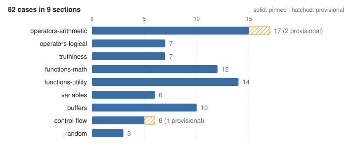

# eel-conformance

An executable specification of EEL2, the expression language MilkDrop presets are written in: the dialect of ns-eel that `per_frame`, `per_pixel`, `per_point` and `init` blocks use. There has never been a written specification for this language, only implementations that disagree with each other. This corpus is an attempt at one. Every rule is a case with a program, an input state and a required output state, so conformance is something you run rather than something you argue about.

The cases are plain JSON with a JSON Schema. Running them requires nothing from this package: a C++, Rust or JavaScript engine can read `cases/*.json` directly. The TypeScript loader and harness are a convenience for engines that live in that ecosystem.

<picture>
  <source media="(prefers-color-scheme: dark)" srcset="./docs/coverage-dark.svg">
  
</picture>

## What is in the box

| Path | What it is |
| --- | --- |
| `cases/*.json` | The corpus. Portable data; this is the specification. |
| `schema.json` | JSON Schema (draft-07) for a case group. |
| `src/index.ts` | Loader, the specification constants, and the harness. |
| `dist/cli.js` | `eel-conformance`, a command-line view of the corpus. |

```
$ eel-conformance sections
section               cases  provisional  description
operators-arithmetic  17     2            Arithmetic operators, their zero-guards, and precedence.
operators-logical     7      -            Bitwise operators, comparisons, and the logical operators that are NOT bitwise despite their names.
truthiness            7      -            The close-factor truthiness threshold: a value is true when its magnitude EXCEEDS 1e-5.
functions-math        12     -            Transcendental and root functions, and the domain guards that keep them finite.
functions-utility     14     -            Rounding, clamping, interpolation, and the default arguments that fill omitted parameters.
variables             6      -            Variable initialisation, assignment as an expression, overwritable constants, and the finite clamp at the statement boundary.
buffers               10     -            megabuf and gmegabuf guest memory: indexing, truncation, bounds, and separation. Both buffers hold 1048576 f32 slots and start zero-filled.
control-flow          6      1            loop() and while() statements, their iteration cap, and the condition rule that differs from every other boolean context.
random                3      -            rand() and randint() under the fixed conformance RNG, which returns exactly 0.5 for every call (see README, Runner contract).

82 cases in 9 sections, 3 provisional
```

A case looks like this:

```json
{
  "id": "index-truncates",
  "name": "a buffer index truncates toward zero",
  "program": ["megabuf(2.9) = 4", "x = megabuf(2)"],
  "expected": { "x": 4 },
  "expectedMegabuf": { "2": 4 }
}
```

## Runner contract

A conforming runner executes one case like this:

1. **Start from zero.** Every variable is 0 until assigned. Reading an unknown name is legal and yields 0, never an error. Apply the case's `env` on top.
2. **Allocate both guest buffers** at 1,048,576 f32 slots each, zero-filled, then apply `megabuf` and `gmegabuf` from the case. `megabuf` is per-preset scratch; `gmegabuf` is shared across presets.
3. **Execute `program` as one block**, in order. It is a single program, not independent lines: state carries from each statement to the next.
4. **Use the fixed RNG.** Every `rand()` / `randint()` draw returns exactly `0.5`. Randomness is not what these cases test, and a fixed draw is what makes them portable.
5. **Compare.** For each entry in `expected`, the variable must be within `1e-12 + |expected| * 1e-9`. Same for `expectedMegabuf` / `expectedGmegabuf` against buffer slots. Absent variables read as 0, so `{"x": 0}` is a real assertion.

Buffer size is part of the contract, not an implementation detail. Bounds behaviour is only defined against a declared size, and a runner that allocates a short buffer will read past its end and produce garbage where the specification requires 0.

### Case status

Each case is `pinned` (the default) or `provisional`.

- **pinned**: derived from documented MilkDrop 2.x / ns-eel behaviour. A conforming implementation must produce this value.
- **provisional**: this corpus's *observed* behaviour, not yet confirmed against ns-eel. A provisional case is a question, not a requirement. Enforcing it still has value, since silent drift is worse than a wrong-but-known value, but do not port one into another implementation without checking upstream first.

## Install

```sh
npm install eel-conformance
```

## Running it against your engine

The harness does the seeding and the comparing; you supply the one thing that is yours, executing EEL. A runner receives the program lines, an `env` to mutate, both buffers to mutate, and the random draw to use.

```ts
import { conforms, formatReport, runConformance } from 'eel-conformance';
import { execute } from './my-eel-engine';

const report = await runConformance(({ program, env, megabuf, gmegabuf, random }) => {
  execute(program.join('\n'), { env, megabuf, gmegabuf, rand: random });
});

console.log(formatReport(report));
process.exit(conforms(report) ? 0 : 1);
```

`runConformance` records a thrown error as an error on that case and keeps going, because the useful output is the whole table, not the first crash. `conforms` is true when every pinned case passed; provisional failures are reported separately and never count against conformance. Variable names in `env` are lower-cased, matching the language's case-insensitivity.

The sibling package [`milkdrop-toolchain`](../milkdrop-toolchain) runs this corpus against its interpreter, JIT and WGSL generator in its own test suite, and is where the cases were first written.

## What the corpus covers

Sections, in file order: arithmetic operators and precedence; bitwise and logical operators; the truthiness threshold and short-circuiting; math functions and their domain guards; rounding, clamping and interpolation helpers; variables and the finite clamp; `megabuf` / `gmegabuf` guest memory; `loop` / `while` control flow; and the random functions.

Rules that most often catch a new implementation:

- **Division by zero is 0**, but the guard is *exact zero*: `1 / 0.0000001` divides normally and yields ten million. A tolerance guard here silently zeroes results real presets depend on.
- **`%` truncates both operands to integers first**; float remainder is `mod()` / `fmod()`. They are different operators, not spellings of one.
- **Truthiness is `|v| > 1e-5`**, not `v != 0`, for `if`, `&&`, `||`, `!` and `bnot`. But see the open question about `while` below.
- **`==` is exact; `equal()` uses the close factor.** Only one of them is tolerant.
- **`bor()` and `band()` are logical, not bitwise**, despite the names. The bitwise operators are `|` and `&`. `bor(2,4)` is 1, not 6.
- **`frac()` subtracts the floor**, so `frac(-0.25)` is `0.75`. Using `trunc` instead diverges on every negative input.
- **`step(edge, v)` takes the edge first.**
- **`pi` and `e` are ordinary prepopulated variables**, and assignments to them stick. Around 74 presets in the Butterchurn corpus overwrite one.
- **Names are case-insensitive.** `contVol` and `contvol` are one variable.
- **Non-finite values are clamped to 0 at the statement boundary.** Expression state persists across frames, so one escaped Infinity would poison a variable for the preset's lifetime.
- **`smoothstep()` with equal edges** is defined here as `v < edge ? 0 : 1`. GLSL and WGSL leave that case undefined, so a GPU backend must special-case it rather than call the builtin.

## Open questions

The three provisional cases are places where the originating implementation had to pick a behaviour and the reference is unverified. Resolving them against ns-eel would be the most useful contribution to this specification.

1. **`while` condition truthiness** (`control-flow/while-condition-is-exact-zero`). A `while()` condition is tested against exact zero, while every other boolean context uses the `|v| > 1e-5` threshold. A condition decaying to `1e-6` therefore keeps looping instead of exiting. If the close-factor rule turns out to be correct, a class of presets is currently spinning to the iteration cap (2,097,152) every frame.
2. **Unary minus versus `^`** (`operators-arithmetic/precedence-unary-minus-over-pow`). `-2 ^ 2` parses as `(-2)^2 = 4`, not `-(2^2) = -4`. Most languages that spell exponentiation as an operator bind unary minus more loosely. No Butterchurn-corpus preset appears to depend on it.
3. **`^` associativity** (`operators-arithmetic/pow-left-associative`). `2 ^ 3 ^ 2` parses left-associatively as 64, not the more usual right-associative 512.

## Contributing a case

Add it to the appropriate group in `cases/`. Keep `id` stable: never reuse an id for different semantics, because other implementations track results by it. Say in `note` *why* the value is what it is and what depends on it; a case whose expected value nobody can justify becomes unchangeable for the wrong reason. `eel-conformance validate` checks the shape, and `bun test` checks the invariants the schema cannot express.

Changing an existing pinned value is a platform-semantics decision. Check a preset corpus for content depending on the old behaviour before editing.

## Development

The code is developed in [zz-plant/stims](https://github.com/zz-plant/stims) under [`packages/eel-conformance`](https://github.com/zz-plant/stims/tree/main/packages/eel-conformance), next to the app that uses it, and released from there. [zz-plant/eel-conformance](https://github.com/zz-plant/eel-conformance) is a read-only mirror of that directory, updated on every change. Open issues and pull requests on zz-plant/stims.

## Provenance

Extracted from `spec/eel-conformance/` in [zz-plant/stims](https://github.com/zz-plant/stims), where the corpus was written to pin the semantics shared by that project's EEL interpreter, JIT and WGSL generator. The cases and the schema are unchanged. The loader is the Stims loader with a `cases/` path that works from both `src/` and `dist/`; the harness and the CLI are new.

## License

[Unlicense](./LICENSE). Public domain.
