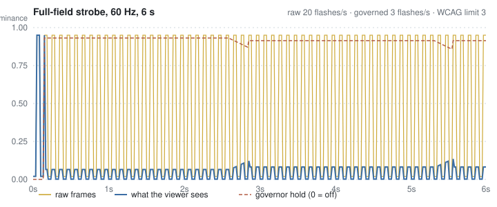
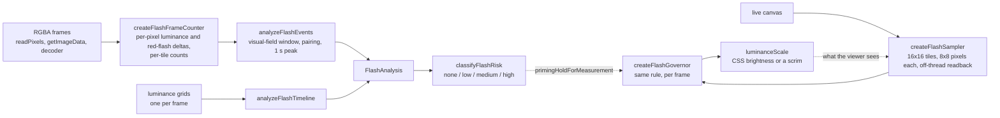

# flash-guard

WCAG 2.3.1 flash analysis for frame sequences, and a live governor that keeps a canvas under the threshold while it is being shown. It measures what the standard measures: pairs of opposing luminance changes of 10% or more, in any 10-degree visual field, more than three times in any second, plus the PEAT/Harding red-flash criterion. The offline half audits recorded or rendered frames and returns a flash rate and a risk band. The live half watches a canvas, counts the same flashes as they happen, and solves for the brightness scale that puts the next swing under the limit. Pure TypeScript, no dependencies, tested without a GPU. It was built for [Stims](https://toil.fyi), where MilkDrop presets can strobe and the viewer may not have asked for that, and it is extracted here because every game, video player and visualizer has the same problem.

These are screen-content heuristics, not a medical device. They flag content worth review and reduce measured flash rate; they do not certify anything as safe.

<picture>
  <source media="(prefers-color-scheme: dark)" srcset="./docs/governor-trace-dark.svg">
  
</picture>

The figure is generated by `bun run figure:svg` from a real run of the governor against a synthetic strobe; the flash rates in its caption come from `analyzeFlashTimeline` scoring both traces.

## How it fits together



## The rule, as implemented

| WCAG 2.3.1 says | `flash-guard` does | Constant |
| --- | --- | --- |
| A flash is a pair of opposing changes in relative luminance of 10% or more of maximum | A tile transition qualifies when the swing is at least 0.1; a flash is counted when a qualifying field-wide transition reverses the previous one | `FLASH_LUMINANCE_DELTA` |
| ...where the darker image is below 0.80 | The darker end of the pair must be under 0.8 | `FLASH_DARKER_CEILING` |
| The area that flashes must exceed 25% of any 10-degree visual field | A window a third of each axis is slid across the tile grid with a summed-area table; the transition counts if any window has 25% qualifying pixels | `FLASH_AREA_FRACTION`, `VISUAL_FIELD_FRACTION` |
| More than three flashes in any one-second period fails | Peak count over any sliding 1 s window, compared against 3 | `FLASHES_PER_SECOND_LIMIT` |
| Red flash: a transition to or from a saturated red | Saturated when R/(R+G+B) is at least 0.8; qualifies when the red-flash value max(0, R-G-B)·320 changes by more than 20 | `RED_SATURATION_MIN`, `RED_FLASH_SCALE`, `RED_FLASH_DELTA` |

Magnitude is decided per pixel before any spatial aggregation. Averaging luminance over a tile first scales every swing down by the flashing region's coverage, and on sparse bright-on-black content that pushed real flashes two orders of magnitude under the threshold.

## Install

```sh
npm install flash-guard
```

Two entry points: `flash-guard` for everything, and `flash-guard/worker` for the readback worker the live sampler uses (bundlers pick it up from the `new URL('./readback.worker.js', import.meta.url)` pattern automatically; pass `createWorker` to load it another way).

## Quick start

### Audit frames you already have

```ts
import { analyzeRgbaFrames, classifyFlashRisk } from 'flash-guard';

// 2 seconds of 640x360 frames: a full-screen strobe, 7.5 frames on, 7.5 off.
const frames: Uint8Array[] = [];
for (let f = 0; f < 120; f += 1) {
  const on = Math.floor(f / 7.5) % 2 === 1;
  const px = new Uint8Array(640 * 360 * 4).fill(on ? 255 : 10);
  for (let i = 3; i < px.length; i += 4) px[i] = 255;
  frames.push(px);
}

const result = analyzeRgbaFrames(frames, { width: 640, height: 360, deltaMs: 1000 / 60 });
console.log(result);
console.log('risk:', classifyFlashRisk(result));
```

Output, as printed by `bun`:

```
{
  peakFlashesPerSecond: 8,
  totalFlashes: 14,
  exceedsThreshold: true,
  peakRedFlashesPerSecond: 0,
  totalRedFlashes: 0,
  exceedsRedThreshold: false,
  motionEnergy: 0.12566782313003366,
  luminanceVolatility: 0.3308987543146804,
  meanLuminance: 0.46828547724559366,
  frameCount: 120,
}
risk: high
```

A 4 Hz square wave is 8 flashes a second: every change after the first completes an opposing pair. For a long capture, `createFlashFrameCounter` lets you `push` one frame at a time and keeps only per-tile counts, so memory does not grow with the frame size.

### Govern a canvas while it draws

```ts
import { createBrightnessFilterApplier, createFlashController } from 'flash-guard';

const controller = createFlashController({
  canvas,
  applyLuminanceScale: createBrightnessFilterApplier(canvas),
  isEnabled: () => settings.reduceFlashing,
});

function render(now: number) {
  draw();                 // whatever you draw
  controller.tick(now);   // sample inside the same task as the draw
  requestAnimationFrame(render);
}
```

`tick` must run in the same task as the draw. A WebGPU canvas holds its frame only until it is presented, and a WebGL canvas without `preserveDrawingBuffer` may already be cleared; read from a separate animation frame, both report calm pixels and the governor never engages. If your render loop already has a frame-drawn notification, pass it as `subscribeToFrames` and call `start()` instead.

### Drive the governor yourself

```ts
import { createFlashGovernor, RECOMMENDED_GRID } from 'flash-guard';

const governor = createFlashGovernor();
const frame = new Float32Array(RECOMMENDED_GRID * RECOMMENDED_GRID);
let scale = 1;
for (let f = 0; f < 120; f += 1) {
  const on = Math.floor(f / 7.5) % 2 === 1;
  frame.fill(on ? 0.95 : 0.02); // the frame as drawn
  const d = governor.sample(f * (1000 / 60), frame, RECOMMENDED_GRID, RECOMMENDED_GRID, {
    viewScale: scale, // the mitigation the viewer is seeing it through
  });
  scale = d.luminanceScale;
}
```

Printed every quarter second from that loop:

```
t=0.00s flashesInWindow=0 hold=0.000 luminanceScale=1.000
t=0.25s flashesInWindow=1 hold=0.000 luminanceScale=1.000
t=0.50s flashesInWindow=2 hold=0.931 luminanceScale=0.069
t=0.75s flashesInWindow=2 hold=0.931 luminanceScale=0.069
t=1.00s flashesInWindow=2 hold=0.931 luminanceScale=0.069
t=1.25s flashesInWindow=1 hold=0.931 luminanceScale=0.069
t=1.50s flashesInWindow=0 hold=0.931 luminanceScale=0.069
t=1.75s flashesInWindow=0 hold=0.931 luminanceScale=0.069
```

Pass the frame as drawn and tell the governor, as `viewScale`, the mitigation already in force. Without it the governor never observes its own effect, keeps counting flashes it has already suppressed, and escalates to the ceiling. Multiplying the scale into the frame yourself is not the same: the governor would then read its own dimming step as the content darkening.

That loop hands it one value per tile, which is exact for a uniform strobe. For a real canvas, use the sampler's field, which has `RECOMMENDED_SAMPLE_DENSITY` samples along each tile edge, and pass `density` too.

## How the governor decides

Drawn from the source, where each choice records the measurement that forced it.

- **It engages before the limit.** Intervention starts at the second flash in the window (`engageAt`), not the fourth. Acting only on the fourth would mean the failing sequence had already been shown.
- **It solves rather than ramps.** On a flash it computes the largest scale at which the transition it just observed no longer covers 25% of any visual field, then jumps there in one step. Blind ramping from a gentle start let a black-to-white strobe land nine flashes before the clamp caught up, when the limit is three. The solve uses the whole field, not its single largest swing: one bright point crossing one sample is not what made the frame a flash, and solving for it took a calm preset from full brightness to 9% on the first flash.
- **It does not count its own dimming.** Both frames of a comparison are judged at the scale now in force, so a swing the content makes is measured as the viewer sees it, and the drop the governor just applied does not read as the content darkening. Judged as shown, that drop qualified across most of the frame and paired with the content's next brightening into a flash the content never made.
- **It starts gentle.** The first hold is 0.2, not a floor near full dimming, so a mild flicker is not punished like a full strobe; the solved step finds the right level.
- **It releases slowly, and only after a delay.** Release begins once the window has been clear for 1.5 s and then eases off at 0.004 per frame. Releasing as soon as the window emptied, which is guaranteed to happen while the clamp works, let the strobe restart and settle into a limit cycle measured at 8 flashes a second while pinned at the ceiling.
- **It compares frames 16.7 ms apart, whatever the display rate, and never skips one.** On a 120 Hz screen, frame-to-frame twinkle in calm content read as 82 flashes a second; compared one 60 Hz frame apart it read 2.4, and content that really strobed read the same either way. Skipping a 60 Hz frame doubles the motion in a comparison, so the gate sits at three quarters of a frame, clear of timestamp jitter, and up to three readbacks queue rather than a slow one refusing the next frame.
- **It needs a fine enough grid.** At 6x6 tiles the visual-field window is 2x2 and one tile is 25% of it, so every flickering highlight trips the rule. `RECOMMENDED_GRID` is 16; `MIN_USEFUL_GRID` is 8.
- **It judges pixels, not tiles.** One value per tile is a point read of about four pixels, which puts 25 points in a visual field, and the governor acts on the worst of 144 fields. Fine moving texture read as 12 to 49 flashes on frames the per-pixel analysis scored at 0. Each tile is read as 8x8 single pixels (`RECOMMENDED_SAMPLE_DENSITY`) and thresholded one by one, the offline analysis's own method at a coarser stride. Averaging each tile is not the fix: it scales a partial-coverage swing down by its coverage.

The sampler takes a snapshot of the canvas inside the draw with `createImageBitmap`, already downscaled (nearest neighbour) to the 128x128 field, and hands it to a worker whose readback does the waiting for the GPU. Measured on an M1 Max at 1280x720 in headless Chromium, per sample, first at a 16x16 grid:

| Backend | Main thread, synchronous read | Main thread, off-thread read | Grid arrives after |
| --- | --- | --- | --- |
| WebGPU | 1.9 to 2.3 ms | 0.1 ms | 2.1 to 2.3 ms |
| WebGL | 2.7 to 3.6 ms | 0.1 ms | 2.8 to 3.2 ms |

The off-thread grid matched the synchronous read exactly over 12 frames on each backend. Where workers or `OffscreenCanvas` are missing, the synchronous read is used. At the 128x128 field the capture still costs 0.1 ms of main thread and the field arrives 3.0 to 3.5 ms later; judging it costs 0.09 ms on a still frame and 0.24 ms on busy texture.

## API

| Export | Purpose |
| --- | --- |
| `analyzeRgbaFrames(frames, options)` | RGBA frames in, `FlashAnalysis` out. Options: `width`, `height`, `deltaMs`, optional `cols`, `rows`, `stride`, `flipY`. |
| `createFlashFrameCounter(options)` | Streaming form: `push(frame)`, `analyze()`, `input()`, `reset()`. |
| `analyzeFlashEvents(input)` | Per-transition, per-tile qualifying-pixel counts in (`FlashCountInput`), analysis out. The only path that evaluates red flash. |
| `analyzeFlashTimeline({ frames, deltaMs, cols?, rows? })` | Per-frame luminance grids in, analysis out. |
| `classifyFlashRisk(analysis)` | `'none'`, `'low'`, `'medium'` or `'high'`; `high` means over the WCAG limit on either channel. `describeFlashRisk(level)` gives a short label. |
| `createFlashGovernor(options?)` | The live state machine: `sample(nowMs, samples, cols, rows, { density?, viewScale? })` returns `{ hold, luminanceScale, flashesInWindow, engaged, flashed }`; also `prime(hold)`, `reset()`, `getState()`. `samples` is `cols * density` by `rows * density`. |
| `primingHoldForMeasurement({ flashRiskLevel, maxLuminanceDelta })` | A starting hold for content already measured `high`, so its first flashes are mitigated rather than counted. |
| `createFlashController(options)` | Sampler plus governor plus the apply-on-change loop: `start()`, `stop()`, `tick(now)`, `prime(hold)`, `release()`, `getState()`. |
| `createBrightnessFilterApplier(element)` | An `applyLuminanceScale` that writes a CSS `brightness()` filter, clearing it at 1. |
| `createFlashSampler({ grid?, density?, createWorker? })` | Canvas to luminance field, off the main thread when possible, with up to `MAX_CAPTURES_IN_FLIGHT` readbacks queued. `createMainThreadFlashReader(grid, density)` is the synchronous fallback. |
| `RECOMMENDED_GRID`, `RECOMMENDED_SAMPLE_DENSITY`, `MIN_USEFUL_GRID`, `MIN_SAMPLE_INTERVAL_MS` | 16 tiles a side, 8 samples along each tile edge, the coarsest grid that discriminates, and the gate between compared frames. |
| `relativeLuminance(r, g, b)`, `linearizeChannel(byte)`, `LINEAR_CHANNEL_LUT` | WCAG relative luminance from sRGB bytes, and the 256-entry table it reads. |
| `isFlashTransition`, `isRedFlashTransition`, `isSaturatedRed`, `redFlashValue`, `peakWindowFraction` | The primitives every path above is built from. |
| `FLASHES_PER_SECOND_LIMIT`, `FLASH_LUMINANCE_DELTA`, `FLASH_DARKER_CEILING`, `FLASH_AREA_FRACTION`, `VISUAL_FIELD_FRACTION`, `RED_SATURATION_MIN`, `RED_FLASH_DELTA`, `RED_FLASH_SCALE` | The thresholds, defined once. |

## Demo

`demo/index.html` strobes a canvas at a chosen rate and contrast and shows the governor's readout and a live trace of raw versus seen luminance. Run `bun run build` first; the page imports from `dist/`.

## Development

The code is developed in [zz-plant/stims](https://github.com/zz-plant/stims) under [`packages/flash-guard`](https://github.com/zz-plant/stims/tree/main/packages/flash-guard), next to the app that uses it, and released from there. [zz-plant/flash-guard](https://github.com/zz-plant/flash-guard) is a read-only mirror of that directory, updated on every change. Open issues and pull requests on zz-plant/stims.

## Provenance

Extracted from [zz-plant/stims](https://github.com/zz-plant/stims):

| Package file | Stims source |
| --- | --- |
| `src/thresholds.ts` | `src/js/core/flash-thresholds.ts` |
| `src/analysis.ts` | `scripts/flash-analysis.ts`, with its two entry points now sharing one pairing and windowing implementation |
| `src/frames.ts` | New: the per-pixel counting that was inlined in `scripts/analyze-preset-flash.ts`, with the thresholds read from `thresholds.ts` instead of retyped |
| `src/governor.ts` | `src/js/core/services/flash-governor.ts` |
| `src/controller.ts` | `src/js/core/services/flash-safety.ts`, with the accessibility preference and the stage filter replaced by callbacks |
| `src/sampler.ts`, `src/readback.worker.ts` | `src/js/core/services/flash-sampler.ts`, `flash-readback.worker.ts`, with the worker factory injectable |
| `src/risk.ts` | The classifier from `src/js/core/sensory-profile.ts` |

Tests: the Stims suites (`flash-analysis`, `flash-governor`, `flash-safety`, `flash-sampler`) carried over, plus a new suite for the pixel frontend that checks it against the luminance path and exercises the visual-field window and the red channel. `bun test` runs 74 tests across 5 files.

## License

[Unlicense](./LICENSE). Public domain.
