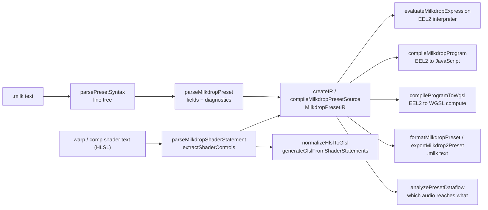

# milkdrop-toolchain

`milkdrop-toolchain` is the part of a MilkDrop engine that does not touch a GPU: it reads `.milk` preset text, compiles the equations into an intermediate representation, evaluates or JIT-compiles the EEL2 expression language, analyzes the HLSL warp and composite shaders, translates them to GLSL, lowers EEL programs to WGSL compute shaders, and writes presets back out as text (both the editor dialect and the exact MilkDrop 2 file format). It is written in TypeScript, has no runtime dependencies, and keeps presets as `.milk` files rather than inventing a new format, so anything it produces can still be opened by MilkDrop, projectM or Butterchurn. It was born inside [Stims](https://toil.fyi), the browser visualizer at zz-plant/stims, where the same code compiles every preset the renderer plays; this package is that compiler and its analysis tools, extracted so other editors, linters, converters and renderers can share one reading of what a preset means.

## Pipeline



Preset text goes through a lossless line-level syntax tree, then a field parser, then the IR builder, which also parses every equation into expression ASTs and classifies the shader text. From the IR, three execution tiers agree on the same semantics: the tree-walking interpreter, the JavaScript JIT (with an interpreter fallback when `new Function` is blocked by CSP), and the WGSL generator. The formatter and the MilkDrop 2 exporter turn the IR back into text.

## Install

```sh
npm i milkdrop-toolchain
```

The package ships compiled ESM in `dist/` with type declarations, and the TypeScript sources in `src/` for runtimes that execute `.ts` directly (`import ... from 'milkdrop-toolchain/src/expression.ts'`).

## Quick start

### Parse and compile a preset

```ts
import { compileMilkdropPresetSource } from 'milkdrop-toolchain';

const source = `[preset00]
fDecay=0.98
nWaveMode=7
per_frame_init_1=q1 = 0.5;
per_frame_1=zoom = 1 + 0.02 * bass_att;
per_frame_2=rot = sin(time * 0.3) * 0.02;
per_pixel_1=warp = q1 * (1 - rad);
per_frame_3=q2 = foo(1);
`;

const compiled = compileMilkdropPresetSource(source, { id: 'demo' });

console.log('decay:', compiled.ir.numericFields.decay, 'wave mode:', compiled.ir.numericFields.wave_mode);
console.log('per-frame statements:', compiled.ir.programs.perFrame.statements.length);
console.log('per-pixel statements:', compiled.ir.programs.perPixel.statements.length);
console.log('fidelity:', compiled.ir.compatibility.parity.fidelityClass);
for (const d of compiled.diagnostics) {
  console.log(`${d.severity} ${d.code} ${d.message}`);
}
```

Output:

```
decay: 0.98 wave mode: 7
per-frame statements: 3
per-pixel statements: 1
fidelity: near-exact
warning preset_expression_unknown_function Expression references unknown function or variable "foo", which evaluates to 0 at runtime.
```

Field names are normalized to the MilkDrop 2 spelling (`fDecay` becomes `decay`, `nWaveMode` becomes `wave_mode`); the alias table is in `field-table.ts`.

### Evaluate an EEL2 expression

```ts
import { evaluateMilkdropExpression, parseMilkdropExpression } from 'milkdrop-toolchain';

const env = { bass: 1.4, zoom: 1 };
const expr = parseMilkdropExpression('zoom * (1 + 0.1 * if(above(bass, 1), bass - 1, 0)) + 3 / 0', 1);
console.log('diagnostics:', expr.diagnostics.length);
console.log('value:', evaluateMilkdropExpression(expr.value!, env));
console.log('int division:', evaluateMilkdropExpression(parseMilkdropExpression('7 % 2.9', 1).value!, {}));
console.log('truthiness:', evaluateMilkdropExpression(parseMilkdropExpression('if(0.000001, 1, 2)', 1).value!, {}));
```

Output:

```
diagnostics: 0
value: 1.04
int division: 1
truthiness: 2
```

`3 / 0` contributed `0`, `%` truncated both operands to integers before dividing, and `0.000001` was false because EEL2 truthiness is `|v| > 0.00001`. For a program block rather than a single expression, `compileMilkdropProgram(block)` returns a function that runs it against `(env, state, registers, locals, megabuf, gmegabuf, rnd)`.

### Compile an EEL2 block to WGSL

```ts
import { compileMilkdropPresetSource, compileProgramToWgsl } from 'milkdrop-toolchain';

const compiled = compileMilkdropPresetSource(
  '[preset00]\nper_frame_1=q1 = q1 + bass * 0.1;\nper_frame_2=zoom = 1 + sin(time) * 0.01;\n',
  { id: 'wgsl-demo' },
);
const result = compileProgramToWgsl(compiled.ir.programs.perFrame);
console.log('registers:', result.registerKeys);
console.log(result.wgslCode);
```

Output (the `VmState` and `VmSignals` struct declarations and the EEL helper functions are elided; the full text is about 250 lines):

```
registers: [ "q1" ]
struct VmState {
  bass: f32,
  ...
  zoom: f32,
}

struct VmSignals {
  time: f32,
  frame: f32,
  fps: f32,
  ...
}

@group(0) @binding(0) var<storage, read_write> state: VmState;
@group(0) @binding(1) var<storage, read> signals: VmSignals;

  fn milkdropBool(value: f32) -> f32 {
    return select(0.0, 1.0, abs(value) > 0.00001);
  }

  fn milkdropDiv(left: f32, right: f32) -> f32 {
    return select(left / right, 0.0, right == 0.0);
  }
  ...

@compute @workgroup_size(1)
fn main() {
  state.q1 = milkdropFinite((state.q1 + (signals.bass * 0.1)));
  state.zoom = milkdropFinite((1 + (sin(signals.time) * 0.01)));
}
```

`result.fieldKeys` lists the `VmState` members in order so a host can lay out the storage buffer; `MILKDROP_WGSL_SIGNAL_FIELDS` gives the `VmSignals` layout.

## API

Everything below is exported from the package root. Each module under `src/` is also importable directly through `milkdrop-toolchain/src/<file>.ts`.

### Preset text

| Export | Purpose |
| --- | --- |
| `parsePresetSyntax(source)` / `printPresetSyntax(tree)` | Lossless line-level syntax tree of a `.milk` file; printing gives back the exact bytes. |
| `fieldAssignments(tree)`, `isShaderSection(name)`, `splitInlineComment(line)` | Helpers over the syntax tree. |
| `parseMilkdropPreset(source)` | Fields and sections of a preset, with parse diagnostics. |

### Compiler

| Export | Purpose |
| --- | --- |
| `compileMilkdropPresetSource(raw, source?, options?)` | Parse, build the IR, format, and cache; returns a `MilkdropCompiledPreset`. |
| `createIR(ast, diagnostics, source?, options?)`, `createMilkdropIr(...)` | The IR builder without the cache or formatter. |
| `createPresetSource(partial, raw, title, author)` | Fill in a `MilkdropPresetSource` record. |
| `clearCompiledPresetCache()`, `getCompiledPresetCacheSize()`, `warmupCompiledPresetCache(presets)` | Control the compile cache. |
| `DEFAULT_MILKDROP_STATE`, `createDefaultCustomWaveSlot()`, `createDefaultShapeSlot()`, `MAX_CUSTOM_WAVES`, `MAX_CUSTOM_SHAPES` | MilkDrop's default per-frame state and slot templates. |
| `buildParityReport(ir, options)` | Per-backend parity report: what runs as written, what is approximated, what is blocked. |
| `buildBackendDivergence`, `buildVisualFallbacks`, `buildBlockingConstructDetails`, `buildDegradationReasons`, `classifyFidelity`, `buildCompatibilityEvidence` | The pieces of the compatibility classification. |
| `loadMilkdropParityAllowlist()`, `isMilkdropParityConstructAllowlisted(...)` | The parity allowlist (`data/parity-allowlist.json`), empty by default. |

### EEL2 expressions

| Export | Purpose |
| --- | --- |
| `parseMilkdropExpression(source, line)` | Parse one expression to an AST, with diagnostics. |
| `parseMilkdropStatement(source, line)`, `splitMilkdropStatements(source)` | Parse `target = expr;` statements, split a block on `;`. |
| `evaluateMilkdropExpression(node, env, helpers?)` | Tree-walking interpreter. |
| `walkMilkdropExpression(node, visit)` | Visit every node of an AST. |
| `findNearestMatch(name, candidates)` | Spelling suggestion for unknown identifiers. |
| `compileMilkdropProgram(block)` | JIT a program block to a JavaScript function; falls back to the interpreter when `new Function` is unavailable. |
| `prewarmMilkdropPrograms(ir, shouldAbort?)` | Compile every block of a preset ahead of time, yielding between blocks. |
| `MILKDROP_MEGABUF_SIZE`, `MILKDROP_GMEGABUF_SIZE` | Size of the `megabuf` and `gmegabuf` scratch arrays. |
| `EEL_FUNCTIONS`, `EEL_BINARY_OPERATORS`, `EEL_UNARY_OPERATORS`, `getEelFunctionSpec(name)`, `evaluateEelCall(...)`, `toMilkdropInt(v)`, `MILKDROP_EEL_CLOSE_FACTOR` | The one function table the interpreter, JIT and WGSL generator all read. |
| `compileProgramToWgsl(block, options?)` | Lower a program block to a WGSL compute shader. |
| `buildWgslExpressionString(node, ...)` | Lower one expression to WGSL. |
| `MILKDROP_WGSL_SIGNAL_FIELDS`, `MILKDROP_WGSL_SIGNAL_ALIAS_MAP`, `deriveMilkdropViewportSignalValues(signals)` | The `VmSignals` uniform layout and its aliases. |
| `resolveMilkdropIdentifier(env, name)`, `normalizeFieldSuffix`, `normalizeProgramAssignmentTarget`, `aliasMap` | Case-insensitive identifier and field-name resolution. |
| `MILKDROP_FIELDS`, `buildFieldAliasMap()`, `editorFieldKey(key)`, `MILKDROP2_FIELD_PAIRS`, `SHAPE_FIELD_ALIASES`, `IGNORED_FIELD_SPELLINGS` | The field table: every known preset field, its type, default and spellings. |
| `MILKDROP_BUILTIN_DOCS`, `MILKDROP_INTRINSIC_FUNCTION_NAMES`, `MILKDROP_INTRINSIC_IDENTIFIER_NAMES`, `MILKDROP_INTRINSIC_FUNCTIONS`, `MILKDROP_INTRINSIC_IDENTIFIERS`, `milkdropVariableNames(...)`, `MILKDROP_REGISTER_WORD_PATTERN`, `MILKDROP_FUNCTION_SNIPPET_TEMPLATES`, `MILKDROP_Q_REGISTER_COUNT`, `MILKDROP_T_REGISTER_COUNT` | Documentation of every builtin, for editors and linters. |

### Shader text

| Export | Purpose |
| --- | --- |
| `extractShaderSource(fields, stage)`, `ensureShaderBody(text)` | Recover the warp or comp shader text from the preset's backtick lines. |
| `parseMilkdropShaderStatement(line)` | Parse one HLSL statement to a shader AST. |
| `evaluateMilkdropShaderExpression(node, env)` | Constant-evaluate a shader expression. |
| `extractShaderControls(...)` | Read the colour, texture and warp controls a shader body sets. |
| `evaluateMilkdropShaderControlProgram(...)`, `evaluateMilkdropShaderControlExpressions(...)` | Evaluate those controls against a frame's variables. |
| `normalizeHlslToGlsl(body, ...)` | Translate an HLSL shader body to GLSL ES. |
| `extractNativeShaderBody(text)`, `splitShaderGlobalsAndBody(text)` | Split `shader_body { ... }` from its globals. |
| `generateGlslFromShaderStatements(statements, stage)` | Rebuild GLSL from parsed statements. |
| `createCompositeGlslEmitter(...)`, `injectDirectShaderGlsl(...)`, `generateShaderVariantTag(...)` | Lower-level GLSL emission. |
| `desugarShaderBranches(body)`, `setShaderBranchDesugarEnabled(flag)`, `isShaderBranchDesugarEnabled()` | Optional pass that rewrites `if` branches into `mix`/`select` form. Off by default; the setter is module-level state. |
| `clearShaderAnalysisCaches()` | Drop the memoized analyses. |
| `MILKDROP_SHADER_TEXTURE_SAMPLERS`, `normalizeMilkdropShaderSamplerName`, `isMilkdropShaderSamplerName`, `isMilkdropVolumeShaderSamplerName`, `classifyTex3dSamplerEquivalence`, `TEX3D_NOT_EQUIVALENT_SAMPLERS`, `MILKDROP_SHADER_AUX_TEXTURE_SOURCE_IDS`, `getMilkdropShaderAuxTextureSourceId` | The sampler and texture name tables. |
| `MILKDROP_TEXTURE_FILES`, `CUSTOM_TEXTURE_FILES` | Texture file names MilkDrop ships. |
| `describeShaderTranslations(compiled)`, `describeExecutionMode(mode)` | Per-stage summary: source, GLSL, which path produced it, per-backend execution mode. |
| `resolveShaderExecutionMode(compiled, backend)`, `isShaderApproximated(mode)`, `describeShaderApproximation(...)` | The shared vocabulary for "does this backend run the shader as written". |

### Formatting and export

| Export | Purpose |
| --- | --- |
| `formatMilkdropPreset(compiled)` | Serialize a compiled preset back to `.milk` text in the editor dialect. |
| `readMilkdropField(source, key)`, `findMilkdropFieldLine(...)`, `findMilkdropEquationLine(...)` | Read a field or locate its line in the text. |
| `upsertMilkdropField(source, key, value)`, `upsertMilkdropFields(source, entries)` | Set fields in preset text without disturbing the rest. |
| `isFieldShadowedByEquations(...)`, `getFieldOverwriteKind(...)`, `computeMidiGutterInfo(...)` | Which fields an equation overwrites each frame. |
| `emitProgramLines(...)`, `serializeString(v)`, `formatNumber(v)`, `resolveShaderText(ir, stage)`, `resolveFormattedTitle(...)`, `FALLBACK_TITLE` | Formatter building blocks. |
| `exportMilkdrop2Preset(compiled)` | Write the MilkDrop 2 file format: `MILKDROP_PRESET_VERSION`, MilkDrop's key names, backtick shader lines. |
| `MILKDROP2_STIMS_KEYS` | Keys that only Stims reads and the exporter writes only when they differ from the default. |
| `lineageFromFields(fields)`, `lineageFieldLines(refs)`, `isLineageFieldKey(key)` | Remix lineage metadata stored in the preset. |

### Static analysis

| Export | Purpose |
| --- | --- |
| `analyzePresetDataflow(ir)` | Which audio signals reach which control or drawn part, read from the equations. |
| `controlAudio`, `drawnPartAudio`, `frameValueName`, `dataflowSignature` | Query and fingerprint a dataflow result. |
| `analyzePresetMath(source)` | Motion, reactivity and complexity summary of a preset's equations. |

### Types

The `MilkdropCompiledPreset`, `MilkdropPresetIR`, `MilkdropProgramBlock`, `MilkdropCompiledStatement`, `MilkdropExpressionNode`, `MilkdropDiagnostic`, `MilkdropPresetSource`, `MilkdropCompileOptions`, `MilkdropShaderStatement`, `MilkdropShaderControls`, `MilkdropRuntimeSignals` and related types are exported from the root. `MilkdropRuntimeSignals` is the shape of the per-frame signal environment a host passes to compiled programs.

## What is not here

- The renderer. Drawing waves, shapes, the warp mesh and the composite pass, and feeding audio into the signal environment, is the host's job. Stims does it with three.js on WebGL and WebGPU.
- The CPU VM. `compileMilkdropProgram` gives you a function per program block; the loop that runs init, per-frame, per-pixel and the custom wave and shape programs in the right order with the right register bank, and blends between presets, lives in Stims (`vm.ts`).
- The GPU compute VM that dispatches the WGSL this package generates and reads the state buffer back.
- HLSL to WGSL. In Stims the shader text is converted to WGSL through three.js TSL nodes, which this package does not depend on. The HLSL side here stops at the GLSL translation and the control analysis.

## Semantics

The EEL2 semantics implemented by the interpreter, the JIT and the WGSL generator are specified by the sibling package [`eel-conformance`](../eel-conformance), a set of portable JSON cases with a JSON Schema and a runner contract. Five behaviours that differ from JavaScript and trip up most reimplementations:

1. Division by exact zero yields `0`, not `Infinity` or `NaN` (`3 / 0` is `0`).
2. `%` truncates both operands to integers first, and a zero divisor yields `0`.
3. Truthiness is `|v| > 0.00001`: `if(0.000001, a, b)` takes the `b` branch.
4. `bor` and `band` are logical, not bitwise: `bor(0.5, 0)` is `1`.
5. Identifiers are case-insensitive: `Zoom`, `ZOOM` and `zoom` are the same variable, and `pi` and `e` are ordinary prepopulated variables a preset may overwrite.

## Development

The code is developed in [zz-plant/stims](https://github.com/zz-plant/stims) under [`packages/milkdrop-toolchain`](https://github.com/zz-plant/stims/tree/main/packages/milkdrop-toolchain), next to the app that uses it, and released from there. [zz-plant/milkdrop-toolchain](https://github.com/zz-plant/milkdrop-toolchain) is a read-only mirror of that directory, updated on every change. Open issues and pull requests on zz-plant/stims.

## Provenance

Extracted from [zz-plant/stims](https://github.com/zz-plant/stims), `src/js/milkdrop/`. The copied modules are the preset parser and syntax tree (`preset-parser.ts`, `preset-syntax.ts`), the EEL2 front end (`expression.ts`, `expression-jit.ts`, `builtin-docs.ts`, `field-normalization.ts`, `field-table.ts`), the compiler (`compiler.ts`, `compiler-types.ts`, `common-types.ts` and the 24 files under `compiler/`, including `ir.ts`, `eel-function-table.ts`, `shader-analysis*.ts`, `shader-branch-desugar.ts`, `wgsl-generator.ts`, `compatibility.ts`), the shader front end (`shader-ast.ts`, `shader-source.ts`, `shader-samplers.ts`, `shader-expression-shared.ts`, `texture-files.ts`, `shader-translation.ts`, `shader-execution-mode.ts`), the formatter and exporters (`formatter.ts`, `milkdrop2-export.ts`, `preset-lineage-fields.ts`), the analyzers (`preset-dataflow.ts`, `preset-math-analyzer.ts`), and `wgsl-signal-layout.ts` and `parity-allowlist.ts` with its JSON. Two files differ from their Stims originals: `types.ts` re-exports only the compiler-facing type modules instead of the renderer and catalog types, and `runtime-signals.ts` holds the `MilkdropRuntimeSignals` type copied out of Stims' `runtime-types.ts`. Relative imports were given explicit `.ts` extensions so `tsc` can emit working ESM.

24 of Stims' unit test files were carried over (510 tests), minus the cases that read presets from Stims' bundled corpus or exercise the renderer.

## License

[Unlicense](./LICENSE). This is free and unencumbered software released into the public domain.
